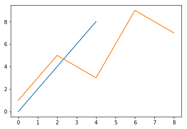
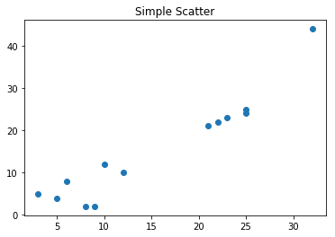
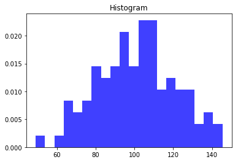
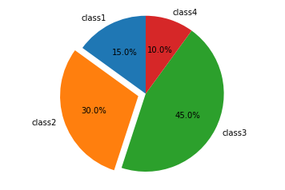
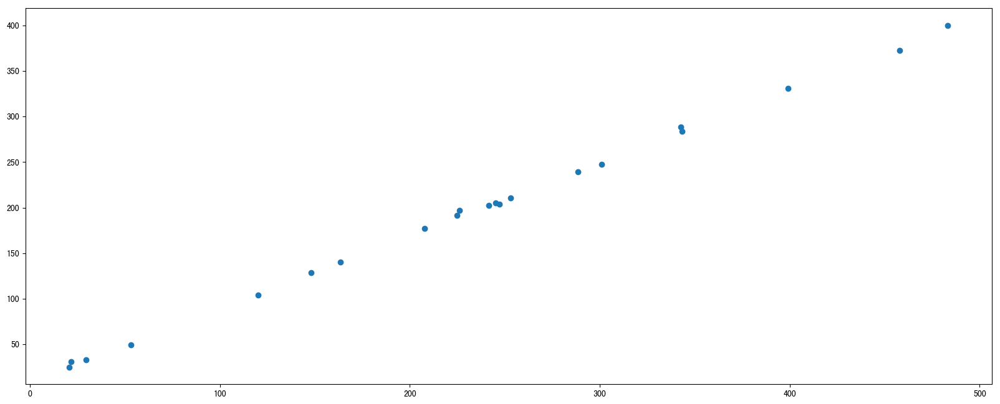

# 2.3. 散点图scatter

学习目标
----

*   目标
    *   掌握常见统计图及其意义
    *   绘制散点图
*   应用
    *   探究不同变量之间的关系

Matplotlib能够绘制**折线图、散点图、柱状图、直方图、饼图。**

我们需要知道不同的统计图的意义，以此来决定选择哪种统计图来呈现我们的数据。

2.3.1 常见图形种类及意义
---------------

* 折线图：以折线的上升或下降来表示统计数量的增减变化的统计图

  **特点：能够显示数据的变化趋势，反映事物的变化情况。(变化)**

  

* 散点图：用两组数据构成多个坐标点，考察坐标点的分布,判断两变量之间是否存在某种关联或总结坐标点的分布模式。

  **特点：判断变量之间是否存在数量关联趋势,展示离群点(分布规律)**

  

* 柱状图：排列在工作表的列或行中的数据可以绘制到柱状图中。

  **特点：绘制连离散的数据,能够一眼看出各个数据的大小,比较数据之间的差别。(统计/对比)**

  

* 直方图：由一系列高度不等的纵向条纹或线段表示数据分布的情况。 一般用横轴表示数据范围，纵轴表示分布情况。

  **特点：绘制连续性的数据展示一组或者多组数据的分布状况(统计)**

  

* 饼图：用于表示不同分类的占比情况，通过弧度大小来对比各种分类。

  **特点：分类数据的占比情况(占比)**

  

2.3.2 散点图绘制
-----------

需求：探究房屋面积和房屋价格的关系

房屋面积数据：

    x = [225.98, 247.07, 253.14, 457.85, 241.58, 301.01,  20.67, 288.64,
           163.56, 120.06, 207.83, 342.75, 147.9 ,  53.06, 224.72,  29.51,
            21.61, 483.21, 245.25, 399.25, 343.35]

房屋价格数据：

    y = [196.63, 203.88, 210.75, 372.74, 202.41, 247.61,  24.9 , 239.34,
           140.32, 104.15, 176.84, 288.23, 128.79,  49.64, 191.74,  33.1 ,
            30.74, 400.02, 205.35, 330.64, 283.45]

代码：

    # 1）准备数据
    x = [225.98, 247.07, 253.14, 457.85, 241.58, 301.01,  20.67, 288.64,
           163.56, 120.06, 207.83, 342.75, 147.9 ,  53.06, 224.72,  29.51,
            21.61, 483.21, 245.25, 399.25, 343.35]
    y = [196.63, 203.88, 210.75, 372.74, 202.41, 247.61,  24.9 , 239.34,
           140.32, 104.15, 176.84, 288.23, 128.79,  49.64, 191.74,  33.1 ,
            30.74, 400.02, 205.35, 330.64, 283.45]
    
    # 2）创建画布
    plt.figure(figsize=(20, 8), dpi=100)
    
    # 3）绘制散点图
    plt.scatter(x, y)
    
    # 4）显示图像
    plt.show()

2.3.3 散点图应用场景
-------------

*   探究不同变量之间的内在关系