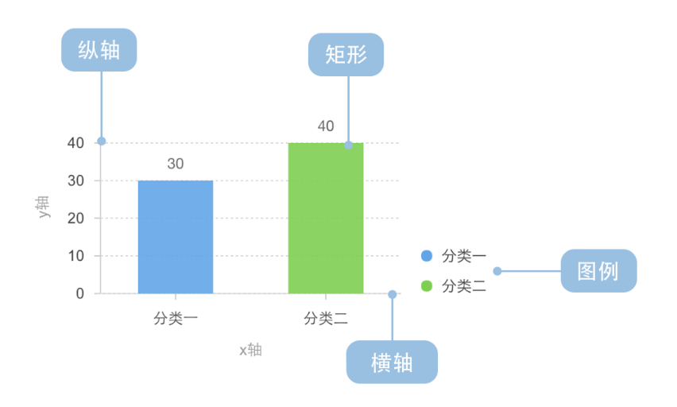
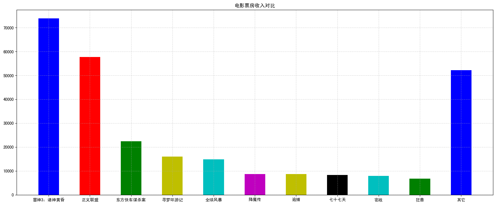
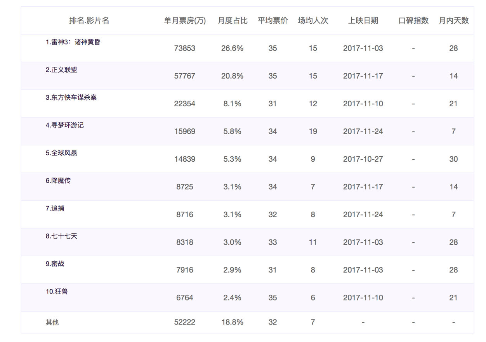
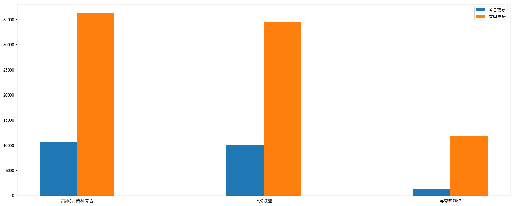

# 2.4. 柱状图bar

学习目标
----

*   目标
    *   应用bar实现柱状图的绘制
    *   知道柱状图的应用场景
*   应用
    *   电影票房收入绘制

2.4.1 柱状图绘制
-----------

### 需求1-对比每部电影的票房收入

电影数据如下图所示：

#### 1 准备数据

    ['雷神3：诸神黄昏','正义联盟','东方快车谋杀案','寻梦环游记','全球风暴', '降魔传','追捕','七十七天','密战','狂兽','其它']
    [73853,57767,22354,15969,14839,8725,8716,8318,7916,6764,52222]

#### 2 绘制

*   matplotlib.pyplot.bar(x, width, align='center', **kwargs)

绘制柱状图

    Parameters:    
    x : sequence of scalars.
    
    width : scalar or array-like, optional
    柱状图的宽度
    
    align : {‘center’, ‘edge’}, optional, default: ‘center’
    Alignment of the bars to the x coordinates:
    ‘center’: Center the base on the x positions.
    ‘edge’: Align the left edges of the bars with the x positions.
    每个柱状图的位置对齐方式
    
    **kwargs :
    color:选择柱状图的颜色
    
    Returns:    
    `.BarContainer`
    Container with all the bars and optionally errorbars.

代码：

    # 1）准备数据
    # 电影名字
    movie_name = ['雷神3：诸神黄昏','正义联盟','东方快车谋杀案','寻梦环游记','全球风暴','降魔传','追捕','七十七天','密战','狂兽','其它']
    # 横坐标
    x = range(len(movie_name))
    # 票房数据
    y = [73853,57767,22354,15969,14839,8725,8716,8318,7916,6764,52222]
    
    # 2）创建画布
    plt.figure(figsize=(20, 8), dpi=100)
    
    # 3）绘制柱状图
    plt.bar(x, y, width=0.5, color=['b','r','g','y','c','m','y','k','c','g','b'])
    
    # 修改x轴的刻度显示
    plt.xticks(x, movie_name)
    
    # 添加网格显示
    plt.grid(linestyle="--", alpha=0.5)
    
    # 添加标题
    plt.title("电影票房收入对比")
    
    # 4）显示图像
    plt.show()

### 需求2-如何对比电影票房收入才更能加有说服力？

### 比较相同天数的票房

有时候为了公平起见，我们需要对比不同电影首日和首周的票房

#### 1 准备数据

    movie_name = ['雷神3：诸神黄昏','正义联盟','寻梦环游记']
    
    first_day = [10587.6,10062.5,1275.7]
    first_weekend=[36224.9,34479.6,11830]
    
    数据来源: https://piaofang.maoyan.com/?ver=normal

效果如下：

#### 2 绘制

*   添加首日首周两部分的柱状图
*   x轴中文坐标位置调整

代码：

    # 1）准备数据
    movie_name = ['雷神3：诸神黄昏','正义联盟','寻梦环游记']
    
    first_day = [10587.6,10062.5,1275.7]
    first_weekend=[36224.9,34479.6,11830]
    
    x = range(len(movie_name))
    
    # 2）创建画布
    plt.figure(figsize=(20, 8), dpi=100)
    
    # 3）绘制柱状图
    plt.bar(x, first_day, width=0.2, label="首日票房")
    plt.bar([i+0.2 for i in x], first_weekend, width=0.2, label="首周票房")
    
    # 显示图例
    plt.legend()
    
    # 修改x轴刻度显示
    plt.xticks([i+0.1 for i in x], movie_name)
    
    # 4）显示图像
    plt.show()

2.4.2 柱状图应用场景
-------------

适合用在分类数据对比场景上

*   数量统计
*   用户数量对比分析