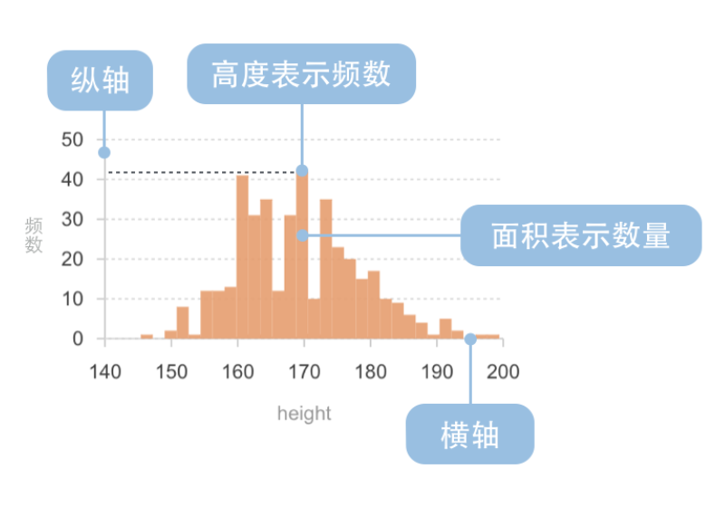
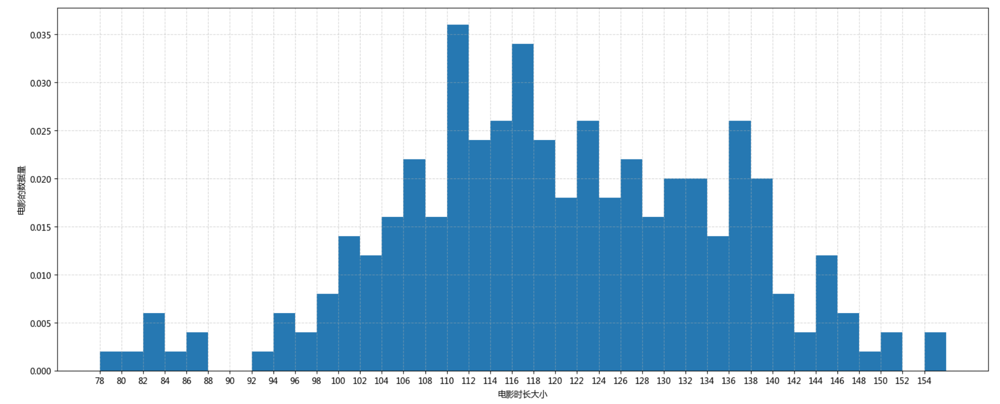

# 2.5. 直方图histogram

学习目标
----

* 目标
  *   应用hist实现直方图的绘制
  *   知道直方图图的应用场景
* 应用

  电影时长分布

2.5.1 直方图介绍
-----------

直方图，形状类似柱状图却有着与柱状图完全不同的含义。直方图牵涉统计学的概念，首先要对数据进行分组，然后统计每个分组内数据元的数量。 在坐标系中，横轴标出每个组的端点，纵轴表示频数，每个矩形的高代表对应的频数，称这样的统计图为频数分布直方图。

### 相关概念：

*   组数：在统计数据时，我们把数据按照不同的范围分成几个组，分成的组的个数称为组数
*   组距：每一组两个端点的差

2.5.2 直方图与柱状图的对比
----------------

*   柱状图是以矩形的长度表示每一组的频数或数量，其宽度(表示类别)则是固定的，**利于较小的数据集分析**。
*   直方图是以矩形的长度表示每一组的频数或数量，宽度则表示各组的组距，因此其高度与宽度均有意义，利于**展示大量数据集的统计结果**。
*   由于分组数据具有连续性，**直方图的各矩形通常是连续排列，而柱状图则是分开排列**。

2.5.3 直方图绘制
-----------

需求：电影时长分布状况
-----------

现有250部电影的时长，希望统计出这些电影时长的分布状态(比如时长为100分钟到120分钟电影的数量，出现的频率)等信息，你应该如何呈现这些数据？

数据：

    time = [131,  98, 125, 131, 124, 139, 131, 117, 128, 108, 135, 138, 131, 102, 107, 114, 119, 128, 121, 142, 127, 130, 124, 101, 110, 116, 117, 110, 128, 128, 115,  99, 136, 126, 134,  95, 138, 117, 111,78, 132, 124, 113, 150, 110, 117,  86,  95, 144, 105, 126, 130,126, 130, 126, 116, 123, 106, 112, 138, 123,  86, 101,  99, 136,123, 117, 119, 105, 137, 123, 128, 125, 104, 109, 134, 125, 127,105, 120, 107, 129, 116, 108, 132, 103, 136, 118, 102, 120, 114,105, 115, 132, 145, 119, 121, 112, 139, 125, 138, 109, 132, 134,156, 106, 117, 127, 144, 139, 139, 119, 140,  83, 110, 102,123,107, 143, 115, 136, 118, 139, 123, 112, 118, 125, 109, 119, 133,112, 114, 122, 109, 106, 123, 116, 131, 127, 115, 118, 112, 135,115, 146, 137, 116, 103, 144,  83, 123, 111, 110, 111, 100, 154,136, 100, 118, 119, 133, 134, 106, 129, 126, 110, 111, 109, 141,120, 117, 106, 149, 122, 122, 110, 118, 127, 121, 114, 125, 126,114, 140, 103, 130, 141, 117, 106, 114, 121, 114, 133, 137,  92,121, 112, 146,  97, 137, 105,  98, 117, 112,  81,  97, 139, 113,134, 106, 144, 110, 137, 137, 111, 104, 117, 100, 111, 101, 110,105, 129, 137, 112, 120, 113, 133, 112,  83,  94, 146, 133, 101,131, 116, 111,  84, 137, 115, 122, 106, 144, 109, 123, 116, 111,111, 133, 150]

效果：

### 1 直方图绘制api

matplotlib.pyplot.hist(x, bins=None, normed=None, **kwargs)

    Parameters:    
    x : (n,) array or sequence of (n,) arrays
    
    bins : integer or sequence or ‘auto’, optional
    组距

### 2 绘制

*   设置组距
*   设置组数（通常对于数据较少的情况，分为5~12组，数据较多，更换图形显示方式）
    *   通常设置组数会有相应公式：组数 = 极差/组距= (max-min)/bins

代码：

    # 1）准备数据
    time = [131,  98, 125, 131, 124, 139, 131, 117, 128, 108, 135, 138, 131, 102, 107, 114, 119, 128, 121, 142, 127, 130, 124, 101, 110, 116, 117, 110, 128, 128, 115,  99, 136, 126, 134,  95, 138, 117, 111,78, 132, 124, 113, 150, 110, 117,  86,  95, 144, 105, 126, 130,126, 130, 126, 116, 123, 106, 112, 138, 123,  86, 101,  99, 136,123, 117, 119, 105, 137, 123, 128, 125, 104, 109, 134, 125, 127,105, 120, 107, 129, 116, 108, 132, 103, 136, 118, 102, 120, 114,105, 115, 132, 145, 119, 121, 112, 139, 125, 138, 109, 132, 134,156, 106, 117, 127, 144, 139, 139, 119, 140,  83, 110, 102,123,107, 143, 115, 136, 118, 139, 123, 112, 118, 125, 109, 119, 133,112, 114, 122, 109, 106, 123, 116, 131, 127, 115, 118, 112, 135,115, 146, 137, 116, 103, 144,  83, 123, 111, 110, 111, 100, 154,136, 100, 118, 119, 133, 134, 106, 129, 126, 110, 111, 109, 141,120, 117, 106, 149, 122, 122, 110, 118, 127, 121, 114, 125, 126,114, 140, 103, 130, 141, 117, 106, 114, 121, 114, 133, 137,  92,121, 112, 146,  97, 137, 105,  98, 117, 112,  81,  97, 139, 113,134, 106, 144, 110, 137, 137, 111, 104, 117, 100, 111, 101, 110,105, 129, 137, 112, 120, 113, 133, 112,  83,  94, 146, 133, 101,131, 116, 111,  84, 137, 115, 122, 106, 144, 109, 123, 116, 111,111, 133, 150]
    
    # 2）创建画布
    plt.figure(figsize=(20, 8), dpi=100)
    
    # 3）绘制直方图
    # 设置组距
    distance = 2
    # 计算组数
    group_num = int((max(time) - min(time)) / distance)
    # 绘制直方图
    plt.hist(time, bins=group_num)
    
    # 修改x轴刻度显示
    plt.xticks(range(min(time), max(time))[::2])
    
    # 添加网格显示
    plt.grid(linestyle="--", alpha=0.5)
    
    # 添加x, y轴描述信息
    plt.xlabel("电影时长大小")
    plt.ylabel("电影的数据量")
    
    # 4）显示图像
    plt.show()

2.3.4 直方图的应用场景
--------------

*   用于表示分布情况
*   通过直方图还可以观察和估计哪些数据比较集中，异常或者孤立的数据分布在何处

例如：用户年龄分布，商品价格分布