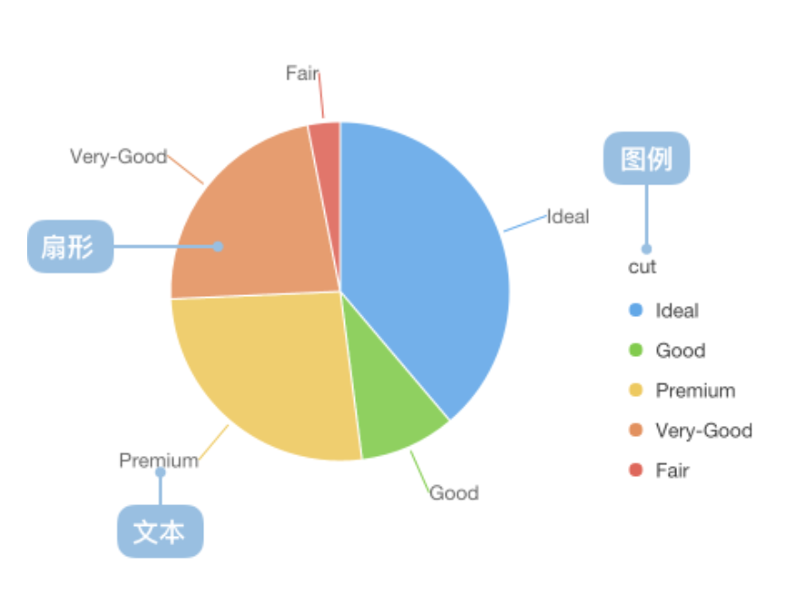
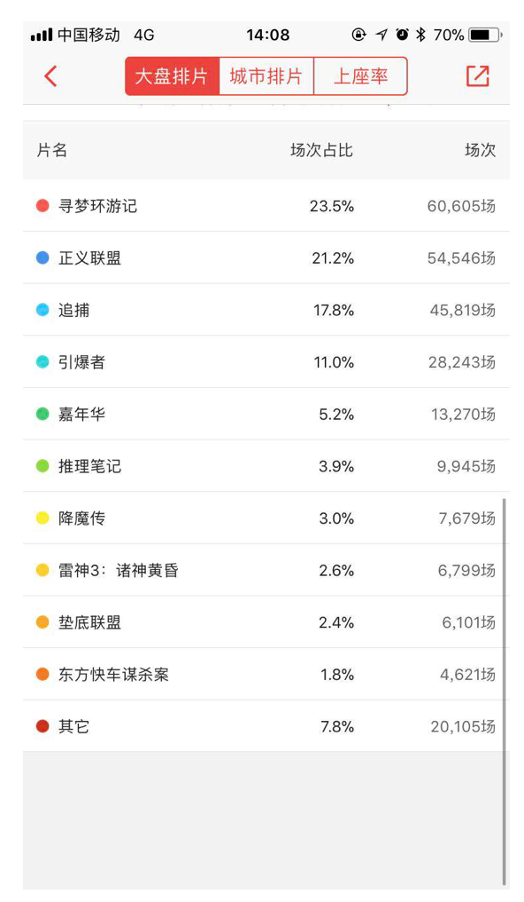
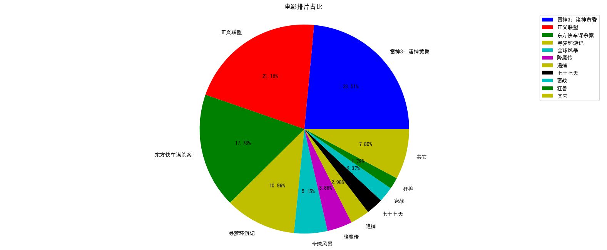
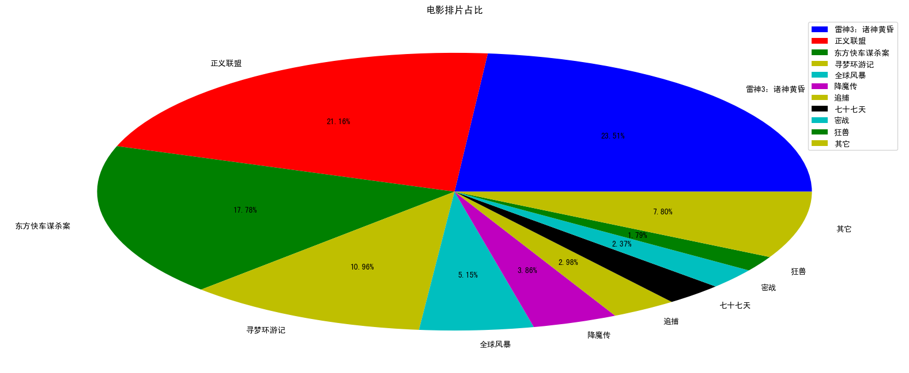

# 2.6. 饼图pie

学习目标
----

*   目标
    *   应用hist实现直方图的绘制
    *   知道直方图图的应用场景
*   应用
    *   电影时长分布

2.6.1 饼图介绍
----------

饼图广泛得应用在各个领域，用于表示不同分类的占比情况，通过弧度大小来对比各种分类。饼图通过将一个圆饼按照分类的占比划分成多个区块，整个圆饼代表数据的总量，每个区块（圆弧）表示该分类占总体的比例大小，所有区块（圆弧）的加和等于 100%。

2.6.2 饼图绘制
----------

### 需求：显示不同的电影的排片占比

电影排片：

数据：

    movie_name = ['雷神3：诸神黄昏','正义联盟','东方快车谋杀案','寻梦环游记','全球风暴','降魔传','追捕','七十七天','密战','狂兽','其它']
    
    place_count = [60605,54546,45819,28243,13270,9945,7679,6799,6101,4621,20105]

效果：

### 饼图api介绍

*   注意显示的百分比的位数
*   plt.pie(x, labels=,autopct=,colors)
    *   x:数量，自动算百分比
    *   labels:每部分名称
    *   autopct:占比显示指定%1.2f%%
    *   colors:每部分颜色

代码：

    # 1）准备数据
    movie_name = ['雷神3：诸神黄昏','正义联盟','东方快车谋杀案','寻梦环游记','全球风暴','降魔传','追捕','七十七天','密战','狂兽','其它']
    
    place_count = [60605,54546,45819,28243,13270,9945,7679,6799,6101,4621,20105]
    
    # 2）创建画布
    plt.figure(figsize=(20, 8), dpi=100)
    
    # 3）绘制饼图
    plt.pie(place_count, labels=movie_name, autopct="%1.2f%%", colors=['b','r','g','y','c','m','y','k','c','g','y'])
    
    # 显示图例
    plt.legend()
    
    # 添加标题
    plt.title("电影排片占比")
    
    # 4）显示图像
    plt.show()

### 添加axis

为了让显示的饼图保持圆形，需要添加axis保证长宽一样

    plt.axis('equal')

2.6.3 饼图应用场景
------------

*   分类的占比情况（不超过9个分类）

例如：班级男女分布占比，公司销售额占比