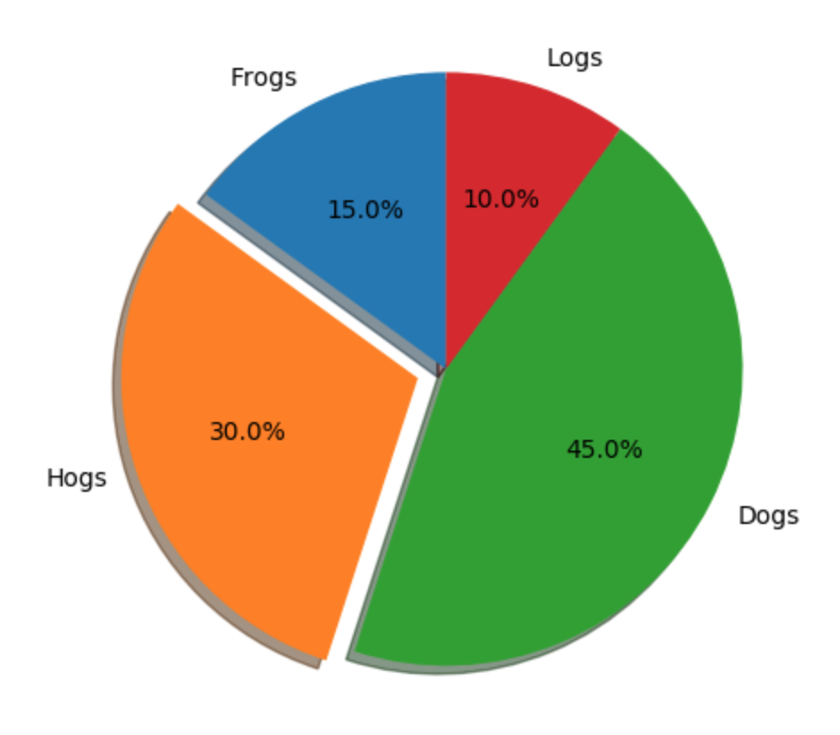

# 2.8. 每日作业

### 实现如下饼图

*   增加阴影
*   增加破裂效果

    import matplotlib.pyplot as plt
    
    # 1）准备参数
    labels = 'Frogs', 'Hogs', 'Dogs', 'Logs'
    sizes = [15, 30, 45, 10]
    explode = (0, 0.1, 0, 0)
    
    # 2）创建绘图区
    fig1, ax1 = plt.subplots()
    
    # 3）绘制饼图
    ax1.pie(sizes, explode=explode, labels=labels, autopct='%1.1f%%',
            shadow=True, startangle=90)
    
    # 4）显示正圆
    ax1.axis('equal')
    
    # 5）显示图像
    plt.show()
