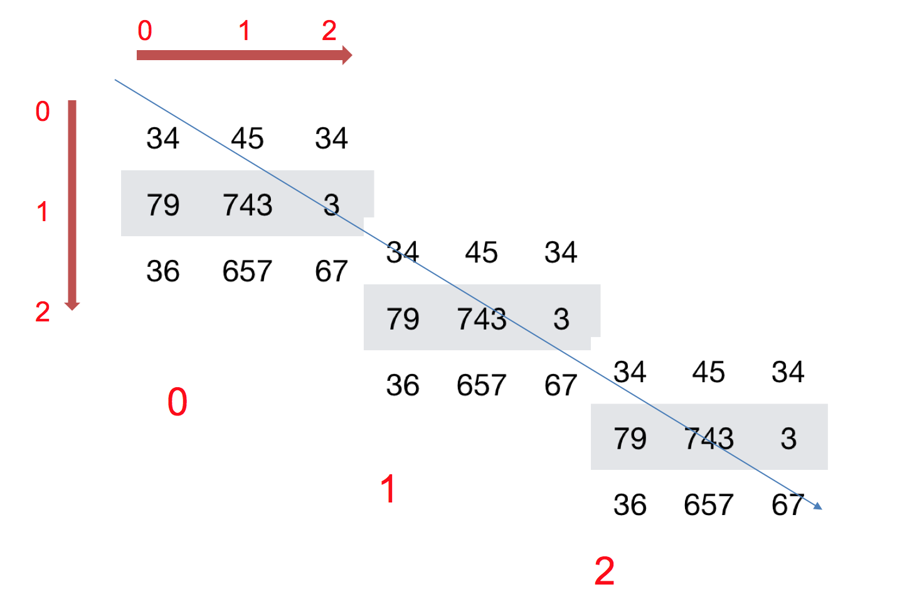

# 3.2. N维数组-ndarray

学习目标
----

*   目标
    *   说明数组的属性，形状、类型
*   应用
    *   无

3.2.1 ndarray的属性
----------------

数组属性反映了数组本身固有的信息。

属性名字

属性解释

ndarray.shape

数组维度的元组

ndarray.ndim

数组维数

ndarray.size

数组中的元素数量

ndarray.itemsize

一个数组元素的长度（字节）

ndarray.dtype

数组元素的类型

3.2.2 ndarray的形状
----------------

首先创建一些数组。

    # 创建不同形状的数组
    >>> a = np.array([[1,2,3],[4,5,6]])
    >>> b = np.array([1,2,3,4])
    >>> c = np.array([[[1,2,3],[4,5,6]],[[1,2,3],[4,5,6]]])

分别打印出形状

    >>> a.shape
    >>> b.shape
    >>> c.shape
    
    (2, 3)  # 二维数组
    (4,)    # 一维数组
    (2, 2, 3) # 三维数组

如何理解数组的形状？

二维数组：

三维数组：

3.2.3 ndarray的类型
----------------

    >>> type(score.dtype)
    
    <type 'numpy.dtype'>

dtype是numpy.dtype类型，先看看对于数组来说都有哪些类型

名称

描述

简写

np.bool

用一个字节存储的布尔类型（True或False）

'b'

np.int8

一个字节大小，-128 至 127

'i'

np.int16

整数，-32768 至 32767

'i2'

np.int32

整数，-2 **31 至 2** 32 -1

'i4'

np.int64

整数，-2 **63 至 2** 63 - 1

'i8'

np.uint8

无符号整数，0 至 255

'u'

np.uint16

无符号整数，0 至 65535

'u2'

np.uint32

无符号整数，0 至 2 ** 32 - 1

'u4'

np.uint64

无符号整数，0 至 2 ** 64 - 1

'u8'

np.float16

半精度浮点数：16位，正负号1位，指数5位，精度10位

'f2'

np.float32

单精度浮点数：32位，正负号1位，指数8位，精度23位

'f4'

np.float64

双精度浮点数：64位，正负号1位，指数11位，精度52位

'f8'

np.complex64

复数，分别用两个32位浮点数表示实部和虚部

'c8'

np.complex128

复数，分别用两个64位浮点数表示实部和虚部

'c16'

np.object_

python对象

'O'

np.string_

字符串

'S'

np.unicode_

unicode类型

'U'

#### 创建数组的时候指定类型

    >>> a = np.array([[1, 2, 3],[4, 5, 6]], dtype=np.float32)
    >>> a.dtype
    dtype('float32')
    
    >>> arr = np.array(['python', 'tensorflow', 'scikit-learn', 'numpy'], dtype = np.string_)
    >>> arr
    array([b'python', b'tensorflow', b'scikit-learn', b'numpy'], dtype='|S12')

*   注意：若不指定，整数默认int64，小数默认float64

3.2.4 总结
--------

知道数组的基本属性，不同形状的维度表示以及数组的类型