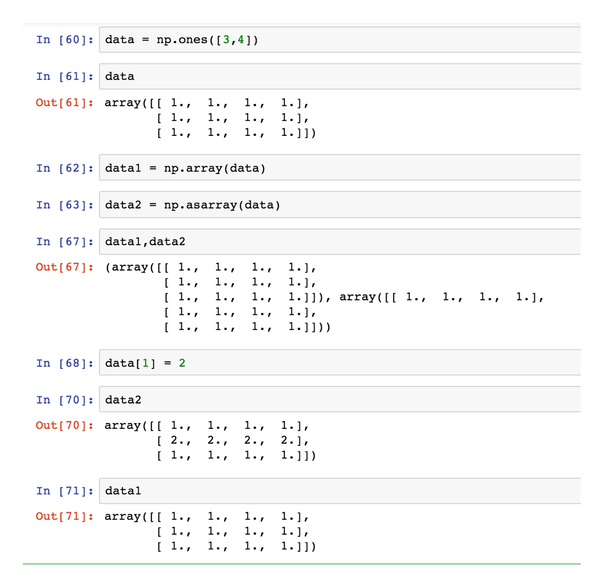
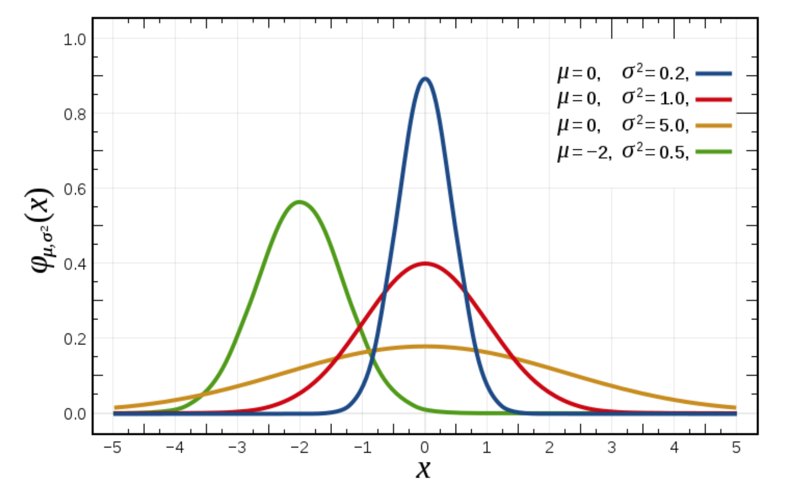

# 3.3. 基本操作

学习目标
----

*   目标
    *   理解数组的各种生成方法
    *   应用数组的索引机制实现数组的切片获取
    *   应用维度变换实现数组的形状改变
    *   应用类型变换实现数组类型改变
    *   应用数组的转换
*   应用
    *   应用正态分布实现模拟股票的涨跌幅数据操作

3.3.1 生成数组的方法
-------------

### 1 生成0和1的数组

* empty(shape\[, dtype, order\]) empty_like(a\[, dtype, order, subok\])  
  eye(N\[, M, k, dtype, order\])
* identity(n\[, dtype\])
* **ones(shape\[, dtype, order\])**
* ones_like(a\[, dtype, order, subok\])
* **zeros(shape\[, dtype, order\])** zeros_like(a\[, dtype, order, subok\])  
  full(shape, fill_value\[, dtype, order\])
* full\_like(a, fill\_value\[, dtype, order, subok\])

  >>> zero = np.zeros([3, 4])
  >>> array([[ 0.,  0.,  0.,  0.],
  >>>    [ 0.,  0.,  0.,  0.],
  >>>    [ 0.,  0.,  0.,  0.]])

### 2 从现有数组生成

* **array(object\[, dtype, copy, order, subok, ndmin\])**

* **asarray(a\[, dtype, order\])**

* asanyarray(a\[, dtype, order\]) ascontiguousarray(a\[, dtype\])
* asmatrix(data\[, dtype\])
* **copy(a\[, order\])**

  a = np.array([[1,2,3],[4,5,6]])
  # 从现有的数组当中创建
  a1 = np.array(a)
  # 相当于索引的形式，并没有真正的创建一个新的
  a2 = np.asarray(a)

#### 关于array和asarray的不同

### 3 生成固定范围的数组

*   np.linspace (start, stop, num, endpoint, retstep, dtype)

生成等间隔的序列

    start 序列的起始值
    stop 序列的终止值，
    如果endpoint为true，该值包含于序列中
    num 要生成的等间隔样例数量，默认为50
    endpoint 序列中是否包含stop值，默认为ture
    retstep 如果为true，返回样例，
    以及连续数字之间的步长
    dtype 输出ndarray的数据类型

    # 生成等间隔的数组
    np.linspace(0, 100, 10)

返回结果：

    array([  0.        ,  11.11111111,  22.22222222,  33.33333333,
            44.44444444,  55.55555556,  66.66666667,  77.77777778,
            88.88888889, 100.        ])

* 其它的还有
  *   numpy.arange(start,stop, step, dtype)
  *   numpy.logspace(start,stop, num, endpoint, base, dtype)

  np.arange(10, 50, 2)

返回结果：

    array([10, 12, 14, 16, 18, 20, 22, 24, 26, 28, 30, 32, 34, 36, 38, 40, 42,
           44, 46, 48])

### 4 生成随机数组

* np.random模块

  * 均匀分布

    * np.random.rand(_d0_, _d1_, _..._, _dn_)

      返回**\[0.0，1.0)**内的一组均匀分布的数。

    * **np.random.uniform(_low=0.0_, _high=1.0_, _size=None_)**

      功能：从一个均匀分布\[low,high)中随机采样，注意定义域是左闭右开，即包含low，不包含high.

      参数介绍:

      low: 采样下界，float类型，默认值为0；

      high: 采样上界，float类型，默认值为1；

      size: 输出样本数目，为int或元组(tuple)类型，例如，size=(m,n,k), 则输出m_n_k个样本，缺省时输出1个值。

      返回值：ndarray类型，其形状和参数size中描述一致。

    * np.random.randint(_low_, _high=None_, _size=None_, _dtype='l'_)

      从一个均匀分布中随机采样，生成一个整数或N维整数数组，取数范围：若high不为None时，取\[low,high)之间随机整数，否则取值\[0,low)之间随机整数。

  # 生成均匀分布的随机数
  x1 = np.random.uniform(-1, 1, 100000000)

返回结果：

    array([ 0.22411206,  0.31414671,  0.85655613, ..., -0.92972446,
    0.95985223,  0.23197723])

画图看分布状况：

    import matplotlib.pyplot as plt
    
    # 生成均匀分布的随机数
    x1 = np.random.uniform(-1, 1, 100000000)
    
    # 画图看分布状况
    # 1）创建画布
    plt.figure(figsize=(10, 10), dpi=100)
    
    # 2）绘制直方图
    plt.hist(x1, 1000)
    
    # 3）显示图像
    plt.show()

* 正态分布

  * np.random.randn(_d0, d1, …, dn_)

    功能：从标准正态分布中返回一个或多个样本值

  * **np.random.normal(_loc=0.0_, _scale=1.0_, _size=None_)**

    loc：float

     此概率分布的均值（对应着整个分布的中心centre）

    scale：float

     此概率分布的标准差（对应于分布的宽度，scale越大越矮胖，scale越小，越瘦高）

    size：int or tuple of ints

     输出的shape，默认为None，只输出一个值

  * np.random.standard_normal(_size=None_)

    返回指定形状的标准正态分布的数组。

#### 补充：正态分布（理解）

##### 1 什么是正态分布

正态分布是一种概率分布。正态分布是具有两个参数μ和σ的连续型随机变量的分布，第一参数μ是服从正态分布的随机变量的均值，第二个参数σ是此随机变量的方差，所以正态分布记作**N(μ，σ )**。

##### 2 正态分布的应用

生活、生产与科学实验中很多随机变量的概率分布都可以近似地用正态分布来描述。

##### 3 正态分布特点

**μ决定了其位置，其标准差σ**。决定了分布的幅度。当μ = 0,σ = 1时的正态分布是标准正态分布。

标准差如何来？

###### 3.1 方差

在概率论和统计学中衡量一组数据离散程度的度量

其中M为平均值，n为数据总个数，S为标准差，S^2可以理解一个整体为方差

###### 3.2 标准差与方差的意义

可以理解成数据的一个离散程度的衡量

    x2 = np.random.normal(1.75, 1, 100000000)

返回结果：

    array([2.90646763, 1.46737886, 2.21799024, ..., 1.56047411, 1.87969135,
           0.9028096 ])

    # 生成均匀分布的随机数
    x2 = np.random.normal(1.75, 1, 100000000)
    
    # 画图看分布状况
    # 1）创建画布
    plt.figure(figsize=(20, 10), dpi=100)
    
    # 2）绘制直方图
    plt.hist(x2, 1000)
    
    # 3）显示图像
    plt.show()

例如：我们可以模拟生成一组股票的涨跌幅的数据

案例：随机生成8只股票2周的交易日涨幅数据
---------------------

8只股票，**两周(10天)**的涨跌幅数据，如何获取？

*   两周的交易日数量为：2 X 5 =10
*   随机生成涨跌幅在某个正态分布内，比如均值0，方差1

### 股票涨跌幅数据的创建

    # 创建符合正态分布的8只股票10天的涨跌幅数据
    stock_change = np.random.normal(0, 1, (8, 10))
    stock_change

返回结果：

    array([[-0.03862668, -1.46128096, -0.75596237,  0.89737022, -1.86978433,
             0.38845392,  1.14856354, -1.10912275,  1.28900021, -0.86801677],
           [ 1.8701446 ,  0.50407342, -0.74396489, -1.69641331, -0.89969227,
             2.42459765,  0.78987443, -0.82935223,  0.82546455,  0.40524289],
           [-1.7365776 , -0.81501515, -1.08974743, -1.4138561 ,  0.85495155,
             0.30076624, -2.0813311 ,  1.52886975,  0.62945643, -1.48714683],
           [-1.12084983, -0.63070289, -0.20677245, -0.49096973, -0.40551104,
            -0.46320893, -0.73190969,  0.00392486,  2.524498  ,  0.25843191],
           [ 0.05001371,  0.52267878,  1.31974783,  0.64840953,  1.56360431,
            -0.79233575,  1.47275167,  0.61070343, -0.33247221, -0.57492172],
           [ 0.7092757 ,  0.00928591,  0.27008373,  0.79050681, -0.95887888,
             0.03661459,  0.81303927, -0.54139691,  0.69623969,  0.06570421],
           [-1.40481949,  0.49151272,  1.01992235,  1.89152928, -0.76415623,
             0.3100241 ,  1.27156806, -1.76199057, -0.77419965, -0.17574386],
           [-0.21745814, -1.78433763, -0.7953073 ,  0.4765644 , -0.2589575 ,
             0.97014013,  1.67321489,  1.73370987,  0.29886514,  1.27186522]])

3.3.2 数组的索引、切片
--------------

* 获取第一个股票的前3个交易日的涨跌幅数据

  # 二维的数组，两个维度 
  stock_change[0, 0:3]

返回结果：

    array([-0.03862668, -1.46128096, -0.75596237])

一维、二维、三维的数组如何索引？

    # 三维，一维
    a1 = np.array([ [[1,2,3],[4,5,6]], [[12,3,34],[5,6,7]]])
    # 返回结果
    array([[[ 1,  2,  3],
            [ 4,  5,  6]],
    
           [[12,  3, 34],
            [ 5,  6,  7]]])
    # 索引、切片
    >>> a1[0, 0, 1]   # 输出: 2

3.3.3 形状修改
----------

需求：让刚才的股票行、日期列反过来，变成日期行，股票列

* **ndarray.reshape(shape\[, order\]) Returns an array containing the same data with a new shape.**

  # 在转换形状的时候，一定要注意数组的元素匹配
  stock_change.reshape([10, 8]) # 只是将形状进行了修改，但并没有将行列进行转换
  stock_change.reshape([-1,20])  # 数组的形状被修改为: (4, 20), -1: 表示通过待计算

* **ndarray.T 数组的转置**
  *   将数组的行、列进行互换

  stock_change.shape
  (8, 10)
  stock_change.T.shape
  (10, 8)

* **ndarray.resize(new_shape\[, refcheck\]) Change shape and size of array in-place.**

  stock_change.resize([10, 8])

3.3.4 类型修改
----------

* **ndarray.astype(type)**

  stock_change.astype(np.int32)

* **ndarray.tostring(\[order\])或者ndarray.tobytes(\[order\]) Construct Python bytes containing the raw data bytes in the array.**
  *   转换成bytes

  arr = np.array([[[1, 2, 3], [4, 5, 6]], [[12, 3, 34], [5, 6, 7]]])
  arr.tostring()

拓展：如果遇到

    IOPub data rate exceeded.
        The notebook server will temporarily stop sending output
        to the client in order to avoid crashing it.
        To change this limit, set the config variable
        `--NotebookApp.iopub_data_rate_limit`.

这个问题是在jupyer当中对输出的字节数有限制，需要去修改配置文件

创建配置文件

    jupyter notebook --generate-config
    vi ~/.jupyter/jupyter_notebook_config.py

取消注释,多增加

    ## (bytes/sec) Maximum rate at which messages can be sent on iopub before they
    #  are limited.
    c.NotebookApp.iopub_data_rate_limit = 10000000

**但是不建议这样去修改，jupyter输出太大会崩溃**

3.3.5 数组的去重
-----------

* **ndarray.unique**

  temp = np.array([[1, 2, 3, 4],[3, 4, 5, 6]])
  >>> np.unique(temp)
  >>> array([1, 2, 3, 4, 5, 6])

3.3.6 小结
--------

*   创建数组
    *   均匀
    *   **随机（正态分布）**
*   正态分布
*   数组索引
*   数组形状改变
*   数组类型
    *   reshape
    *   resize
*   数组转换
    *   T
    *   tostring
    *   unique