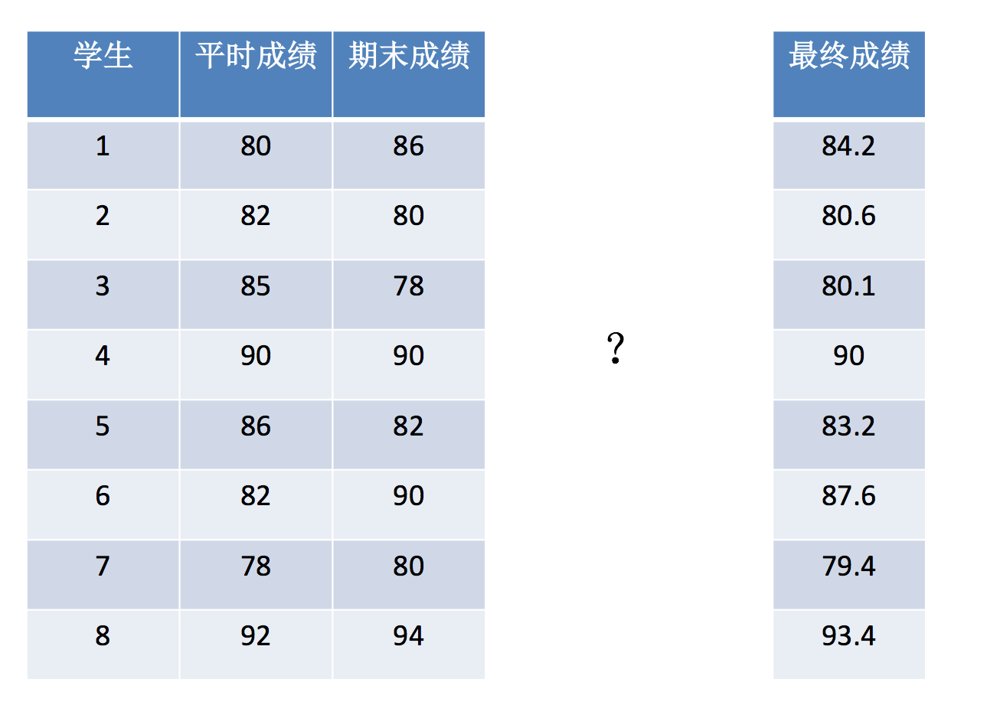
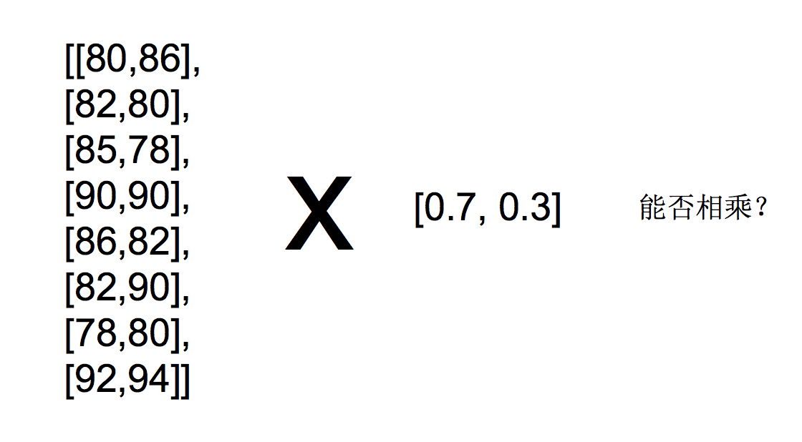
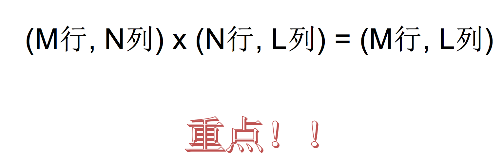
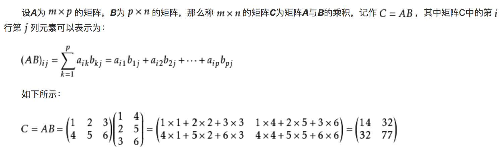

# 3.5. 数组间的运算

学习目标
----

* 目标

  *   说明数组间运算的广播机制
  *   知道数组与数之间的运算
  *   知道数组与数组之间的运算
  *   理解矩阵的特点以及运算规则
  *   应用np.matmul实现矩阵运算
* 应用

  * 学生综合成绩矩阵运算

3.5.1 场景
--------

数据：

    [[80, 86],
    [82, 80],
    [85, 78],
    [90, 90],
    [86, 82],
    [82, 90],
    [78, 80],
    [92, 94]]

3.5.2 数组与数的运算
-------------

    arr = np.array([[1, 2, 3, 2, 1, 4], [5, 6, 1, 2, 3, 1]])
    arr + 1
    arr / 2
    
    # 可以对比python列表的运算，看出区别
    a = [1, 2, 3, 4, 5]
    a * 3

3.5.3 数组与数组的运算
--------------

    arr1 = np.array([[1, 2, 3, 2, 1, 4], [5, 6, 1, 2, 3, 1]])
    arr2 = np.array([[1, 2, 3, 4], [3, 4, 5, 6]])

上面这个能进行运算吗，结果是不行的！

3.5.4 广播机制
----------

**执行 broadcast 的前提在于，两个 ndarray 执行的是 element-wise的运算，Broadcast机制的功能是为了方便不同形状的ndarray（numpy库的核心数据结构）进行数学运算。**

当操作两个数组时，numpy会逐个比较它们的shape（构成的元组tuple），只有在下述情况下，两个数组才能够进行数组与数组的运算。

*   维度相等
*   shape（其中相对应的一个地方为1）

例如：

    Image (3d array):  256 x 256 x 3
    Scale (1d array):              3
    Result (3d array): 256 x 256 x 3
    
    A      (4d array):  9 x 1 x 7 x 1
    B      (3d array):      8 x 1 x 5
    Result (4d array):  9 x 8 x 7 x 5
    
    A      (2d array):  5 x 4
    B      (1d array):      1
    Result (2d array):  5 x 4
    
    A      (2d array):  15 x 3 x 5
    B      (1d array):  15 x 1 x 1
    Result (2d array):  15 x 3 x 5

如果是下面这样，则不匹配：

    A  (1d array): 10
    B  (1d array): 12
    A  (2d array):      2 x 1
    B  (3d array):  8 x 4 x 3

**思考：下面两个ndarray是否能够进行运算？**

    arr1 = np.array([[1, 2, 3, 2, 1, 4], [5, 6, 1, 2, 3, 1]])
    arr2 = np.array([[1], [3]])

3.5.5 矩阵运算
----------

现在再次回到最开始的学生成绩问题：

**思考：如何能够直接得出每个学生的成绩？**

### 1 什么是矩阵

矩阵，英文matrix，**和array的区别矩阵必须是2维的，但是array可以是多维的。**

* np.mat()
  *   将数组转换成矩阵类型

  a = np.array([[80, 86],
  [82, 80],
  [85, 78],
  [90, 90],
  [86, 82],
  [82, 90],
  [78, 80],
  [92, 94]])
  b = np.array([[0.7], [0.3]])

  np.mat(a)

### 2 矩阵乘法运算

矩阵乘法的两个关键：

*   形状改变
*   运算规则

形状改变：

必须符合上面的式子，否则运算出错。

运算规则：

**矩阵乘法api：**

* np.matmul
* np.dot

  >>> a = np.array([[80, 86],
  >>> [82, 80],
  >>> [85, 78],
  >>> [90, 90],
  >>> [86, 82],
  >>> [82, 90],
  >>> [78, 80],
  >>> [92, 94]])
  >>> b = np.array([[0.7], [0.3]])

  >>> np.matmul(a, b)
  >>> array([[81.8],
  >>>    [81.4],
  >>>    [82.9],
  >>>    [90. ],
  >>>    [84.8],
  >>>    [84.4],
  >>>    [78.6],
  >>>    [92.6]])
  >>> np.dot(a,b)
  >>> array([[81.8],
  >>>    [81.4],
  >>>    [82.9],
  >>>    [90. ],
  >>>    [84.8],
  >>>    [84.4],
  >>>    [78.6],
  >>>    [92.6]])

#### 3 矩阵应用场景

**大部分机器学习算法需要用到**