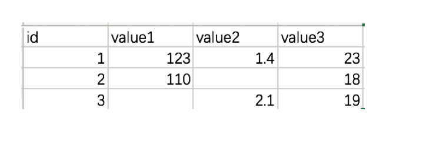

# 3.7. IO操作与数据处理

学习目标
----

*   目标
    *   知道Numpy文件的读取
*   应用
    *   无

3.7.1 问题
--------

大多数数据并不是我们自己构造的，而是存在文件当中，需要我们用工具获取。

但是Numpy其实并不适合用来读取和处理数据，因此我们这里了解相关API，以及Numpy不方便的地方即可。

3.7.2 Numpy读取
-------------

*   genfromtxt(fname\[, dtype, comments, ...\]) Load data from a text file, with missing values handled as specified.

    # 读取数据
    test = np.genfromtxt("test.csv", delimiter=',')

返回结果：

    array([[  nan,   nan,   nan,   nan],
           [  1. , 123. ,   1.4,  23. ],
           [  2. , 110. ,   nan,  18. ],
           [  3. ,   nan,   2.1,  19. ]])

3.7.3 如何处理缺失值
-------------

#### 1 什么是缺失值

什么时候numpy中会出现nan：当我们读取本地的文件为float的时候，如果有缺失(或者为None)，就会出现nan

#### 2 缺失值处理

那么，在一组数据中单纯的把nan替换为0，合适么？会带来什么样的影响？

比如，全部替换为0后，替换之前的平均值如果大于0，替换之后的均值肯定会变小，所以更一般的方式是把缺失的数值替换为均值（中值）或者是直接删除有缺失值的一行

所以：

* 如何计算一组数据的中值或者是均值
* 如何删除有缺失数据的那一行（列）**在pandas中介绍**

  t中存在nan值，如何操作把其中的nan填充为每一列的均值
  t = array([[  0.,   1.,   2.,   3.,   4.,   5.],
  ​       [  6.,   7.,  nan,   9.,  10.,  11.],
  ​       [ 12.,  13.,  14.,  nan,  16.,  17.],
  ​       [ 18.,  19.,  20.,  21.,  22.,  23.]])

处理逻辑：

看了上面的处理过程，非常麻烦，别担心之后我们会介绍强大的Pandas工具进行处理！！