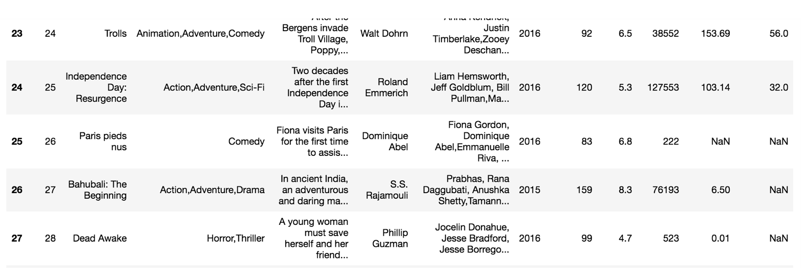
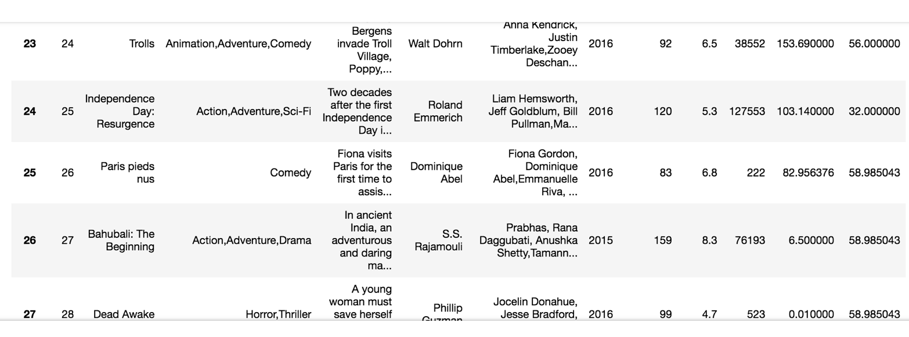
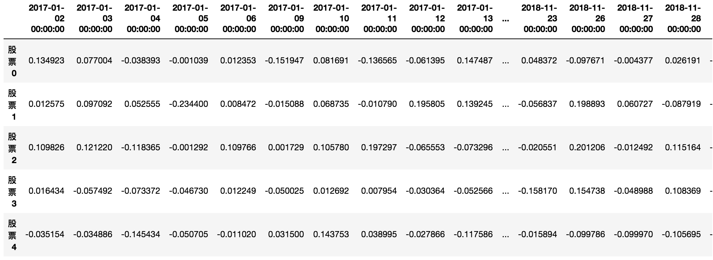
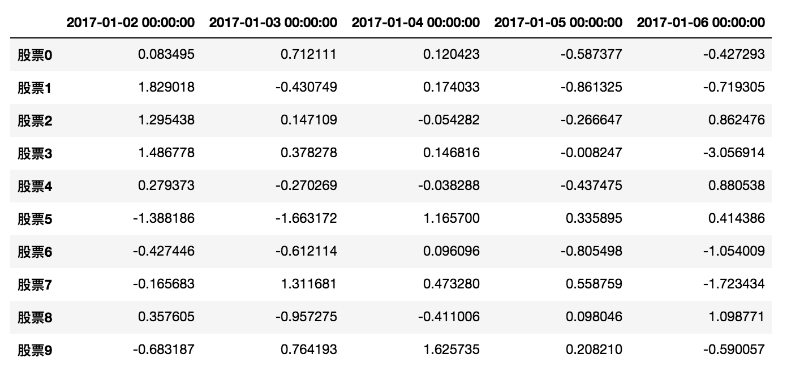
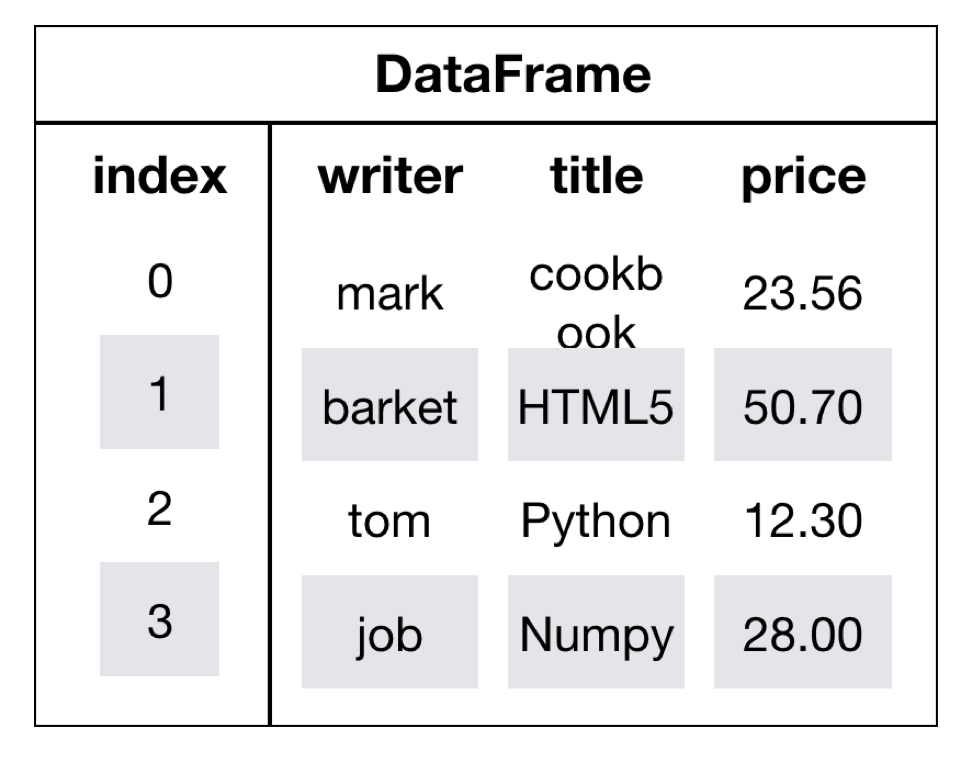
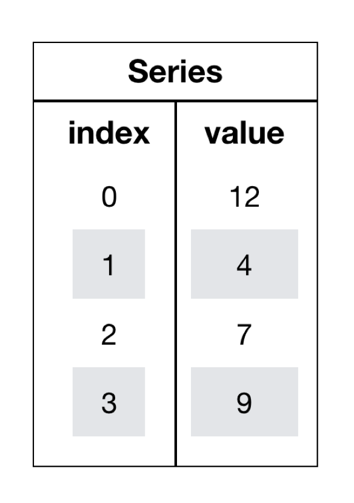

# 4.1. Pandas介绍

学习目标
----

*   目标
    *   了解Numpy与Pandas的不同
    *   了解Pandas的MultiIndex与panel结构
    *   说明Pandas的Series与Dataframe两种结构的区别
*   应用
    *   股票涨跌幅数据的修改

4.1.1 Pandas介绍
--------------

*   2008年WesMcKinney开发出的库
*   专门用于数据挖掘的开源python库
*   **以Numpy为基础，借力Numpy模块在计算方面性能高的优势**
*   **基于matplotlib，能够简便的画图**
*   **独特的数据结构**

4.1.2 为什么使用Pandas
-----------------

Numpy已经能够帮助我们处理数据，能够结合matplotlib解决部分数据展示等问题，那么pandas学习的目的在什么地方呢？

*   **便捷的数据处理能力**

*   **读取文件方便**
*   **封装了Matplotlib、Numpy的画图和计算**

4.1.3 案例：
---------

**回忆我们在numpy当中创建的股票涨跌幅数据形式？**

    # 创建一个符合正态分布的10个股票5天的涨跌幅数据
    stock_change = np.random.normal(0, 1, (10, 5))
    
    array([[-0.06544031, -1.30931491, -1.45451514,  0.57973008,  1.48602405],
           [-1.73216741, -0.83413717,  0.45861517, -0.80391793, -0.46878575],
           [ 0.21805567,  0.19901371,  0.7134683 ,  0.5484263 ,  0.38623412],
           [-0.42207879, -0.33702398,  0.42328531, -1.23079202,  1.32843773],
           [-1.72530711,  0.07591832, -1.91708358, -0.16535818,  1.07645091],
           [-0.81576845, -0.28675278,  1.20441981,  0.73365951, -0.06214496],
           [-0.98820861, -1.01815231, -0.95417342, -0.81538991,  0.50268175],
           [-0.10034128,  0.61196204, -0.06850331,  0.74738433,  0.143011  ],
           [ 1.00026175,  0.34241958, -2.2529711 ,  0.93921064,  1.14080312],
           [ 2.52064693,  1.55384756,  1.72252984,  0.61270132,  0.60888092]])

**但是这样的数据形式很难看到存储的是什么样的数据，并且也很难获取相应的数据，比如需要获取某个指定股票的数据，就很难去获取！！**

#### 问题：如何让数据更有意义的显示？

    # 使用Pandas中的数据结构
    stock_change = pd.DataFrame(stock_change)

#### 给股票涨跌幅数据增加行列索引，显示效果更佳

效果：

* 增加行索引

  # 构造行索引序列
  stock_code = ['股票' + str(i) for i in range(stock_change.shape[0])]

  # 添加行索引
  data = pd.DataFrame(stock_change, index=stock_code)

* 增加列索引

股票的日期是一个时间的序列，我们要实现从前往后的时间还要考虑每月的总天数等，不方便。使用pd.date_range()：用于生成一组连续的时间序列(暂时了解)

    date_range(start=None,end=None, periods=None, freq='B')
    
        start:开始时间
    
        end:结束时间
    
        periods:时间天数
    
        freq:递进单位，默认1天,'B'默认略过周末

    # 生成一个时间的序列，略过周末非交易日
    date = pd.date_range('2017-01-01', periods=stock_change.shape[1], freq='B')
    
    # index代表行索引，columns代表列索引
    data = pd.DataFrame(stock_change, index=stock_index, columns=date)

4.1.4 DataFrame
---------------

### 4.1.4.1 DataFrame结构

DataFrame对象既有行索引，又有列索引

*   行索引，表明不同行，横向索引，叫index
*   列索引，表名不同列，纵向索引，叫columns

### 4.1.4.2 DatatFrame的属性

常用属性：

* **shape**

  data.shape
  # 结果
  (10, 5)

* **index**

DataFrame的行索引列表

    data.index
    
    Index(['股票0', '股票1', '股票2', '股票3', '股票4', '股票5', '股票6', '股票7', '股票8', '股票9'], dtype='object')

*   **columns**

DataFrame的列索引列表

    data.columns
    
    DatetimeIndex(['2017-01-02', '2017-01-03', '2017-01-04', '2017-01-05',
                   '2017-01-06'],
                  dtype='datetime64[ns]', freq='B')

*   **values**

直接获取其中array的值

    data.values
    
    array([[-0.06544031, -1.30931491, -1.45451514,  0.57973008,  1.48602405],
           [-1.73216741, -0.83413717,  0.45861517, -0.80391793, -0.46878575],
           [ 0.21805567,  0.19901371,  0.7134683 ,  0.5484263 ,  0.38623412],
           [-0.42207879, -0.33702398,  0.42328531, -1.23079202,  1.32843773],
           [-1.72530711,  0.07591832, -1.91708358, -0.16535818,  1.07645091],
           [-0.81576845, -0.28675278,  1.20441981,  0.73365951, -0.06214496],
           [-0.98820861, -1.01815231, -0.95417342, -0.81538991,  0.50268175],
           [-0.10034128,  0.61196204, -0.06850331,  0.74738433,  0.143011  ],
           [ 1.00026175,  0.34241958, -2.2529711 ,  0.93921064,  1.14080312],
           [ 2.52064693,  1.55384756,  1.72252984,  0.61270132,  0.60888092]])

*   **T**

转置

    data.T

返回结果：

常用方法：

*   **head(5)**：显示前5行内容

如果不补充参数，默认5行。填入参数N则显示前N行

    data.head(5)
    
    2017-01-02 00:00:00    2017-01-03 00:00:00    2017-01-04 00:00:00    2017-01-05 00:00:00    2017-01-06 00:00:00
    股票0    -0.065440    -1.309315    -1.454515    0.579730    1.486024
    股票1    -1.732167    -0.834137    0.458615    -0.803918    -0.468786
    股票2    0.218056    0.199014    0.713468    0.548426    0.386234
    股票3    -0.422079    -0.337024    0.423285    -1.230792    1.328438
    股票4    -1.725307    0.075918    -1.917084    -0.165358    1.076451

*   **tail(5)**:显示后5行内容

如果不补充参数，默认5行。填入参数N则显示后N行

    data.tail(5)
    
     2017-01-02 00:00:00    2017-01-03 00:00:00    2017-01-04 00:00:00    2017-01-05 00:00:00    2017-01-06 00:00:00
    股票5    -0.815768    -0.286753    1.204420    0.733660    -0.062145
    股票6    -0.988209    -1.018152    -0.954173    -0.815390    0.502682
    股票7    -0.100341    0.611962    -0.068503    0.747384    0.143011
    股票8    1.000262    0.342420    -2.252971    0.939211    1.140803
    股票9    2.520647    1.553848    1.722530    0.612701    0.608881

### 4.1.4.3 DatatFrame索引的设置

*   **修改行列索引值**

注意：以下修改方式是错误的

    # 错误修改方式
    data.index[3] = '股票_3'

正确的方式：

    stock_code = ["股票_" + str(i) for i in range(stock_change.shape[0])]
    
    # 必须整体全部修改
    data.index = stock_code

结果

    2017-01-02 00:00:00    2017-01-03 00:00:00    2017-01-04 00:00:00    2017-01-05 00:00:00    2017-01-06 00:00:00
    股票_0    -0.065440    -1.309315    -1.454515    0.579730    1.486024
    股票_1    -1.732167    -0.834137    0.458615    -0.803918    -0.468786
    股票_2    0.218056    0.199014    0.713468    0.548426    0.386234
    股票_3    -0.422079    -0.337024    0.423285    -1.230792    1.328438
    股票_4    -1.725307    0.075918    -1.917084    -0.165358    1.076451
    股票_5    -0.815768    -0.286753    1.204420    0.733660    -0.062145
    股票_6    -0.988209    -1.018152    -0.954173    -0.815390    0.502682
    股票_7    -0.100341    0.611962    -0.068503    0.747384    0.143011
    股票_8    1.000262    0.342420    -2.252971    0.939211    1.140803
    股票_9    2.520647    1.553848    1.722530    0.612701    0.608881

* **重设索引**
  *   reset_index(drop=False)
      *   设置新的下标索引
      *   drop:默认为False，不删除原来索引，如果为True,删除原来的索引值

  # 重置索引,drop=False
  data.reset_index()

      index    2017-01-02 00:00:00    2017-01-03 00:00:00    2017-01-04 00:00:00    2017-01-05 00:00:00    2017-01-06 00:00:00
  0    股票_0    -0.065440    -1.309315    -1.454515    0.579730    1.486024
  1    股票_1    -1.732167    -0.834137    0.458615    -0.803918    -0.468786
  2    股票_2    0.218056    0.199014    0.713468    0.548426    0.386234
  3    股票_3    -0.422079    -0.337024    0.423285    -1.230792    1.328438
  4    股票_4    -1.725307    0.075918    -1.917084    -0.165358    1.076451
  5    股票_5    -0.815768    -0.286753    1.204420    0.733660    -0.062145
  6    股票_6    -0.988209    -1.018152    -0.954173    -0.815390    0.502682
  7    股票_7    -0.100341    0.611962    -0.068503    0.747384    0.143011
  8    股票_8    1.000262    0.342420    -2.252971    0.939211    1.140803
  9    股票_9    2.520647    1.553848    1.722530    0.612701    0.608881

  # 重置索引,drop=True
  data.reset_index(drop=True)

  2017-01-02 00:00:00    2017-01-03 00:00:00    2017-01-04 00:00:00    2017-01-05 00:00:00    2017-01-06 00:00:00
  0    -0.065440    -1.309315    -1.454515    0.579730    1.486024
  1    -1.732167    -0.834137    0.458615    -0.803918    -0.468786
  2    0.218056    0.199014    0.713468    0.548426    0.386234
  3    -0.422079    -0.337024    0.423285    -1.230792    1.328438
  4    -1.725307    0.075918    -1.917084    -0.165358    1.076451
  5    -0.815768    -0.286753    1.204420    0.733660    -0.062145
  6    -0.988209    -1.018152    -0.954173    -0.815390    0.502682
  7    -0.100341    0.611962    -0.068503    0.747384    0.143011
  8    1.000262    0.342420    -2.252971    0.939211    1.140803
  9    2.520647    1.553848    1.722530    0.612701    0.608881

* **以某列值设置为新的索引**
  *   set_index(_keys_, _drop=True_)
      *   **keys** : 列索引名成或者列索引名称的列表
      *   **drop** : boolean, default True.当做新的索引，删除原来的列

#### 设置新索引案例

* 1、创建

  df = pd.DataFrame({'month': [1, 4, 7, 10],
  ​                    'year': [2012, 2014, 2013, 2014],
  ​                    'sale':[55, 40, 84, 31]})

     month  sale  year
  0  1      55    2012
  1  4      40    2014
  2  7      84    2013
  3  10     31    2014

* 2、以月份设置新的索引

  df.set_index('month')
  ​       sale  year
  month
  1      55    2012
  4      40    2014
  7      84    2013
  10     31    2014

* 3、设置多个索引，以年和月份

  df.set_index(['year', 'month'])
  ​            sale
  year  month
  2012  1     55
  2014  4     40
  2013  7     84
  2014  10    31

> 注：通过刚才的设置，这样DataFrame就变成了一个具有MultiIndex的DataFrame。

4.1.5 MultiIndex与Panel
----------------------

打印刚才的df的行索引结果

    df.index
    
    MultiIndex(levels=[[2012, 2013, 2014], [1, 4, 7, 10]],
               labels=[[0, 2, 1, 2], [0, 1, 2, 3]],
               names=['year', 'month'])

### 4.1.5.1 MultiIndex

多级或分层索引对象。

* index属性
  *   names：levels的名称
  *   levels：每个level的元组值

  df.index.names
  FrozenList(['year', 'month'])

  df.index.levels
  FrozenList([[2012, 2013, 2014], [1, 4, 7, 10]])

### 4.1.5.2 Panel

* _class_ `pandas.Panel`(_data=None_, _items=None_, _major_axis=None_, _minor_axis=None_, _copy=False_, _dtype=None_)
  *   存储3维数组的Panel结构

  p = pd.Panel(np.arange(24).reshape(4,3,2),
  ​                 items=list('ABCD'),
  ​                 major_axis=pd.date_range('20130101', periods=3),
  ​                 minor_axis=['first', 'second'])
  p

  <class 'pandas.core.panel.Panel'>
  Dimensions: 4 (items) x 3 (major_axis) x 2 (minor_axis)
  Items axis: A to D
  Major_axis axis: 2013-01-01 00:00:00 to 2013-01-03 00:00:00
  Minor_axis axis: first to second

* _items_ \- `axis 0`，每个项目对应于内部包含的数据帧(DataFrame)。
* _major_axis_ \- `axis 1`，它是每个数据帧(DataFrame)的索引(行)。
* _minor_axis_ \- `axis 2`，它是每个数据帧(DataFrame)的列。

> **注：Pandas从版本0.20.0开始弃用：推荐的用于表示3D数据的方法是DataFrame上的MultiIndex方法**

**思考：如果获取DataFrame中某个股票的不同时间数据？这样的结构是什么？**

### 4.1.6 Series结构

什么是Series结构呢，我们直接看下面的图：

*   series结构只有行索引

我们将之前的涨跌幅数据进行转置，然后获取'股票0'的所有数据

    data = data.T
    # series
    type(data['股票_0'])
    pandas.core.series.Series
    
    # 这一步相当于是series去获取行索引的值
    data['股票_0']['2017-01-02']
    -0.18753158283513574

### 4.1.6.1 创建series

通过已有数据创建

* 指定内容，默认索引

  pd.Series(np.arange(10))

* 指定索引

  pd.Series([6.7, 5.6, 3, 10, 2], index=[1, 2, 3, 4, 5])

通过字典数据创建

    pd.Series({'red':100, 'blue':200, 'green': 500, 'yellow':1000})

### 4.1.6.2 series获取索引和值

*   index
*   values

4.1.7、小结
--------

*   说明pandas的三种数据结构