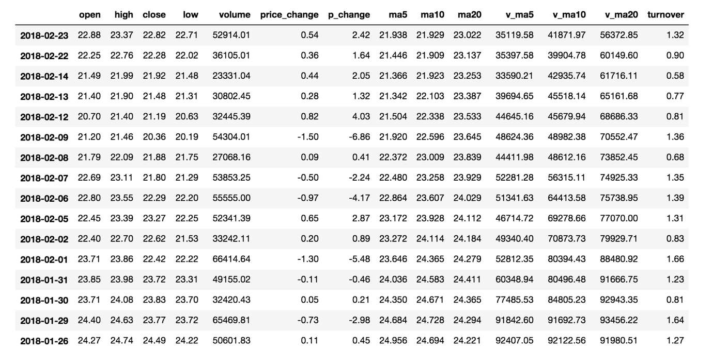

# 4.2. 基本数据操作

学习目标
----

*   目标
    *   记忆DataFrame的形状、行列索引名称获取等基本属性
    *   应用Series和DataFrame的索引进行切片获取
    *   应用sort\_index和sort\_values实现索引和值的排序
*   应用
    *   股票每日数据的操作

为了更好的理解这些基本操作，我们将读取一个真实的股票数据。关于文件操作，后面在介绍，这里只先用一下API

    # 读取文件
    data = pd.read_csv("./stock_day/stock_day.csv")
    
    # 删除一些列，让数据更简单些，再去做后面的操作
    data = data.drop(["ma5","ma10","ma20","v_ma5","v_ma10","v_ma20"], axis=1)

4.2.1 索引操作
----------

Numpy当中我们已经讲过使用索引选取序列和切片选择，pandas也支持类似的操作，也可以直接使用列名、行名

称，甚至组合使用。

### 4.2.1.1 **直接使用行列索引(先列后行)**

获取'2018-02-27'这天的'close'的结果

    # 直接使用行列索引名字的方式（先列后行）
    data['open']['2018-02-27']
    23.53
    
    # 不支持的操作
    # 错误
    data[['2018-02-27']]['open']
    # 错误
    data[:1, :2]

### 4.2.1.2 **结合loc或者iloc使用索引**

获取从'2018-02-27':'2018-02-22'，'open'的结果

    # 使用loc:只能指定行列索引的名字
    data.loc['2018-02-27':'2018-02-22', 'open']
    
    2018-02-27    23.53
    2018-02-26    22.80
    2018-02-23    22.88
    Name: open, dtype: float64
    
    # 使用iloc可以通过索引的下标去获取
    # 获取前100天数据的'open'列的结果
    data.iloc[0:100, 0:2].head()
    
                open    high    close    low
    2018-02-27    23.53    25.88    24.16    23.53
    2018-02-26    22.80    23.78    23.53    22.80
    2018-02-23    22.88    23.37    22.82    22.71

#### 4.2.1.3 **使用ix组合索引**

> Warning:Starting in 0.20.0, the `.ix` indexer is deprecated, in favor of the more strict `.iloc` and `.loc` indexers.

获取行第1天到第4天，\['open', 'close', 'high', 'low'\]这个四个指标的结果

    # 使用ix进行下表和名称组合做引
    data.ix[0:4, ['open', 'close', 'high', 'low']]
    
    # 推荐使用loc和iloc来获取的方式
    data.loc[data.index[0:4], ['open', 'close', 'high', 'low']]
    data.iloc[0:4, data.columns.get_indexer(['open', 'close', 'high', 'low'])]
    
                open    close    high    low
    2018-02-27    23.53    24.16    25.88    23.53
    2018-02-26    22.80    23.53    23.78    22.80
    2018-02-23    22.88    22.82    23.37    22.71
    2018-02-22    22.25    22.28    22.76    22.02

4.2.2 赋值操作
----------

对DataFrame当中的close列进行重新赋值为1

    # 直接修改原来的值
    data['close'] = 1
    # 或者
    data.close = 1

4.2.3 排序
--------

排序有两种形式，一种对内容进行排序，一种对索引进行排序

#### DataFrame

* 使用df.sort_values(key=, ascending=)对内容进行排序
  *   单个键或者多个键进行排序,默认升序
  *   ascending=False:降序
  *   ascending=True:升序

  # 按照涨跌幅大小进行排序 , 使用ascending指定按照大小排序
  data = data.sort_values(by='p_change', ascending=False).head()

              open    high    close    low        volume price_change p_change turnover
  2015-08-28    15.40    16.46    16.46    15.00    117827.60    1.50    10.03    4.03
  2015-05-21    27.50    28.22    28.22    26.50    121190.11    2.57    10.02    4.15
  2016-12-22    18.50    20.42    20.42    18.45    150470.83    1.86    10.02    3.77
  2015-08-04    16.20    17.35    17.35    15.80    94292.63    1.58    10.02    3.23
  2016-07-07    18.66    18.66    18.66    18.41    48756.55    1.70    10.02    1.67

  # 按照多个键进行排序
  data = data.sort_values(by=['open', 'high'])
  ​            open    high    close    low        volume price_change p_change turnover
  2015-06-15    34.99    34.99    31.69    31.69    199369.53    -3.52    -10.00    6.82
  2015-06-12    34.69    35.98    35.21    34.01    159825.88    0.82    2.38    5.47
  2015-06-10    34.10    36.35    33.85    32.23    269033.12    0.51    1.53    9.21
  2017-11-01    33.85    34.34    33.83    33.10    232325.30    -0.61    -1.77    5.81
  2015-06-11    33.17    34.98    34.39    32.51    173075.73    0.54    1.59    5.92

* 使用df.sort_index对索引进行排序

这个股票的日期索引原来是从大到小，现在重新排序，从小到大

    # 对索引进行排序
    data.sort_index()
    
                open    high    close    low    volume    price_change    p_change    turnover
    2015-03-02    12.25    12.67    12.52    12.20    96291.73    0.32    2.62    3.30
    2015-03-03    12.52    13.06    12.70    12.52    139071.61    0.18    1.44    4.76
    2015-03-04    12.80    12.92    12.90    12.61    67075.44    0.20    1.57    2.30
    2015-03-05    12.88    13.45    13.16    12.87    93180.39    0.26    2.02    3.19
    2015-03-06    13.17    14.48    14.28    13.13    179831.72    1.12    8.51    6.16

#### Series

*   使用series.sort_values(ascending=True)对内容进行排序

series排序时，只有一列，不需要参数

    data['p_change'].sort_values(ascending=True).head()
    
    2015-09-01   -10.03
    2015-09-14   -10.02
    2016-01-11   -10.02
    2015-07-15   -10.02
    2015-08-26   -10.01
    Name: p_change, dtype: float64

*   使用series.sort_index()对索引进行排序

与df一致

    # 对索引进行排序
    data['p_change'].sort_index().head()
    
    2015-03-02    2.62
    2015-03-03    1.44
    2015-03-04    1.57
    2015-03-05    2.02
    2015-03-06    8.51
    Name: p_change, dtype: float64

4.2.4 总结
--------

*   索引操作，loc和iloc
*   赋值操作
*   sort_values对内容进行排序
*   sort_index对索引进行排序