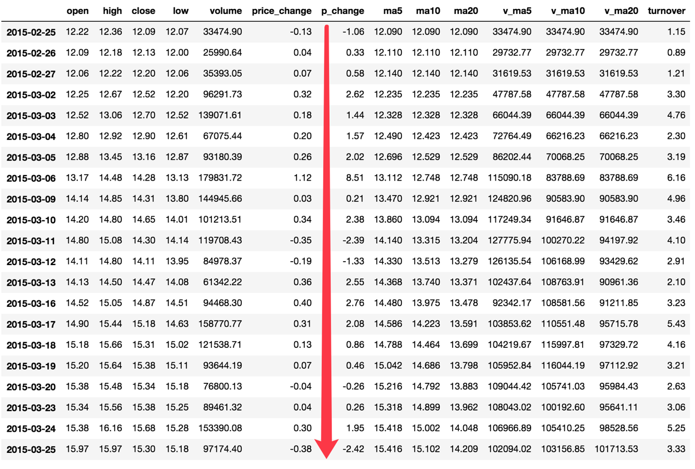
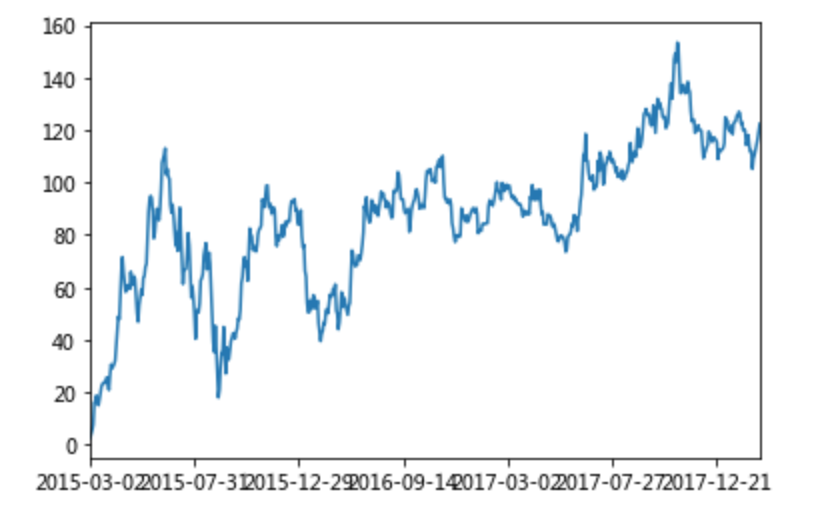

# 4.3. DataFrame运算

学习目标
----

*   目标
    *   使用describe完成综合统计
    *   使用max完成最大值计算
    *   使用min完成最小值计算
    *   使用mean完成平均值计算
    *   使用std完成标准差计算
    *   使用idxmin、idxmax完成最大值最小值的索引
    *   使用cumsum等实现累计分析
    *   应用逻辑运算符号实现数据的逻辑筛选
    *   应用isin实现数据的筛选
    *   应用query实现数据的筛选
    *   应用add等实现数据间的加法运算
    *   应用apply函数实现数据的自定义处理
*   应用
    *   股票每日数据的统计

4.3.1 算术运算
----------

*   add(other)

比如进行数学运算加上具体的一个数字

```python
data['open'].add(1)

2018-02-27    24.53
2018-02-26    23.80
2018-02-23    23.88
2018-02-22    23.25
2018-02-14    22.49
```


*   sub(other)

如果想要得到每天的涨跌大小？求出每天 close- open价格差

```python
# 1、筛选两列数据
close = data['close']
open1 = data['open']
# 2、收盘价减去开盘价
data['m_price_change'] = close.sub(open1)
data.head()

            open     high   close   low   volume  price_change  p_change  turnover my_price_change
2018-02-27    23.53    25.88    24.16    23.53    95578.03    0.63    2.68    2.39    0.63
2018-02-26    22.80    23.78    23.53    22.80    60985.11    0.69    3.02    1.53    0.73
2018-02-23    22.88    23.37    22.82    22.71    52914.01    0.54    2.42    1.32    -0.06
2018-02-22    22.25    22.76    22.28    22.02    36105.01    0.36    1.64    0.90    0.03
2018-02-14    21.49    21.99    21.92    21.48    23331.04    0.44    2.05    0.58    0.43
```


4.3.2 逻辑运算
----------

### 4.3.2.1 逻辑运算符号<、 >、|、 &

* 例如筛选p_change > 2的日期数据
  *   data\['p_change'\] > 2返回逻辑结果

  2018-02-27     True
  2018-02-26     True
  2018-02-23     True
  2018-02-22    False
  2018-02-14     True


  # 逻辑判断的结果可以作为筛选的依据
  data['p_change'] > 2

  pen    high    close    low    volume    price_change    p_change    turnover    my_price_change
  2018-02-27    23.53    25.88    24.16    23.53    95578.03    0.63    2.68    2.39    0.63
  2018-02-26    22.80    23.78    23.53    22.80    60985.11    0.69    3.02    1.53    0.73
  2018-02-23    22.88    23.37    22.82    22.71    52914.01    0.54    2.42    1.32    -0.06
  2018-02-14    21.49    21.99    21.92    21.48    23331.04    0.44    2.05    0.58    0.43
  2018-02-12    20.70    21.40    21.19    20.63    32445.39    0.82    4.03    0.81    0.49

* 完成一个多个逻辑判断， 筛选p_change > 2并且open > 15

  data[(data['p_change'] > 2) & (data['open'] > 15)]

  open    high    close    low    volume    price_change    p_change    turnover    my_price_change
  2017-11-14    28.00    29.89    29.34    27.68    243773.23    1.10    3.90    6.10    1.34
  2017-10-31    32.62    35.22    34.44    32.20    361660.88    2.38    7.42    9.05    1.82
  2017-10-27    31.45    33.20    33.11    31.45    333824.31    0.70    2.16    8.35    1.66
  2017-10-26    29.30    32.70    32.41    28.92    501915.41    2.68    9.01    12.56    3.11


### 4.3.2.2 逻辑运算函数

*   query(expr)
    *   expr:查询字符串

通过query使得刚才的过程更加方便简单

    data.query("p_change > 2 & turnover > 15")


*   isin(values)

例如判断'turnover'是否为4.19, 2.39

    # 可以指定值进行一个判断，从而进行筛选操作
    data[data['turnover'].isin([4.19, 2.39])]
    
    open    high    close    low    volume    price_change    p_change    turnover    my_price_change
    2018-02-27    23.53    25.88    24.16    23.53    95578.03    0.63    2.68    2.39    0.63
    2017-07-25    23.07    24.20    23.70    22.64    167489.48    0.67    2.91    4.19    0.63
    2016-09-28    19.88    20.98    20.86    19.71    95580.75    0.98    4.93    2.39    0.98
    2015-04-07    16.54    17.98    17.54    16.50    122471.85    0.88    5.28    4.19    1.00


4.3.3 统计运算
----------

### 4.3.3.1 describe()

综合分析: 能够直接得出很多统计结果,`count`, `mean`, `std`, `min`, `max` 等

    # 计算平均值、标准差、最大值、最小值
    data.describe()


### 4.3.3.2 统计函数

Numpy当中已经详细介绍，在这里我们演示min(最小值), max(最大值), mean(平均值), median(中位数), var(方差), std(标准差)结果,

`count`

Number of non-NA observations

`sum`

**Sum of values**

`mean`

**Mean of values**

`median`

Arithmetic median of values

`min`

**Minimum**

`max`

**Maximum**

`mode`

Mode

`abs`

Absolute Value

`prod`

Product of values

`std`

**Bessel-corrected sample standard deviation**

`var`

**Unbiased variance**

`idxmax`

compute the index labels with the maximum

`idxmin`

compute the index labels with the minimum

**对于单个函数去进行统计的时候，坐标轴还是按照这些默认为“columns” (axis=0, default)，如果要对行“index” 需要指定(axis=1)**

* max()、min()

  # 使用统计函数：0 代表列求结果， 1 代表行求统计结果
  data.max(0)

  open                   34.99
  high                   36.35
  close                  35.21
  low                    34.01
  volume             501915.41
  price_change            3.03
  p_change               10.03
  turnover               12.56
  my_price_change         3.41
  dtype: float64

* std()、var()

  # 方差
  data.var(0)

  open               1.545255e+01
  high               1.662665e+01
  close              1.554572e+01
  low                1.437902e+01
  volume             5.458124e+09
  price_change       8.072595e-01
  p_change           1.664394e+01
  turnover           4.323800e+00
  my_price_change    6.409037e-01
  dtype: float64

  # 标准差
  data.std(0)

  open                   3.930973
  high                   4.077578
  close                  3.942806
  low                    3.791968
  volume             73879.119354
  price_change           0.898476
  p_change               4.079698
  turnover               2.079375
  my_price_change        0.800565
  dtype: float64

* median()：中位数

中位数为将数据从小到大排列，在最中间的那个数为中位数。如果没有中间数，取中间两个数的平均值。

    df = pd.DataFrame({'COL1' : [2,3,4,5,4,2],
                       'COL2' : [0,1,2,3,4,2]})
    
    df.median()
    
    COL1    3.5
    COL2    2.0
    dtype: float64


* idxmax()、idxmin()

  # 求出最大值的位置
  data.idxmax(axis=0)

  open               2015-06-15
  high               2015-06-10
  close              2015-06-12
  low                2015-06-12
  volume             2017-10-26
  price_change       2015-06-09
  p_change           2015-08-28
  turnover           2017-10-26
  my_price_change    2015-07-10
  dtype: object


  # 求出最小值的位置
  data.idxmin(axis=0)

  open               2015-03-02
  high               2015-03-02
  close              2015-09-02
  low                2015-03-02
  volume             2016-07-06
  price_change       2015-06-15
  p_change           2015-09-01
  turnover           2016-07-06
  my_price_change    2015-06-15
  dtype: object


4.3.4 累计统计函数
------------

函数

作用

`cumsum`

**计算前1/2/3/…/n个数的和**

`cummax`

计算前1/2/3/…/n个数的最大值

`cummin`

计算前1/2/3/…/n个数的最小值

`cumprod`

计算前1/2/3/…/n个数的积

#### 那么这些累计统计函数怎么用？



以上这些函数可以对series和dataframe操作

这里我们按照时间的从前往后来进行累计

* 排序

  # 排序之后，进行累计求和
  data = data.sort_index()

* 对p_change进行求和

  stock_rise = data['p_change']
  # plot方法集成了前面直方图、条形图、饼图、折线图
  stock_rise.cumsum()

  2015-03-02      2.62
  2015-03-03      4.06
  2015-03-04      5.63
  2015-03-05      7.65
  2015-03-06     16.16
  2015-03-09     16.37
  2015-03-10     18.75
  2015-03-11     16.36
  2015-03-12     15.03
  2015-03-13     17.58
  2015-03-16     20.34
  2015-03-17     22.42
  2015-03-18     23.28
  2015-03-19     23.74
  2015-03-20     23.48
  2015-03-23     23.74

#### 那么如何让这个连续求和的结果更好的显示呢？



如果要使用plot函数，需要导入matplotlib.

    import matplotlib.pyplot as plt
    # plot显示图形
    stock_rise.cumsum().plot()
    # 需要调用show，才能显示出结果
    plt.show()


> 关于plot，稍后会介绍API的选择

4.3.5 自定义运算
-----------

* apply(func, axis=0)
  *   func:自定义函数
  *   axis=0:默认是列，axis=1为行进行运算
* 定义一个对列，最大值-最小值的函数

  data[['open', 'close']].apply(lambda x: x.max() - x.min(), axis=0)

  open     22.74
  close    22.85
  dtype: float64


4.3.6 总结
--------

*   掌握算数运算
*   掌握统计运算
*   掌握逻辑运算
*   掌握apply函数的使用