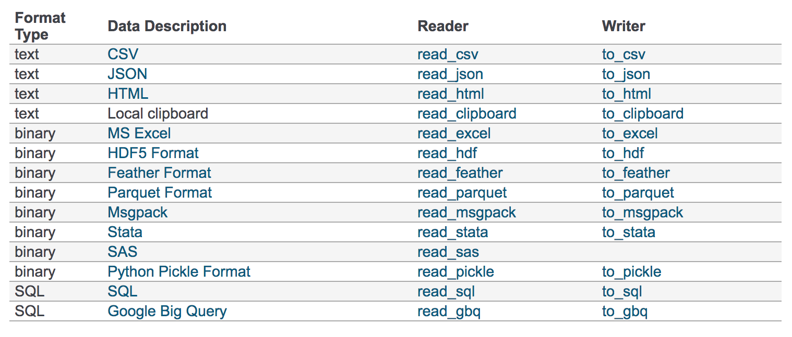
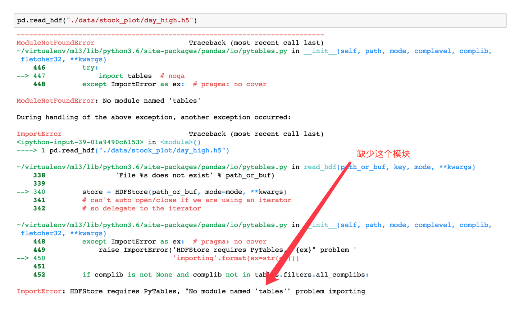

# 4.5. 文件读取与存储

学习目标
----

*   目标
    *   了解Pandas的几种文件读取存储操作
    *   应用CSV方式和HDF方式实现文件的读取和存储
*   应用
    *   实现股票数据的读取存储

我们的数据大部分存在于文件当中，所以pandas会支持复杂的IO操作，pandas的API支持众多的文件格式，如CSV、SQL、XLS、JSON、HDF5。

> 注：最常用的HDF5和CSV文件

4.5.1 CSV
---------

### 4.5.1.1 读取csv文件-read_csv

*   pandas.read\_csv(filepath\_or_buffer, sep =',' , delimiter = None)
    *   filepath\_or\_buffer:文件路径
    *   usecols:指定读取的列名，列表形式

读取之前的股票的数据

    # 读取文件,并且指定只获取'open', 'high', 'close'指标
    data = pd.read_csv("./stock_day/stock_day.csv", usecols=['open', 'high', 'close'])
    
                open    high    close
    2018-02-27    23.53    25.88    24.16
    2018-02-26    22.80    23.78    23.53
    2018-02-23    22.88    23.37    22.82
    2018-02-22    22.25    22.76    22.28
    2018-02-14    21.49    21.99    21.92

### 4.5.1.2 写入csv文件-to_csv

* `DataFrame.to_csv`(_path\_or\_buf=None, sep=', ’, columns=None, header=True, index=True, index_label=None, mode='w', encoding=None_)

  *   path\_or\_buf :string or file handle, default None
  *   sep :character, default ‘,’
  *   columns :sequence, optional
  *   mode:'w'：重写, 'a' 追加
  *   index:是否写进行索引
  *   header :boolean or list of string, default True,是否写进列索引值
* `Series.to_csv`(_path=None_, _index=True_, _sep='_, _'_, _na_rep=''_, _float_format=None_, _header=False_, _index_label=None_, _mode='w'_, _encoding=None_, _compression=None_, _date_format=None_, _decimal='.'_)

  Write Series to a comma-separated values (csv) file

#### 案例

* 保存'open'列的数据

  # 选取10行数据保存,便于观察数据
  data[:10].to_csv("./test.csv", columns=['open'])

* 读取，查看结果

  pd.read_csv("./test.csv")

       Unnamed: 0    open
  0    2018-02-27    23.53
  1    2018-02-26    22.80
  2    2018-02-23    22.88
  3    2018-02-22    22.25
  4    2018-02-14    21.49
  5    2018-02-13    21.40
  6    2018-02-12    20.70
  7    2018-02-09    21.20
  8    2018-02-08    21.79
  9    2018-02-07    22.69

会发现将索引存入到文件当中，变成单独的一列数据。如果需要删除，可以指定index参数,删除原来的文件，重新保存一次。

    # index:存储不会讲索引值变成一列数据
    stock_day[:10].to_csv("./test.csv", columns=['open'], index=False)

* 指定追加方式

  stock_day[:10].to_csv("./test.csv", columns=['open'], index=False, mode='a)

      open
  0    23.53
  ...
  9    22.69
  10    open
  11    23.53
  ...
  20    22.69

又存进了一个列名，所以当以追加方式添加数据的时候，一定要去掉列名columns,指定header=False

    stock_day[:10].to_csv("./test.csv", columns=['open'], index=False, mode='a', header=False)
    open
    0    23.53
    ...
    7    21.20
    8    21.79
    9    22.69
    10    23.53
    11    22.80
    12    22.88
    13    22.25
    ...
    19    22.69

4.5.2 HDF5
----------

### 4.5.2.1 read\_hdf与to\_hdf

**HDF5文件的读取和存储需要指定一个键，值为要存储的DataFrame**

* pandas.read\_hdf(path\_or_buf，key =None，** kwargs)

  从h5文件当中读取数据

  *   path\_or\_buffer:文件路径
  *   key:读取的键
  *   mode:打开文件的模式
  *   return:Theselected object
* `DataFrame.to_hdf`(path\_or\_buf, _key_, _*\_kwargs*)

#### 案例

* 读取文件

  day_high = pd.read_hdf("./stock_data/day/day_high.h5")

如果读取的时候出现以下错误

需要安装安装tables模块避免不能读取HDF5文件

    pip install tables

* 存储文件

  day_high.to_hdf("./test.h5", key="day_high")

再次读取的时候, 需要指定键的名字

    new_high = pd.read_hdf("./test.h5", key="day_high")

4.5.3 JSON
----------

Json是我们常用的一种数据交换格式，前面在前后端的交互经常用到，也会在存储的时候选择这种格式。所以我们需要知道Pandas如何进行读取和存储JSON格式。

### 4.5.3.1 read_json

* pandas.read\_json(path\_or_buf=None, orient=None, typ='frame', lines=False)

  *   将JSON格式准换成默认的Pandas DataFrame格式
  *   orient : string,Indication of expected JSON string format.
      *   'split' : dict like {index -> \[index\], columns -> \[columns\], data -> \[values\]}
      *   **'records' : list like \[{column -> value}, ... , {column -> value}\]**
      *   'index' : dict like {index -> {column -> value}}
      *   **'columns' : dict like {column -> {index -> value}}**,默认该格式
      *   'values' : just the values array
  *   lines : boolean, default False
      *   按照每行读取json对象
  *   typ : default ‘frame’， 指定转换成的对象类型series或者dataframe

  #### 案例

* 数据介绍

这里使用一个新闻标题讽刺数据集，格式为json。`is_sarcastic`：1讽刺的，否则为0；`headline`：新闻报道的标题；`article_link`：链接到原始新闻文章。存储格式为：

    {"article_link": "https://www.huffingtonpost.com/entry/versace-black-code_us_5861fbefe4b0de3a08f600d5", "headline": "former versace store clerk sues over secret 'black code' for minority shoppers", "is_sarcastic": 0}
    {"article_link": "https://www.huffingtonpost.com/entry/roseanne-revival-review_us_5ab3a497e4b054d118e04365", "headline": "the 'roseanne' revival catches up to our thorny political mood, for better and worse", "is_sarcastic": 0}

*   读取

orient指定存储的json格式，lines指定按行作为一个样本

    json_read = pd.read_json("Sarcasm_Headlines_Dataset.json", orient="records", lines=True)

结果为：

### 4.5.3.2 to_json

*   DataFrame.to_json(_path\_or\_buf=None_, _orient=None_, _lines=False_)
    *   将Pandas 对象存储为json格式
    *   _path\_or\_buf=None_：文件地址
    *   orient:存储的json形式，{‘split’,’records’,’index’,’columns’,’values’}
    *   lines:一个对象存储为一行

#### 案例

* 存储文件

  json_read.to_json("./test.json", orient='records')

结果

    [{"article_link":"https:\/\/www.huffingtonpost.com\/entry\/versace-black-code_us_5861fbefe4b0de3a08f600d5","headline":"former versace store clerk sues over secret 'black code' for minority shoppers","is_sarcastic":0},{"article_link":"https:\/\/www.huffingtonpost.com\/entry\/roseanne-revival-review_us_5ab3a497e4b054d118e04365","headline":"the 'roseanne' revival catches up to our thorny political mood, for better and worse","is_sarcastic":0},{"article_link":"https:\/\/local.theonion.com\/mom-starting-to-fear-son-s-web-series-closest-thing-she-1819576697","headline":"mom starting to fear son's web series closest thing she will have to grandchild","is_sarcastic":1},{"article_link":"https:\/\/politics.theonion.com\/boehner-just-wants-wife-to-listen-not-come-up-with-alt-1819574302","headline":"boehner just wants wife to listen, not come up with alternative debt-reduction ideas","is_sarcastic":1},{"article_link":"https:\/\/www.huffingtonpost.com\/entry\/jk-rowling-wishes-snape-happy-birthday_us_569117c4e4b0cad15e64fdcb","headline":"j.k. rowling wishes snape happy birthday in the most magical way","is_sarcastic":0},{"article_link":"https:\/\/www.huffingtonpost.com\/entry\/advancing-the-worlds-women_b_6810038.html","headline":"advancing the world's women","is_sarcastic":0},....]

* 修改lines参数为True

  json_read.to_json("./test.json", orient='records', lines=True)

结果

    {"article_link":"https:\/\/www.huffingtonpost.com\/entry\/versace-black-code_us_5861fbefe4b0de3a08f600d5","headline":"former versace store clerk sues over secret 'black code' for minority shoppers","is_sarcastic":0}
    {"article_link":"https:\/\/www.huffingtonpost.com\/entry\/roseanne-revival-review_us_5ab3a497e4b054d118e04365","headline":"the 'roseanne' revival catches up to our thorny political mood, for better and worse","is_sarcastic":0}
    {"article_link":"https:\/\/local.theonion.com\/mom-starting-to-fear-son-s-web-series-closest-thing-she-1819576697","headline":"mom starting to fear son's web series closest thing she will have to grandchild","is_sarcastic":1}
    {"article_link":"https:\/\/politics.theonion.com\/boehner-just-wants-wife-to-listen-not-come-up-with-alt-1819574302","headline":"boehner just wants wife to listen, not come up with alternative debt-reduction ideas","is_sarcastic":1}
    {"article_link":"https:\/\/www.huffingtonpost.com\/entry\/jk-rowling-wishes-snape-happy-birthday_us_569117c4e4b0cad15e64fdcb","headline":"j.k. rowling wishes snape happy birthday in the most magical way","is_sarcastic":0}...

4.5.4 拓展
--------

**优先选择使用HDF5文件存储**

*   HDF5在存储的是支持压缩，**使用的方式是blosc，这个是速度最快**的也是pandas默认支持的
*   使用压缩可以**提磁盘利用率，节省空间**
*   HDF5还是跨平台的，可以轻松迁移到hadoop 上面

4.5.5 总结
--------

*   pandas的CSV、HDF5、JSON文件的读取