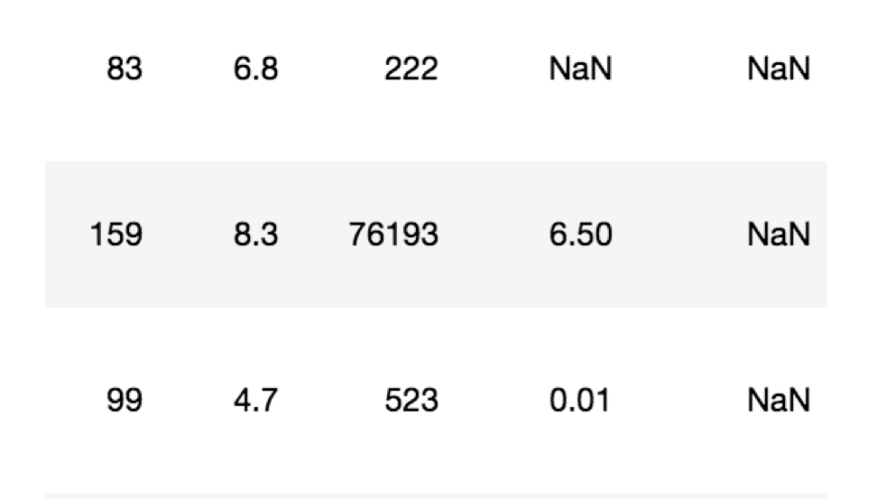

# 4.6. 高级处理-缺失值处理

学习目标
----

*   目标
    *   说明Pandas的缺失值类型
    *   应用replace实现数据的替换
    *   应用dropna实现缺失值的删除
    *   应用fillna实现缺失值的填充
    *   应用isnull判断是否有缺失数据NaN
*   应用
    *   对电影数据进行缺失值处理

4.6.1 如何处理nan
-------------

对于NaN的数据，在numpy中我们是如何处理的？在pandas中我们处理起来非常容易

*   判断数据是否为NaN：pd.isnull(df),pd.notnull(df)

处理方式：

*   存在缺失值nan,并且是np.nan:

    *   1、删除存在缺失值的:dropna(axis='rows')

        *   注：不会修改原数据，需要接受返回值
    *   2、替换缺失值:fillna(value, inplace=True)

        *   value:替换成的值

        *   inplace:True:会修改原数据，False:不替换修改原数据，生成新的对象

*   不是缺失值nan，有默认标记的

4.6.2 电影数据的缺失值处理
----------------

* 电影数据文件获取

  # 读取电影数据
  movie = pd.read_csv("./IMDB/IMDB-Movie-Data.csv")

  989    Martyrs    Horror    A young woman's quest for revenge against the ...    Pascal Laugier    Morjana Alaoui, Mylène Jampanoï, Catherine Bég...    2008    99    7.1    63785    NaN    89.0
  990    Selma    Biography,Drama,History    A chronicle of Martin Luther King's campaign t...    Ava DuVernay    David Oyelowo, Carmen Ejogo, Tim Roth, Lorrain...    2014    128    7.5    67637    52.07    NaN

### 4.6.2.1 判断缺失值是否存在

* pd.notnull()

  pd.notnull(movie)

  Rank    Title    Genre    Description    Director    Actors    Year    Runtime (Minutes)    Rating    Votes    Revenue (Millions)    Metascore
  0    True    True    True    True    True    True    True    True    True    True    True    True
  1    True    True    True    True    True    True    True    True    True    True    True    True
  2    True    True    True    True    True    True    True    True    True    True    True    True
  3    True    True    True    True    True    True    True    True    True    True    True    True
  4    True    True    True    True    True    True    True    True    True    True    True    True
  5    True    True    True    True    True    True    True    True    True    True    True    True
  6    True    True    True    True    True    True    True    True    True    True    True    True
  7    True    True    True    True    True    True    True    True    True    True    False    True

### 4.6.2.2 存在缺失值nan，并且是np.nan

*   1、删除

pandas删除缺失值，使用dropna的前提是，缺失值的类型必须是np.nan

    # 不修改原数据
    movie.dropna()
    
    # 可以定义新的变量接受或者用原来的变量名
    movie = movie.dropna()

* 2、替换缺失值

  # 替换存在缺失值的样本的两列
  # 替换填充平均值，中位数
  movie['Revenue (Millions)'].fillna(movie['Revenue (Millions)'].mean(), inplace=True)
  movie['Metascore'].fillna(movie['Metascore'].mean(), inplace=True)

结果：

    989    Martyrs    Horror    A young woman's quest for revenge against the ...    Pascal Laugier    Morjana Alaoui, Mylène Jampanoï, Catherine Bég...    2008    99    7.1    63785    82.956376    89.000000
    989    990    Selma    Biography,Drama,History    A chronicle of Martin Luther King's campaign t...    Ava DuVernay    David Oyelowo, Carmen Ejogo, Tim Roth, Lorrain...    2014    128    7.5    67637    52.070000    58.985043

### 4.6.2.3 不是缺失值nan，有默认标记的

数据是这样的：

    wis = pd.read_csv("https://archive.ics.uci.edu/ml/machine-learning-databases/breast-cancer-wisconsin/breast-cancer-wisconsin.data")

    name = ["Sample code number", "Clump Thickness", "Uniformity of Cell Size", "Uniformity of Cell Shape", "Marginal Adhesion", "Single Epithelial Cell Size", "Bare Nuclei", "Bland Chromatin", "Normal Nucleoli", "Mitoses", "Class"]

**处理思路分析：**

* 1、先替换‘?’为np.nan
  *   df.replace(to_replace=, value=)
      *   to_replace:替换前的值
      *   value:替换后的值

  # 把一些其它值标记的缺失值，替换成np.nan
  wis = wis.replace(to_replace='?', value=np.nan)

* 2、在进行缺失值的处理

  # 删除
  wis = wis.dropna()

4.6.3 总结
--------

*   isnull、notnull判断是否存在缺失值
*   dropna删除np.nan标记的缺失值
*   fillna填充缺失值
*   replace替换具体某些值