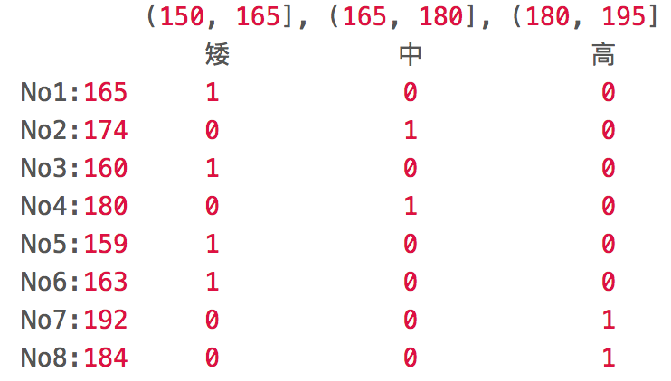
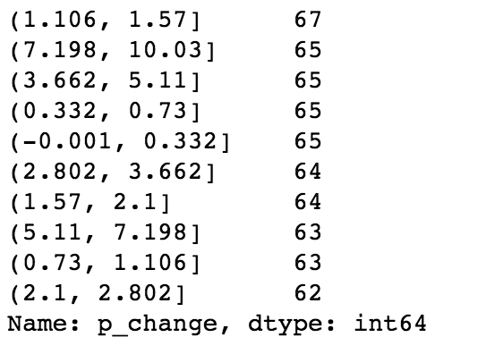

# 4.7. 高级处理-数据离散化

学习目标
----

*   目标
    *   应用cut、qcut实现数据的区间分组
    *   应用get_dummies实现数据的one-hot编码
*   应用
    *   找出股票的涨跌幅异动（异常）值

4.7.1 什么是数据的离散化
---------------

**连续属性的离散化就是将连续属性的值域上，将值域划分为若干个离散的区间，最后用不同的符号或整数** **值代表落在每个子区间中的属性值。**

离散化有很多种方法，这使用一种最简单的方式去操作

*   原始的身高数据：165，174，160，180，159，163，192，184
*   假设按照身高分几个区间段：(150, 165\], (165, 180\], (180, 195\]

这样我们将数据分到了三个区间段，我可以对应的标记为矮、中、高三个类别，最终要处理成一个“哑变量”矩阵。

4.7.2 为什么要离散化
-------------

连续属性离散化的目的是为了简化数据结构，**数据离散化技术可以用来减少给定连续属性值的个数**。离散化方法经常作为数据挖掘的工具。

4.7.3 如何实现数据的离散化
----------------

### 案例：股票的涨跌幅离散化

我们对股票每日的"p_change"进行离散化

### 4.7.3.1 读取股票的数据

先读取股票的数据，筛选出p_change数据

    data = pd.read_csv("./stock_day/stock_day.csv")
    p_change= data['p_change']

### 4.7.3.2 将股票涨跌幅数据进行分组

使用的工具：

* pd.qcut(data, bins)：

  *   对数据进行分组将数据分组 一般会与value_counts搭配使用，统计每组的个数
* series.value_counts()：统计分组次数

  # 自行分组
  qcut = pd.qcut(p_change, 10)
  # 计算分到每个组数据个数
  qcut.value_counts()

自定义区间分组：

* pd.cut(data, bins)

  # 自己指定分组区间
  bins = [-100, -7, -5, -3, 0, 3, 5, 7, 100]
  p_counts = pd.cut(p_change, bins)

### 4.7.3.3 股票涨跌幅分组数据变成one-hot编码

* pandas.get_dummies(_data_, _prefix=None_)

  *   data:array-like, Series, or DataFrame

  *   prefix:分组名字

  # 得出one-hot编码矩阵
  dummaries = pd.get_dummies(p_counts, prefix="rise")

4.7.4 小结
--------

*   数据离散化
*   qcut、cut实现数据分组
*   get_dummies实现哑变量矩阵