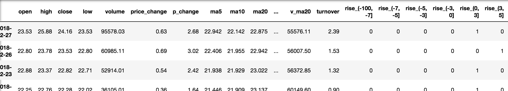
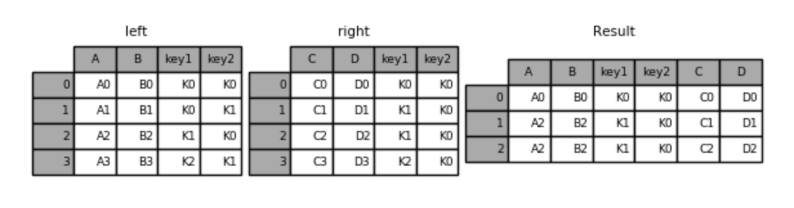
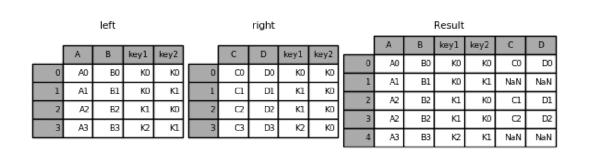

# 4.8. 高级处理-合并

学习目标
----

*   目标
    *   **应用pd.concat实现数据的合并**
    *   **应用pd.merge实现数据的合并**
*   应用
    *   无

**如果你的数据由多张表组成，那么有时候需要将不同的内容合并在一起分析**

4.8.1 pd.concat实现数据合并
---------------------

*   pd.concat(\[data1, data2\], axis=1)
    *   按照行或列进行合并,axis=0为列索引，axis=1为行索引

比如我们将刚才处理好的one-hot编码与原数据合并

    # 按照行索引进行
    pd.concat([data, dummaries], axis=1)

4.8.2 pd.merge
--------------

*   pd.merge(left, right, how='inner', on=None, left\_on=None, right\_on=None,left\_index=False, right\_index=False, sort=True,suffixes=('\_x', '\_y'), copy=True, indicator=False,validate=None)
    *   可以指定按照两组数据的共同键值对合并或者左右各自
    *   `left`: A DataFrame object
    *   `right`: Another DataFrame object
    *   `on`: Columns (names) to join on. Must be found in both the left and right DataFrame objects.
    *   left\_on=None, right\_on=None：指定左右键

Merge method

SQL Join Name

Description

`left`

`LEFT OUTER JOIN`

Use keys from left frame only

`right`

`RIGHT OUTER JOIN`

Use keys from right frame only

`outer`

`FULL OUTER JOIN`

Use union of keys from both frames

`inner`

`INNER JOIN`

Use intersection of keys from both frames

### 4.8.2.1 pd.merge合并

    left = pd.DataFrame({'key1': ['K0', 'K0', 'K1', 'K2'],
                            'key2': ['K0', 'K1', 'K0', 'K1'],
                            'A': ['A0', 'A1', 'A2', 'A3'],
                            'B': ['B0', 'B1', 'B2', 'B3']})
    
    right = pd.DataFrame({'key1': ['K0', 'K1', 'K1', 'K2'],
                            'key2': ['K0', 'K0', 'K0', 'K0'],
                            'C': ['C0', 'C1', 'C2', 'C3'],
                            'D': ['D0', 'D1', 'D2', 'D3']})
    
    # 默认内连接
    result = pd.merge(left, right, on=['key1', 'key2'])

* 左连接

  result = pd.merge(left, right, how='left', on=['key1', 'key2'])

* 右连接

  result = pd.merge(left, right, how='right', on=['key1', 'key2'])

* 外链接

  result = pd.merge(left, right, how='outer', on=['key1', 'key2'])

4.8.3 总结
--------

*   concat进行按照索引的合并
*   merge进行按照键合并