# 5.4. 时间序列数据处理

学习目标
----

*   目标
    *   了解Pandas的时间类型
    *   应用pd.to_datetime和pd.DatetimeIndex实现时间类型转换
    *   应用pd.date_range实现时间序列数据的生成
    *   了解时间序列数据(股票)的分析方法
    *   了解移动窗口的定义
    *   知道移动平均线的作用
    *   知道移动平均线按照周期和算法划分的类别
    *   记忆sma的计算公式
    *   应用pd.rolling_mean实现K线图的均线图绘制
    *   知道wma和ewma的计算方式
    *   应用pd.ewma实现指数平滑移动平均线绘制
    *   说明两两指标散点图之间的关系
*   应用
    *   股票的日线数据移动平均线观察

前面其实我们已经使用一些时间序列接口，回忆我们在股票涨跌幅使用的生成一个时间列表，接下来我们就去看看Pandas当中的时间类型等。

5.4.1 什么是时间序列
-------------

**时间序列是一组按照时间发生先后顺序进行排列的数据点序列。**通常一组时间序列的时间间隔为一恒定值（如1秒，5分钟，12小时，7天，1年），因此时间序列可以作为离散时间数据进行分析处理。

例如：某监控系统的折线图表，显示了请求次数和响应时间随时间的变化趋势

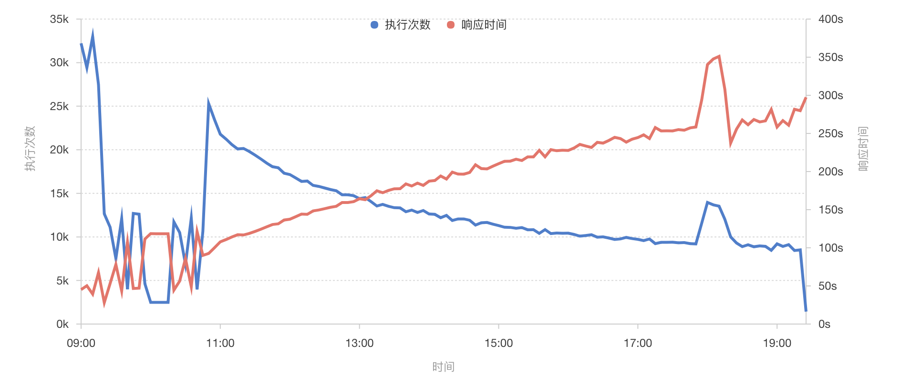

5.4.2 Pandas的时间类型
-----------------

* pd.to_datetime()：转换成pandas的时间类型 Timestamp('2018-03-02 00:00:00')

  # pd将时间数据转换成pandas时间类型
  # 1、填入时间的字符串，格式有几种, "2018-01-01" ，”01/02/2018“
  pd.to_datetime("01/02/2017")

如果我们传入的是多个时间点，那么会是什么样的？

5.4.3 Pandas的时间序列类型
-------------------

* 1、转换时间序列类型

  # 传入时间的列表
  pd.to_datetime(["2017-01-01", "2017-02-01", "2017-03-01"])

  # 或者
  date = [datetime(2018, 3, 1), datetime(2018, 3, 2), datetime(2018, 3, 3), datetime(2018, 3, 4), datetime(2018, 3, 5)]
  date = pd.to_datetime(date)

  # 如果其中有空值
  date = [datetime(2018, 3, 1), datetime(2018, 3, 2), np.nan, datetime(2018, 3, 4), datetime(2018, 3, 5)]
  date = pd.to_datetime(date)
  # 结果会变成NaT类型
  DatetimeIndex(['2018-03-01', '2018-03-02', 'NaT', '2018-03-04', '2018-03-05'], dtype='datetime64[ns]', freq=None)

* 2、Pandas的时间序列类型：DatetimeIndex

  # DateTimeIndex
  pd.to_datetime(date)
  DatetimeIndex(['2018-03-01', '2018-03-02', '2018-03-03', '2018-03-04',
  ​               '2018-03-05'],
  ​              dtype='datetime64[ns]', freq=None)

  pd.to_datetime(date).values

  array(['2018-03-01T00:00:00.000000000', '2018-03-02T00:00:00.000000000',
  ​       '2018-03-03T00:00:00.000000000', '2018-03-04T00:00:00.000000000',
  ​       '2018-03-05T00:00:00.000000000'], dtype='datetime64[ns]')

我们也可以通过DatetimeIndex来转换

* 3、通过pd.DatetimeIndex进行转换

  pd.DatetimeIndex(date)

#### 知道了时间序列类型，所以我们可以用这个当做索引，获取数据

5.4.4 Pandas的基础时间序列结构
---------------------

    # 最基础的pandas的时间序列结构,以时间为索引的，Series序列结构
    # 以时间为索引的DataFrame结构
    series_date = pd.Series(3.0, index=date)
    
    pd.to_datetime(series_date)
    pd.DatetimeIndex(series_date)

pandas时间序列series的index必须是DatetimeIndex

* **DatetimeIndex的属性**
  *   year,month,weekday,day,hour….

  time.year
  time.month
  time.weekday

5.4.5 Pandas生成指定频率的时间序列
-----------------------

*   pandas.date_range(start=None, end=None, periods=None, freq='D', tz=None, normalize=False, name=None, closed=None, **kwargs)
    *   Returna fixed frequency DatetimeIndex, with day (calendar) as the default frequency
    *   start:开始时间
    *   end:结束时间
    *   periods:产生多长的序列
    *   freq:频率 D,H,Q等
    *   tz:时区

参数

含义

D

每日

B

每工作日

H、T或者min、S

时、分、秒

M

每月最后一天

BM

每月最后一个工作日

WOM-1MON, WOM-3FRI

每月第几周的星期几

    # 生成指定的时间序列
    # 1、生成2017-01-02~2017-12-30，生成频率为1天, 不跳过周六周日
    pd.date_range("2017-01-02", "2017-12-30", freq="D")
    
    # 2、生成2017-01-02~2017-12-30，生成频率为1天, 跳过周六周日, 能够用在金融的数据，日线的数据
    pd.date_range("2017-01-02", "2017-12-30", freq="B")
    
    # 3、只知道开始时间日期，我也知道总共天数多少，生成序列， 从"2016-01-01", 共504天，跳过周末
    pd.date_range("2016-01-01", periods=504, freq="B")
    
    # 4、生成按照小时排列的时间序列数据
    pd.date_range("2017-01-02", "2017-12-30", freq='H')
    
    # 5、按照3H去进行生成
    pd.date_range("2017-01-02", "2017-12-30", freq='3H')
    
    # 6、按照1H30分钟去进行生成时间序列
    pd.date_range("2017-01-02", "2017-12-30", freq='1H30min')
    
    # 7、按照每月最后一天
    pd.date_range("2017-01-02", "2017-12-30", freq='BM')
    
    # 8、按照每个月的第几个星期几
    pd.date_range("2017-01-02", "2017-12-30", freq='WOM-3FRI')

5.4.6什么是时间序列分析
--------------

对于时间序列类型，有特有的分析方法。同样股票本身也是一种时间序列类型，我们就以股票的数据来进行时间序列的分析

时间序列分析( time series analysis)方法,强调的是通过对一个区域进行一定时间段内的连续观察计算，提取相关特征，并分析其变化过程。

**时间序列分析主要有确定性变化分析**

*   **确定性变化分析：移动平均法， 移动方差和标准差、移动相关系数**

5.4.7 移动平均法
-----------

### 5.4.7.1 移动窗口

主要用在时间序列的数组变换， 不同作用的函数将它们统称为移动窗口函数

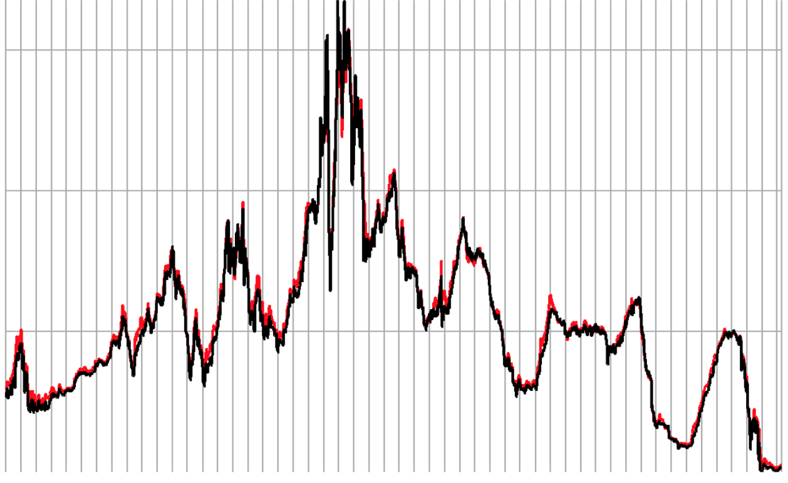

### 5.4.7.2 移动平均线

那么会有各种观察窗口的方法，其中最常用的就是移动平均法

*   移动平均线(Moving Average)简称均线, **将某一段时间的收盘价之和除以该周期**

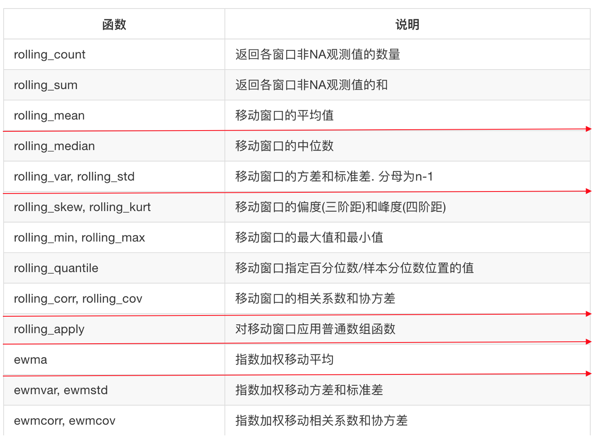

### 5.4.7.3 移动平均线的分类

*   移动平均线依计算周期分为短期(5天)、中期(20天)和长期(60天、120天)，移动平均线没有固定的界限
*   移动平均线依据算法分为算数、加权法和指数移动平均线

> 注：不同的移动平均线方法不一样

#### 1 简单移动平均线

**简单移动平均线(SMA)，又称“算数移动平均线”，是指特定期间的收盘价进行平均化比如说，5日的均线SMA=(C1+ C2 + C3 + C4 + C5) / 5**

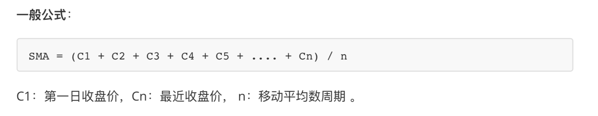

例子：

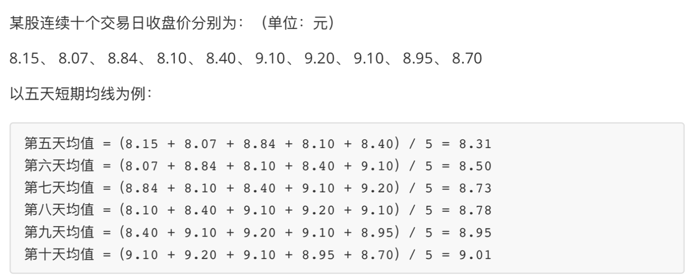

*   案例：对股票数据进行移动平均计算

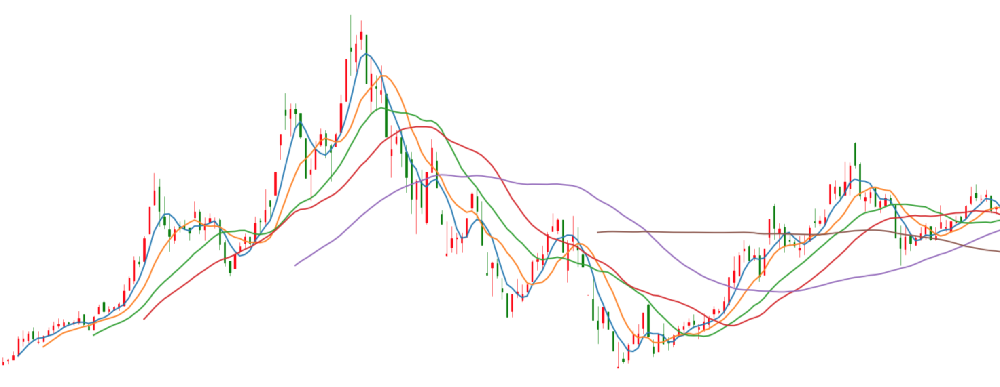

拿到股票数据，画出K线图

    # 拿到股票K线数据
    stock_day = pd.read_csv("./data/stock_day/stock_day.csv")
    stock_day = stock_day.sort_index()
    stock_day["index"] = [i for i in range(stock_day.shape[0])]
    arr = stock_day[['index', 'open', 'close', 'high', 'low']]
    values = arr.values[:200]
    # 画出K线图
    fig, axes = plt.subplots(nrows=1, ncols=1, figsize=(20, 8), dpi=80)
    candlestick_ochl(axes, values, width=0.2, colorup='r', colordown='g')

#### 2 计算移动平均线

* pandas.rolling\_mean(arg, window, min\_periods=None, freq=None, center=False, how=None, **kwargs) Moving mean.

  Parameters:

  *   arg : Series, DataFrame
  *   window : 计算周期

  # 直接对每天的收盘价进行求平均值， 简单移动平局线(SMA)
  # 分别加上短期、中期、长期局均线
  pd.rolling_mean(stock_day["close"][:200], window=5).plot()
  pd.rolling_mean(stock_day["close"][:200], window=10).plot()
  pd.rolling_mean(stock_day["close"][:200], window=20).plot()
  pd.rolling_mean(stock_day["close"][:200], window=30).plot()
  pd.rolling_mean(stock_day["close"][:200], window=60).plot()
  pd.rolling_mean(stock_day["close"][:200], window=120).plot()

### 3 加权移动平均线 (WMA)

加权移动平均线 (WMA)将过去某特定时间内的价格取其平均值，**它的比重以平均线的长度设定，愈近期的收市价，对市况影响愈重要。**

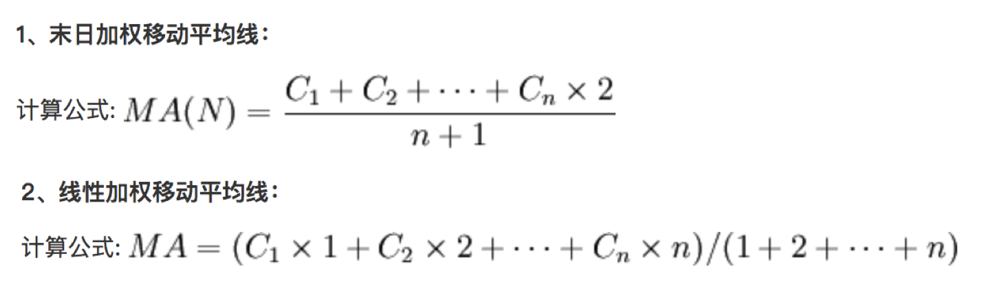

正因加权移动平均线强调将愈近期的价格比重提升，故此当市况倒退时，加权移动平均线比起其它平均线更容易预测价格波动。**但是我们还是不会轻易使用加权，应为他的比重过大！！！！**

### 4 指数平滑移动平均线(EWMA)

是因应移动平均线被视为落后指标的缺失而发展出来的，为解决一旦价格已脱离均线差值扩大，而平均线未能立即反应，EWMA可以减少类似缺点。

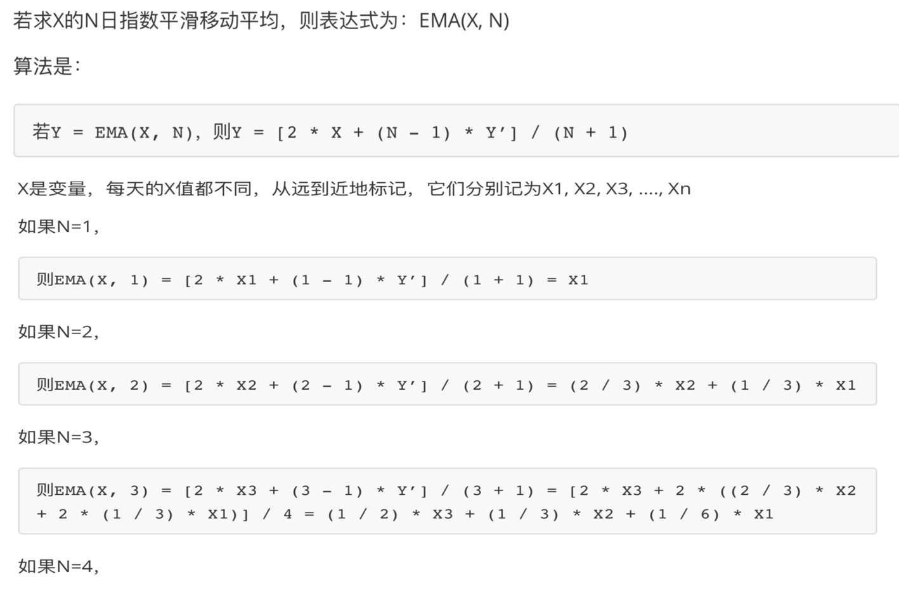

总结：

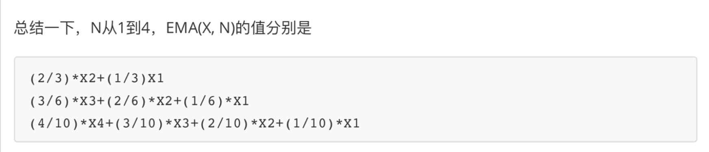

* pd.ewma(com=None, span=one)
  *   指数平均线
  *   span:时间间隔

  # 画出指数平滑移动平均线
  pd.ewma(stock_day['close'][:200], span=10).plot()
  pd.ewma(stock_day['close'][:200], span=30).plot()
  pd.ewma(stock_day['close'][:200], span=60).plot()

5.4.8 移动方差和标准差
--------------

*   方差和标准差：反应某一时期的序列的稳定性

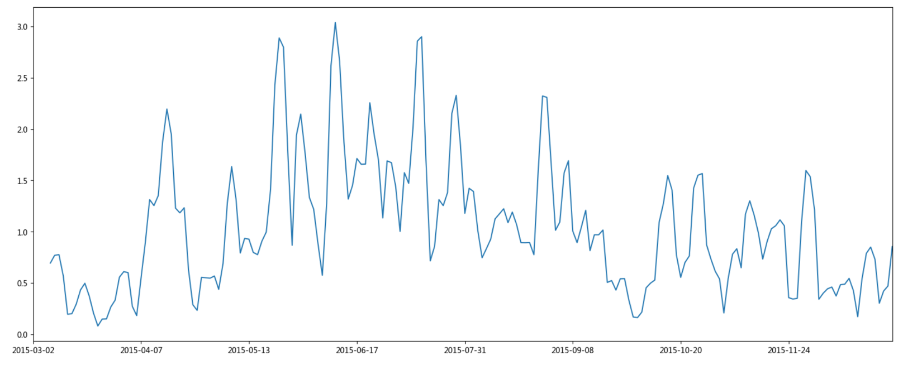

    # 求出指定窗口大小的收盘价标准差和方差
    pd.rolling_var(stock_day['close'][:200], window=10).plot()
    pd.rolling_std(stock_day['close'][:200], window=10).plot()

5.4.9 各项指标数据两两关联散点图
-------------------

* pd.scatter_matrix(frame, figsize=None)
  *   frame:DataFrame

  frame = data[['open','volume', 'ma20', 'p_change', 'turnover']]
  pd.scatter_matrix(frame, figsize=(20, 8))

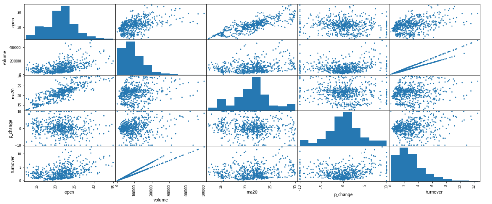

从中我们可以简单看到成交量（volume）和换手率（turnover）有非常明显的线性关系，因为换手率的定义就是：成交量除以发行总股数。

> 通过一些图或者相关性分析可以找到强相关的一些指标，在机器学习、量化中会详细介绍
>
> 相关系数：后面会介绍，目前我们只需知道他是反应两个序列之间的关系即可

5.4.10 案例：移动平均线数据本地保存
---------------------

    ma_list = [5, 20 ,60]
    for ma in ma_list:
        data['MA' + str(ma)] = pd.rolling_mean(data.close, ma)
    for ma in ma_list:
        data['EMA' + str(ma)] = pd.ewma(data.close, span=ma)
    
    data.to_csv("EWMA.csv")

5.4.11 移动平均线的作用
---------------

移动平均线经常会作为技术分析的基础理论，从中衍生出各种技术指标策略。后面将会介绍简单的基于均线的策略。