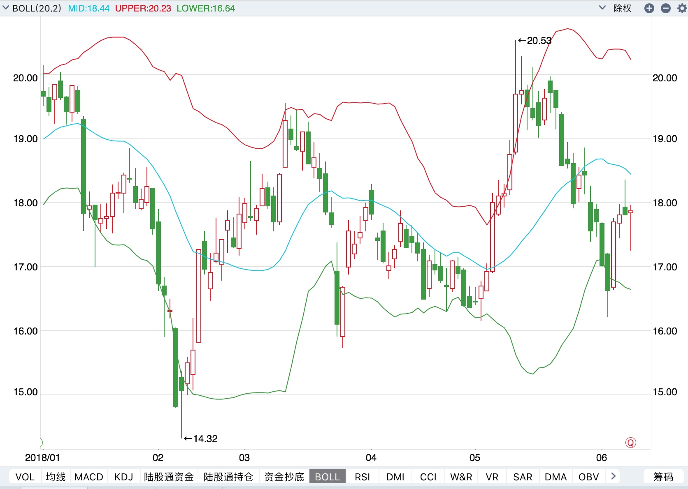
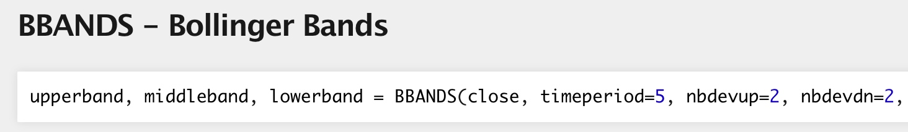

# 6.5. 布林线

学习目标
----

*   目标
    *   说明布林线的含义
    *   应用talib.BBANDS实现指标计算与结果分析
*   应用
    *   无

### 6.5.1 BOLL指标

布林线(BOLL)利用统计原理，求出的标准差及其信赖区间，从而确定股价的波动范围及未来走势，利用波带显示股价的安全高低价位，因而也被称为布林带。其上下限范围不固定，随股价的滚动而变化。股价波动在上限和下限的区间之内，这条带状区的宽窄，随着股价波动幅度的大小而变化，股价涨跌幅度加大时，带状区变宽，涨跌幅度狭小盘整时，带状区则变窄。

> 注：BOLL指标是美国股市分析家约翰·布林根据统计学中的标准差原理设计出来的一种非常简单实用的技术分析指标



### 6.5.2 BOLL指标的计算方法

#### 6.5.2.1 BOLL指标的计算公式

* 中轨线(MA)=N日的移动平均线
* 上轨线(UP)=中轨线＋两倍的标准差
* 下轨线(DN)=中轨线－两倍的标准差

  #### 6.5.2.2、强弱指标的计算公式如下

* 计算N日内的收盘价的移动平均值MA

* 计算标准差MD

  MD=∑(closei−MA)2N MD= \\sqrt{\\dfrac{\\sum(close_{i}-MA)^{2}}{N}} MD=√N∑(closei−MA)2

* 计算MB、UP、DN线

  *   MB=（N－1）日的MA
  *   UP=MB＋2×MD
  *   DN=MB－2×MD

### 6.5.3 BOLL交易信号判断

#### 6.5.3.1 BOLL布林线的意义

*   股价在中轨上方运行时属较安全状态，短线可持有观望。
*   股价在中轨下方运行时属较危险状态，短线应趁反弹中轨时离场。
*   股价突破上轨线后，回探中轨线时不跌破中轨线，显示后市看涨，可持股或加仓。
*   股价跌破下轨线后，反弹中轨线时不站回中轨线以上，则后市看跌，要卖出。
*   通道突然呈急剧变窄收拢形状时，显示股价方向将会发生重大转折，这时结合其他指数技术进行行情判断。

#### 6.5.3.2 案例：BOLL布林线计算以及交易判断实现

*   布林线指标计算



* close : 5日close的array，传入的参数序列必须是Numpy序列
* timeperiod ：默认5天的平均线
* nbdevip/nbdevdn : 默认2倍的标准差

  ```python
  upperband, middleband, lowerband = talib.BBANDS(df["close"].values[:200],timeperiod=20,nbdevdn=2,nbdevup=2)
  candlestick_ochl(axes[2],quotes=arr,width=0.2, colorup='r', colordown='g');
  axes[2].plot(range(200),upperband)
  axes[2].plot(range(200),middleband)
  axes[2].plot(range(200),lowerband)
  ```
