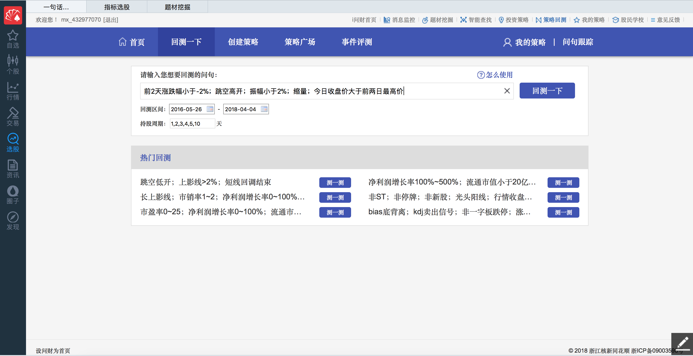
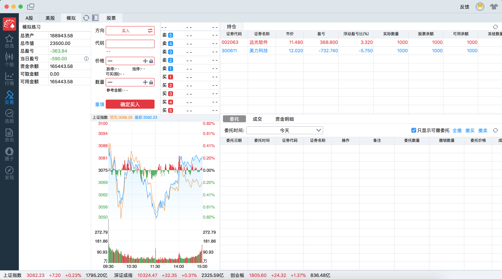
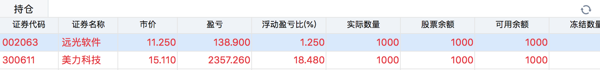

# 6.6. 行情软件演示

学习目标
----

*   目标
    *   应用金融市场行情查询软件进行交易策略演示
    *   选择策略指标买入卖出信号
    *   进行策略回测
    *   查看回测结果
    *   应用金融市场行情查询软件进行模拟交易演示
    *   选择股票选择价格以及股数查看持仓情况
*   应用
    *   无

6.6.1 策略回测
----------

应用MACD指标的交易信号，查看在历史数据的表现情况：

*   选择策略的逻辑
*   选择回测的时间区间
*   运行策略查看分析结果（了解）
    *   盈亏比：总盈利/总亏损
    *   涨跌幅分布
    *   历史明细查看

> 同花顺软件主要提供别人查看行情信息，不是一个供我们做量化的框架平台，分析结果很粗糙。后面量化当中会有详细的指标分析结果

6.6.2 模拟交易
----------

通过虚拟的资金，去买入当前的股票并实时持有。

*   选择购买的股票，购买的股数和价格
*   购买之后可以查看持仓信息

