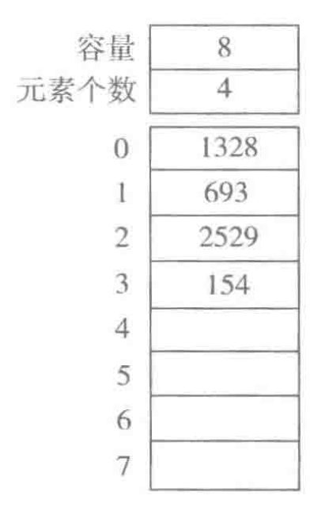

# 2.2. 顺序表的结构与实现

顺序表的结构
------

一个顺序表的完整信息包括两部分，一部分是表中的元素集合，另一部分是为实现正确操作而需记录的信息，即有关表的整体情况的信息，这部分信息主要包括元素存储区的**容量**和当前表中已有的**元素个数**两项。

顺序表的两种基本实现方式
------------

图a为一体式结构，存储表信息的单元与元素存储区以连续的方式安排在一块存储区里，两部分数据的整体形成一个完整的顺序表对象。

一体式结构整体性强，易于管理。但是由于数据元素存储区域是表对象的一部分，顺序表创建后，元素存储区就固定了。

图b为分离式结构，表对象里只保存与整个表有关的信息（即容量和元素个数），实际数据元素存放在另一个独立的元素存储区里，通过链接与基本表对象关联。

元素存储区替换
-------

一体式结构由于顺序表信息区与数据区连续存储在一起，所以若想更换数据区，则只能整体搬迁，即整个顺序表对象（指存储顺序表的结构信息的区域）改变了。

分离式结构若想更换数据区，只需将表信息区中的数据区链接地址更新即可，而该顺序表对象不变。

元素存储区扩充
-------

采用分离式结构的顺序表，若将数据区更换为存储空间更大的区域，则可以在不改变表对象的前提下对其数据存储区进行了扩充，所有使用这个表的地方都不必修改。只要程序的运行环境（计算机系统）还有空闲存储，这种表结构就不会因为满了而导致操作无法进行。人们把采用这种技术实现的顺序表称为动态顺序表，因为其容量可以在使用中动态变化。

**扩充的两种策略**

* 每次扩充增加固定数目的存储位置，如每次扩充增加10个元素位置，这种策略可称为线性增长。

  特点：节省空间，但是扩充操作频繁，操作次数多。

* 每次扩充容量加倍，如每次扩充增加一倍存储空间。

  特点：减少了扩充操作的执行次数，但可能会浪费空间资源。以空间换时间，推荐的方式。
