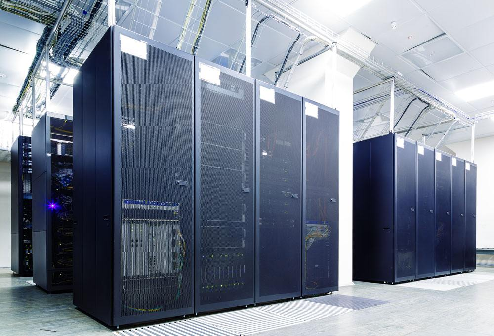

# 1.1. 操作系统(科普章节)

目标
--

*   知道操作系统的作用
*   知道有那些主流的操作系统

### 1.1 操作系统（Operation System，OS）

> 操作系统是管理硬件和控制软件运行的计算机程序，是直接运行在“裸机”上的系统软件,  
> 任何其他软件都必须在操作系统的支持下才能运行

### 1.2 操作系统的作用

*   主要作用是**向下控制硬件向上支持软件的运行**，具有承上启下的作用
*   而其他的诸如编译程序、数据库管理系统，以及大量的应用软件，都直接依赖于操作系统的支持

### 1.3 不同应用领域的主流操作系统

*   桌面操作系统
*   服务器操作系统
*   嵌入式操作系统
*   移动设备操作系统

#### 1> 桌面操作系统

*   Windows 系列
    *   用户群体大
*   macOS
    *   适合于开发人员
*   Linux
    *   应用软件少

#### 2> 服务器操作系统

*   Linux
    *   安全、稳定、免费
    *   占有率高
*   Windows Server
    *   付费
    *   占有率低

#### 3> 嵌入式操作系统

*   Linux

#### 4> 移动设备操作系统

*   iOS
*   Android（基于 `Linux`）