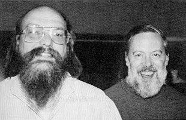

# 1.2. 操作系统发展史(科普章节)

目标
--

*   知道Unix操作系统的作者
*   知道 Linux 内核及发行版的区别
*   知道 Linux 的应用领域
*   知道虚拟机作用

1\. 操作系统的发展历史
-------------

### 1.1 Unix

*   1969 年 **Ken Thompson** 当时在实验室无聊时，为了让一台空闲的电脑上能够运行 "星际旅行（Space Travel）" 游行，在 8 月份左右趁着其妻子探亲的时间，**用了 1 个月的时间**，使用汇编写出了 Unix 操作系统的原型
*   1970 年，美国贝尔实验室的 **Ken Thompson**，以 **BCPL** 语言为基础，设计出很简单且很接近硬件的 **B 语言**（取BCPL的首字母），并且他用 **B 语言** 写了第一个 UNIX 操作系统
*   1971 年，同样酷爱 "星际旅行（Space Travel）" 的 **Dennis M.Ritchie** 为了能早点儿玩上游戏，加入了 **Thompson** 的开发项目，合作开发 UNIX，他的主要工作是改造 **B 语言**，因为**B 语言** 的跨平台性较差
*   1972 年，**Dennis M.Ritchie** 在 **B 语言** 的基础上最终设计出了一种新的语言，他取了 **BCPL** 的第二个字母作为这种语言的名字，这就是 **C 语言**
*   1973 年初，**C 语言**的主体完成，**Thompson** 和 **Ritchie** 迫不及待地开始用它完全重写了现在大名鼎鼎的 **Unix 操作系统**

肯·汤普逊（左）和丹尼斯·里奇（右）

### 1.2 Minix

*   在 Version 7 Unix 推出之后，发布新的使用条款，将 UNIX 源代码私有化，在大学中不能再使用 UNIX 源代码
*   **Andrew S. Tanenbaum（塔能鲍姆）** 教授为了能 **在课堂上教授学生操作系统运作的细节**，决定在不使用任何 AT&T 的源代码前提下，1987年自行开发与 UNIX 兼容的操作系统，以避免版权上的争议
*   以 **小型 UNIX（mini-UNIX）**之意，将它称为 **MINIX**

### 1.3 Linux

*   1991 年 **林纳斯（Linus）** 就读于赫尔辛基大学期间，对 Unix 产生浓厚兴趣，尝试着在Minix 上做一些开发工作
*   因为 **Minix** 只是教学使用，**林纳斯** 他自己编写了Linux 第一个内核，当时，他年仅 21 岁！
*   即 Unix 上跑的应用程序不能在 Linux 上跑，即应用程序与内核之间的接口不一致
*   一开始 Linux 只适用于 386，后来经过全世界的网友的帮助，最终能够兼容多种硬件

2\. Linux 内核及发行版
----------------

### 2.1 Linux 内核版本

*   **内核（kernel）**是系统的心脏，是运行程序和管理硬件设备的核心程序，它提供了一个在裸设备与应用程序间的抽象层
*   Linux 内核版本又分为 **稳定版** 和 **开发版**，两种版本是相互关联，相互循环
    *   **稳定版**：具有工业级强度，可以广泛地应用和部署。新的稳定版相对于较旧的只是修正一些 bug 或加入一些新的驱动程序
    *   **开发版**：由于要试验各种解决方案，所以变化很快
*   内核源码网址：[http://www.kernel.org](http://www.kernel.org)

> 所有来自全世界的对 Linux 源码的修改最终都会汇总到这个网站，由 Linus 领导的开源社区对其进行甄别和修改最终决定是否进入到 Linux 主线内核源码中

### 2.2 Linux 发行版本

*   **Linux 发行版（也被叫做 GNU/Linux 发行版）**通常包含了包括桌面环境、办公套件、媒体播放器、数据库等应用软件
*   常见的发行版本如下：

    *   Ubuntu
    *   Redhat
    *   Fedora
    *   openSUSE
    *   Linux Mint
    *   Debian
    *   Manjaro
    *   Mageia
    *   CentOS
    *   Arch
*   十大 Linux 服务器发行版排行榜：[http://os.51cto.com/art/201612/526126.htm](http://os.51cto.com/art/201612/526126.htm)

> 在几乎每一份与 Linux 有关的榜单上，基于 Debian 的 Ubuntu 都占有一席之位。Canonical 的Ubuntu 胜过其他所有的 Linux 服务器发行版 ―― 从简单安装、出色的硬件发现，到世界级的商业支持，Ubuntu确立了难以企及的严格标准

3\. Linux 的应用领域
---------------

### 3.1 服务器领域

*   Linux 在服务器领域的应用是其重要分支
*   Linux 免费、稳定、高效等特点在这里得到了很好的体现
    *   早期因为维护、运行等原因同样受到了很大的限制
    *   近些年来 Linux 服务器市场得到了飞速的提升，尤其在一些高端领域尤为广泛

### 3.2 嵌入式领域

*   近些年来 Linux 在嵌入式领域的应用得到了飞速的提高
*   Linux 运行稳定、对网络的良好支持性、低成本，且可以根据需要进行软件裁剪，内核最小可以达到几百 KB 等特点，使其近些年来在嵌入式领域的应用得到非常大的提高

> 主要应用：**手机**、**机顶盒**、**数字电视**、**网络电话**、**程控交换机**、**PDA**、等都是其应用领域，得到了 Google、三星、摩托罗拉、NEC 等公司的大力推广

### 3.3 个人桌面领域

*   此领域是传统 Linux 应用最薄弱的环节
*   传统 Linux 由于界面简单、操作复杂、应用软件少的缺点，一直被 Windows 所压制
*   近些年来随着 **Ubuntu**、**Fedora** 等优秀桌面环境的兴起，同时各大硬件厂商对其支持的加大，Linux 在个人桌面领域的占有率在逐渐的提高

> 在 Ubuntu 中玩 QQ

### 4 虚拟机

虚拟机（Virtual Machine）指通过软件模拟的具有完整硬件系统功能的、运行在一个完全隔离环境中的完整计算机系统

*   虚拟系统通过生成现有操作系统的全新虚拟镜像，具有真实操作系统完全一样的功能
*   进入虚拟系统后，所有操作都是在这个全新的独立的虚拟系统里面进行，可以独立安装运行软件，保存数据，拥有自己的独立桌面，不会对真正的系统产生任何影响
*   而且能够在现有系统与虚拟镜像之间灵活切换的一类操作系统

### 小结

*   **Unix、mini-UNIX、Linux都是用C语言开发的**
*   **Unix作者是肯·汤普逊和丹尼斯·里奇，发布时间是1973年**
*   **mini-Unix作者是塔能鲍姆 发布时间1987年**
*   **Linux内核的作者是林纳斯，发布时间是1991年**
*   **Linux在服务器、嵌入式、桌面领域都有应用，主要在服务器领域**
*   **Linux 免费、稳定、高效、开源**