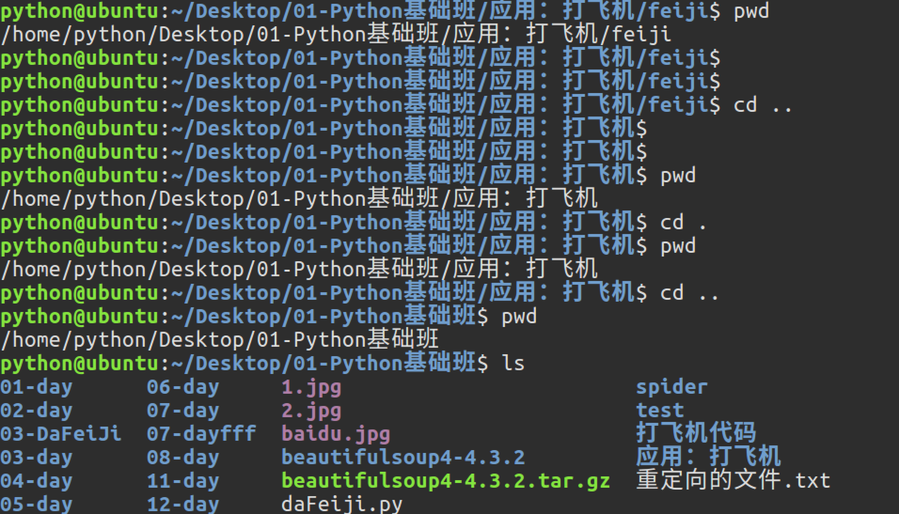

# 1.5. 常用Linux命令的基本使用

目标
--

*   能够说出学习 Linux 终端命令的原因
*   能够写出常用 Linux 命令

01\. 学习 Linux 终端命令的原因
---------------------

*   Linux 刚出世时没有什么图形界面，所有的操作全靠命令完成，近几年来，尽管 Linux 发展得非常迅速，图形界面越来越友好，但是在真正的开发过程中，Linux 命令行的应用还是占有非常重要的席位。
*   Linux 发行版本的命令大概有 200 多个，但是常用的命令只有 10 多个而已
*   **学习Linux命令的原因**: 在职场中，大量的 **服务器维护工作** 都是在 **远程** 通过 **SSH 客户端** 来完成的，并没有图形界面，所有的维护工作都需要通过命令来完成。如 **磁盘操作**、**文件存取**、**目录操作**、**进程管理**、**文件权限** 设定等

> 学习终端命令的技巧：
>
> *   不需要死记硬背，对于常用命令，用的多了，自然就记住了
> *   不要尝试一次学会所有的命令，有些命令是非常不常用的，临时遇到，临时百度就可以

02\. 常用 Linux 命令的基本使用
---------------------

序号

命令

对应英文

作用

01

ls

list

查看当前文件夹下的内容

02

pwd

print wrok directory

查看当前所在文件夹

03

touch \[文件名\]

touch

如果文件不存在，新建文件

04

mkdir \[目录名\]

make directory

创建目录

05

rm \[文件名\]

remove

删除指定的文件名

06

rm \[目录名\] -r

remove

删除指定的文件夹

07

cd \[目录名\]

change directory

切换文件夹

08

cp \[文件名\]

copy

拷贝指定的文件名

09

mv \[文件名\]

move

移动指定的文件名

10

tree \[目录名\]

tree

以树状方式显示目录结构

11

clear

clear

清屏

> 小技巧
>
> *   `ctrl + shift +` **放大**终端窗口的字体显示
> *   `ctrl + -` **缩小**终端窗口的字体显示

### 02.1 ls命令效果图

### 02.2 tree命令效果图

03\. 各种目录的切换：cd
---------------

在使用Unix/Linux的时候，经常需要更换工作目录。cd命令可以帮助用户切换工作目录。`Linux所有的目录和文件名大小写敏感`

cd后面可跟绝对路径，也可以跟相对路径。如果省略目录，则默认切换到当前用户的主目录。

命令

含义

cd

切换到当前用户的主目录(/home/用户目录)，用户登陆的时候，默认的目录就是用户的主目录。

cd ~

切换到当前用户的主目录(/home/用户目录)

cd .

切换到当前目录

cd ..

切换到上级目录

cd -

可进入上次所在的目录

### 03.1 绝对路径和相对路径

*   **绝对路径:从根目录算起的路径叫做绝对路径**
*   **相对路径:从当前目录算起的路径叫做相对路径**

 

### 04\. 自动补全

*   在敲出 **文件**／**目录**／**命令** 的前几个字母之后，按下 **tab** 键
    *   如果输入的没有歧义，系统会自动补全
    *   如果还存在其他 **文件**／**目录**／**命令**，再按一下 **tab** 键，系统会提示可能存在的命令

> 小技巧
>
> *   按 `上`／`下` 光标键可以在曾经使用过的命令之间来回切换
> *   如果想要退出选择，并且不想执行当前选中的命令，可以按 **ctrl + c**

### 思考

1.  如何使用Linux命令在桌面上创建一个test文件夹，然后切换到文件夹里面在创建一个1.txt文件，然后使用相对路径的方式把test文件夹拷贝到用户工作目录
2.  如何使用绝对路径的方式进入桌面，把桌面上创建的test文件夹删除掉