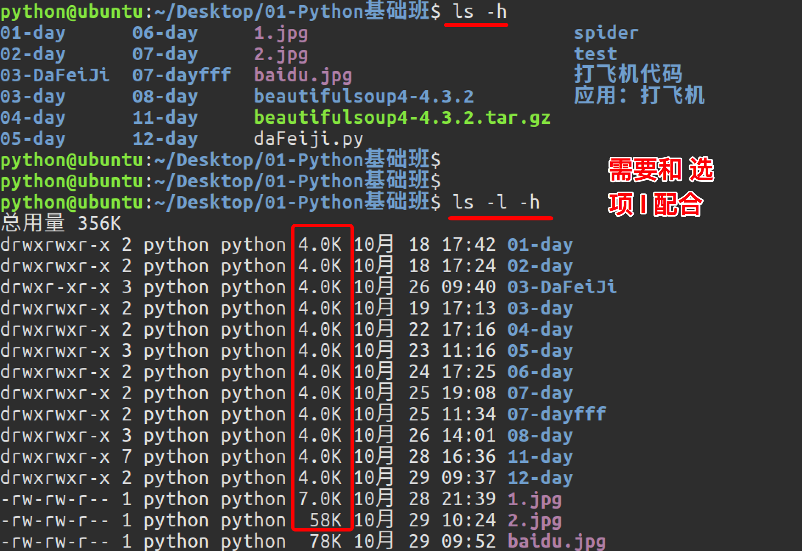
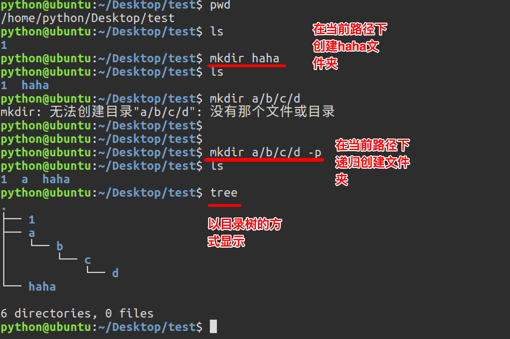
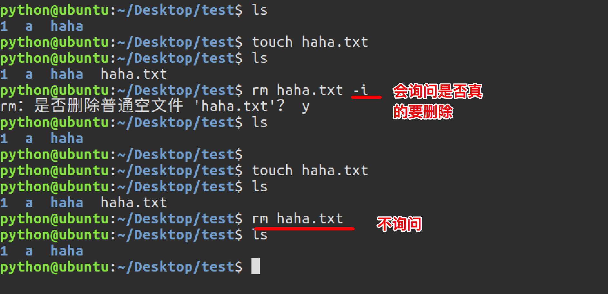
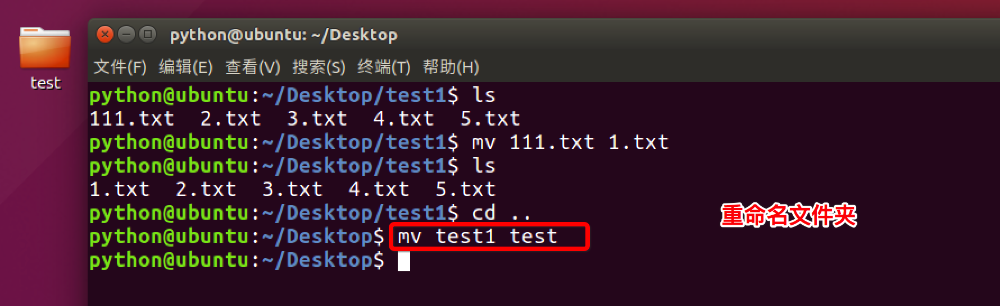
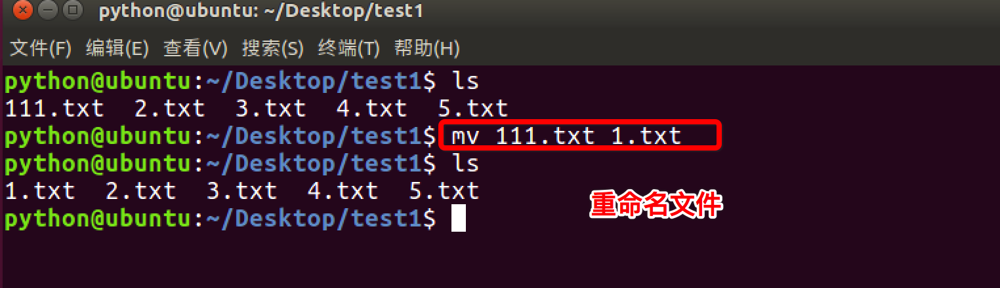
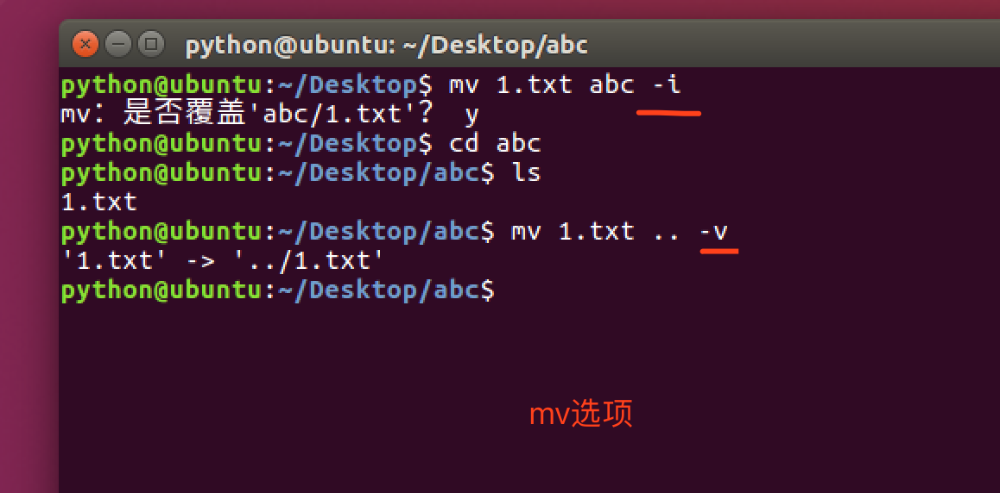

# 1.7. 常用Linux命令选项的使用

目标
--

*   能够写出常用 Linux 命令选项

### 1> ls选项

ls是英文单词list的简写，其功能为列出目录的内容，是用户最常用的命令之一，它类似于DOS下的dir命令。

`Linux文件或者目录名称最长可以有265个字符，“.”代表当前目录，“..”代表上一级目录，以“.”开头的文件为隐藏文件，需要用 -a 参数才能显示。`

ls常用选项：

选项

含义

-a

显示指定目录下的隐藏文件

-l

以列表方式显示文件的详细信息

-h

配合 -l 显示文件大小单位

  
  
  

图中列出的信息含义如下图所示：

### 2> mkdir选项

通过mkdir命令可以创建一个新的目录。参数-p可递归创建目录。 常用参数及含义如下表所示：

选项

含义

-p

创建所依赖的文件夹

需要注意的是新建目录的名称不能与当前目录中已有的目录或文件同名，并且目录创建者必须对当前目录具有写权限。

### 3> rm选项

可通过rm删除文件或目录。使用rm命令要小心，因为文件删除后不能恢复。为了防止文件误删，可以在rm后使用-i参数以逐个确认要删除的文件。

常用参数及含义如下表所示：

选项

含义

-i

以进行交互式方式执行

-f

强制删除，忽略不存在的文件，无需提示

-r

递归地删除目录下的内容，删除文件夹时必须加此参数

-d

删除空目录

 

### 4> cp选项

cp命令的功能是将给出的文件或目录复制到另一个文件或目录中，相当于DOS下的copy命令。

常用选项说明：

选项

含义

-a

该选项通常在复制目录时使用，它保留链接、文件属性，并递归地复制目录，简单而言，保持文件原有权限。

-i

交互式复制，在覆盖目标文件之前将给出提示要求用户确认

-r

若给出的源文件是目录文件，则cp将递归复制该目录下的所有子目录和文件，目标文件必须为一个目录名。

-v

显示拷贝后的路径描述

### 8> mv选项

用户可以使用mv命令来移动文件或目录，也可以给文件或目录重命名。  

常用选项说明：

选项

含义

-i

确认交互方式操作，如果mv操作将导致对已存在的目标文件的覆盖，系统会询问是否重写，要求用户回答以避免误覆盖文件

-v

显示移动后的路径描述

思考
--

*   1.以列表的方式查看根目录下的所有文件，请问命令如何写？
*   2.删除文件，防止文件误删，请问命令如何写？