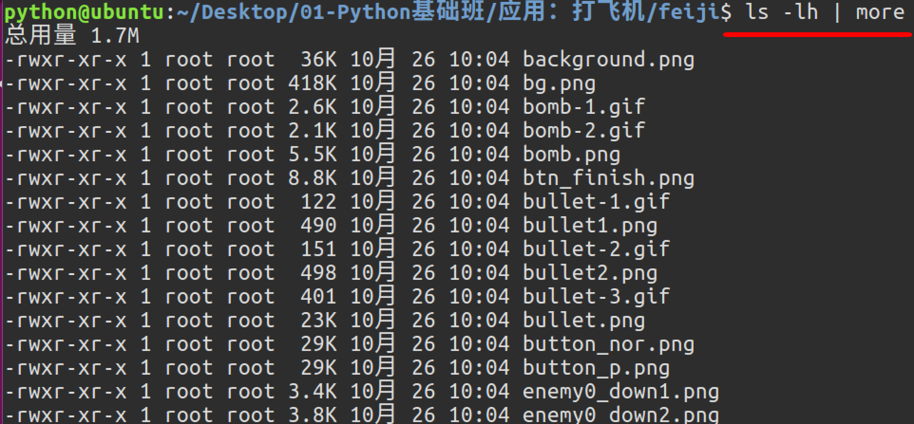
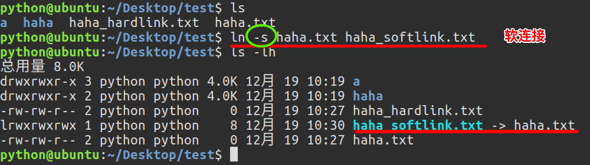
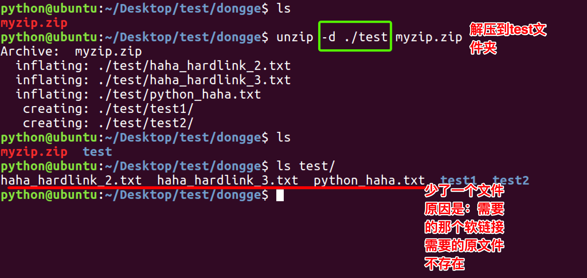
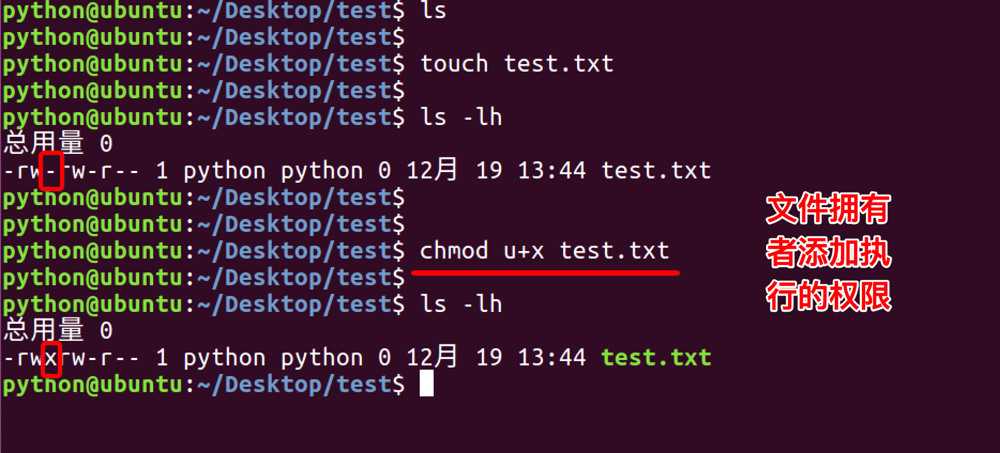
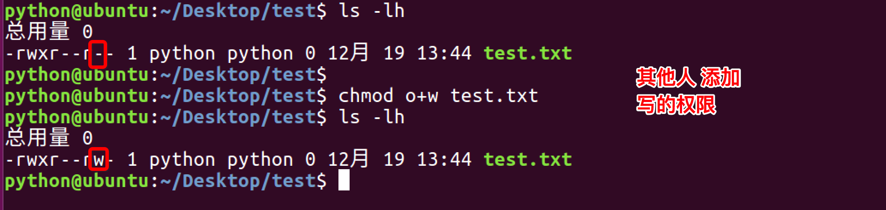
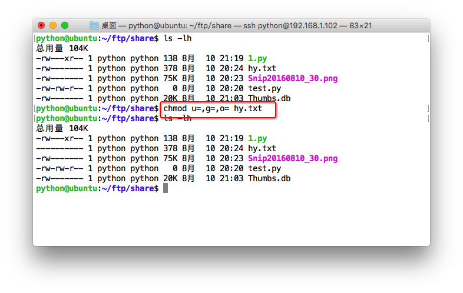
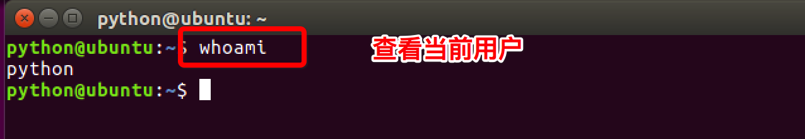

# 2.1. 高级Linux命令及命令选项

目标
--

*   能够将输出内容重定向到文件
*   能够说出管道的作用和语法格式
*   能够通过cat完成文件合并
*   能够使用tar完成文件的压缩和解压缩
*   能够使用chmod完成文件权限的修改

### 1\. 重定向命令：>

Linux允许将命令执行结果重定向到一个文件，本应显示在终端上的内容保存到指定文件中。

如：ls > test.txt ( test.txt 如果不存在，则创建，存在则覆盖其内容 )

注意： **>输出重定向会覆盖原来的内容，>>输出重定向则会追加到文件的尾部。**

### 2\. 查看或者合并文件内容：cat

 

提示:

> gedit 文件编辑命令，可以查看和编辑文件

### 3\. 分屏显示：more

查看内容时，在信息过长无法在一屏上显示时，会出现快速滚屏，使得用户无法看清文件的内容，此时可以使用more命令，每次只显示一页，按下空格键可以显示下一页，按下q键退出显示，按下h键可以获取帮助。

### 4\. 管道：|

管道：一个命令的输出可以通过管道做为另一个命令的输入。

管道我们可以理解现实生活中的管子，管子的一头塞东西进去，另一头取出来，这里“ | ”的左右分为两端，左端塞东西(写)，右端取东西(读)。

### 5\. 建立链接文件：ln

Linux链接文件类似于Windows下的快捷方式。

链接文件分为软链接和硬链接。

软链接：软链接不占用磁盘空间，源文件删除则软链接失效。

硬链接：硬链接只能链接普通文件，不能链接目录。

使用格式：

    ln 源文件 链接文件
    ln -s 源文件 链接文件

如果`没有-s`选项代表建立一个硬链接文件，两个文件占用相同大小的硬盘空间，即使删除了源文件，链接文件还是存在，所以-s选项是更常见的形式。

**注意：如果软链接文件和源文件不在同一个目录，源文件要使用绝对路径，不能使用相对路径。**

           

### 6\. 文本搜索：grep

Linux系统中grep命令是一种强大的文本搜索工具，grep允许对文本文件进行模式查找。如果找到匹配模式， grep打印包含模式的所有行。

grep一般格式为：

    grep [-选项] ‘搜索内容串’文件名

在grep命令中输入字符串参数时，最好引号或双引号括起来。

例如：

    grep 'a' 1.txt

常用选项说明：

选项

含义

-v

显示不包含匹配文本的所有行（相当于求反）

-n

显示匹配行及行号

-i

忽略大小写

grep搜索内容串可以是正则表达式。

正则表达式是对字符串操作的一种逻辑公式，就是用事先定义好的一些特定字符、及这些特定字符的组合，组成一个“规则字符串”，这个“规则字符串”用来表达对字符串的一种过滤逻辑。

grep常用正则表达式：

参数

含义

^a

行首,搜寻以 m 开头的行；grep -n '^a' 1.txt

ke$

行尾,搜寻以 ke 结束的行；grep -n 'ke$' 1.txt

\[Ss\]igna\[Ll\]

匹配 \[\] 里中一系列字符中的一个；搜寻匹配单词signal、signaL、Signal、SignaL的行；grep -n '\[Ss\]igna\[Ll\]' 1.txt

.

(点)匹配一个非换行符的字符；匹配 e 和 e 之间有任意一个字符，可以匹配 eee，eae，eve，但是不匹配 ee，eaae；grep -n 'e.e' 1.txt

### 7\. 查找文件：find

find命令功能非常强大，通常用来在特定的目录下搜索符合条件的文件，也可以用来搜索特定用户属主的文件。

常用用法：

命令

含义

find ./ -name test.sh

查找当前目录下所有名为test.sh的文件

find ./ -name '*.sh'

查找当前目录下所有后缀为.sh的文件

find ./ -name "\[A-Z\]*"

查找当前目录下所有以大写字母开头的文件

### 8\. 通配符

> **通配符是一种特殊字符，用来模糊搜索文件。**

统配字符注意有

*   *：代表0个或多个任意字符
*   ?：代表任意一个字符
*   \[列举的字符\]：代表的任意一个字符

举例

*   find . -name *.txt
*   ls 1?3.txt

**小结: ls, find命令一般会结合通配符使用**

### 9\. 打包及压缩：tar

计算机中的数据经常需要备份，tar是Unix/Linux中最常用的备份工具，此命令可以把一系列文件归档到一个大文件中，也可以把档案文件解开以恢复数据。

tar使用格式 tar \[选项\] 打包文件名 文件

常用参数：

选项

含义

-c

生成档案文件，创建打包文件

-v

列出归档解档的详细过程，显示进度

-f

指定档案文件名称，f后面一定是.tar文件，所以必须放选项最后

-x

解开档案文件

-z

压缩

**注意：除了f需要放在参数的最后，其它参数的顺序任意。**

 

#### 1> gz压缩格式

**tar这个命令并没有压缩的功能，它只是一个打包的命令，但是在tar命令中增加一个选项(-z)可以调用gzip实现了一个压缩的功能，实行一个先打包后压缩的过程。**

**压缩用法：tar -zcvf 压缩包包名 文件1 文件2 ...**

    -z:指定压缩包的格式为：file.tar.gz

**解压用法： tar -zxvf 压缩包包名**

    -z:指定压缩包的格式为：file.tar.gz

**解压到指定目录：-C （大写字母“C”）**

#### 2> bz2压缩格式

*   压缩用法： **tar -jcvf 压缩包包名 文件**

*   解压用法： **tar -jxvf 压缩包包名**

#### 3> zip压缩格式

**通过zip压缩文件的目标文件不需要指定扩展名，默认扩展名为zip。**

压缩文件：zip 目标文件(没有扩展名) 源文件

解压文件：unzip -d 解压后目录文件 压缩文件

 

### 10\. 修改文件权限：chmod

chmod 修改文件权限有两种使用格式：字母法与数字法。

字母法：chmod u/g/o/a +/-/= rwx 文件

\[ u/g/o/a \]

含义

u

user 表示该文件的所有者

g

group 表示与该文件的所有者属于同一组( group )者，即用户组

o

other 表示其他以外的人

a

all 表示这三者皆是

\[ +-= \]

含义

+

增加权限

-

撤销权限

=

设定权限

rwx

含义

r

read 表示可读取，对于一个目录，如果没有r权限，那么就意味着不能通过ls查看这个目录的内容。

w

write 表示可写入，对于一个目录，如果没有w权限，那么就意味着不能在目录下创建新的文件。

x

excute 表示可执行，对于一个目录，如果没有x权限，那么就意味着不能通过cd进入这个目录。

  

**如果需要同时进行设定拥有者、同组者以及其他人的权限，参考如下：**

 

数字法：“rwx” 这些权限也可以用数字来代替

字母

说明

r

读取权限，数字代号为 "4"

w

写入权限，数字代号为 "2"

x

执行权限，数字代号为 "1"

-

不具任何权限，数字代号为 "0"

如执行：chmod u=rwx,g=rx,o=r filename 就等同于：chmod u=7,g=5,o=4 filename

chmod 751 file：

*   文件所有者：读、写、执行权限
*   同组用户：读、执行的权限
*   其它用户：执行的权限

**注意：如果想递归所有目录加上相同权限，需要加上参数“ -R ”。 如：chmod 777 test/ -R 递归 test 目录下所有文件加 777 权限**

### 11\. 查看命令位置：which

 注意:

*   which cd 是查看不了命令所在目录，原因是：

    1.  Linux命令是分为内置命令和外部命令
        1.  内置命令是在系统启动时就载入内存执行效率高
        2.  外面命令是系统的软件功能，需要时载入内存
    2.  cd属于内置命令

### 12\. 切换到管理员账号：sudo -s

Ubuntu下切换到root的简单命令:

**提示: 一般不需要切换到管理员账户，需要使用管理员权限在命令前面加上sudo**

### 13\. 查看当前用户：whoami

查看当前用户命令是 **whoami** 

### 14\. 设置用户密码：passwd

在Unix/Linux中，超级用户可以使用passwd命令为普通用户设置或修改用户密码。用户也可以直接使用该命令来修改自己的密码，而无需在命令后面使用用户名。

### 15\. 退出登录账户： exit

*   如果是图形界面，退出当前终端；
*   如果是使用ssh远程登录，退出登陆账户；
*   如果是切换后的登陆用户，退出则返回上一个登陆账号。

### 16\. 查看所有的登录用户：who

who命令用于查看当前所有登录系统的用户信息。

### 17\. 关机重启：reboot、shutdown

命令

含义

reboot

重新启动操作系统

shutdown –r now

重新启动操作系统，shutdown会给别的用户提示

shutdown -h now

立刻关机，其中now相当于时间为0的状态

shutdown -h 20:25

系统在今天的20:25 会关机

shutdown -h +10

系统再过十分钟后自动关机

### 思考:

1.  查看多个文件，请问命令如何写?
2.  把.gz的压缩包使用绝对路径的方式解压到桌面，请问命令如何写?
3.  给文件的不同用户角色设置不同的权限，请问命令如何写?