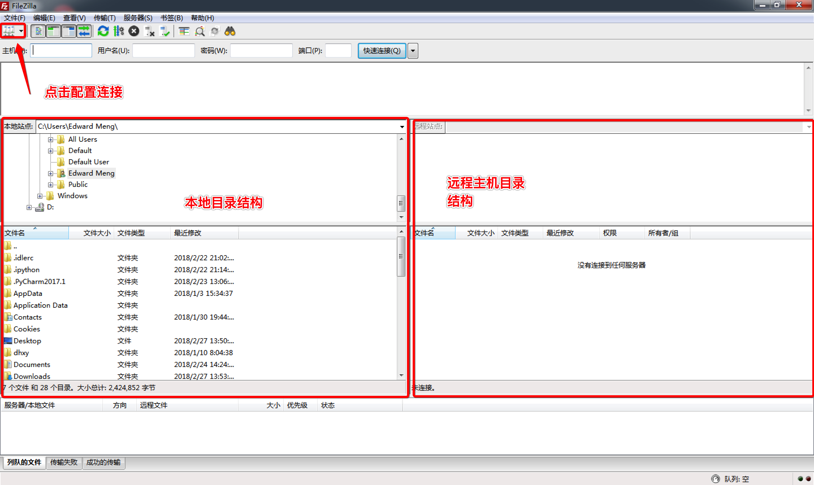
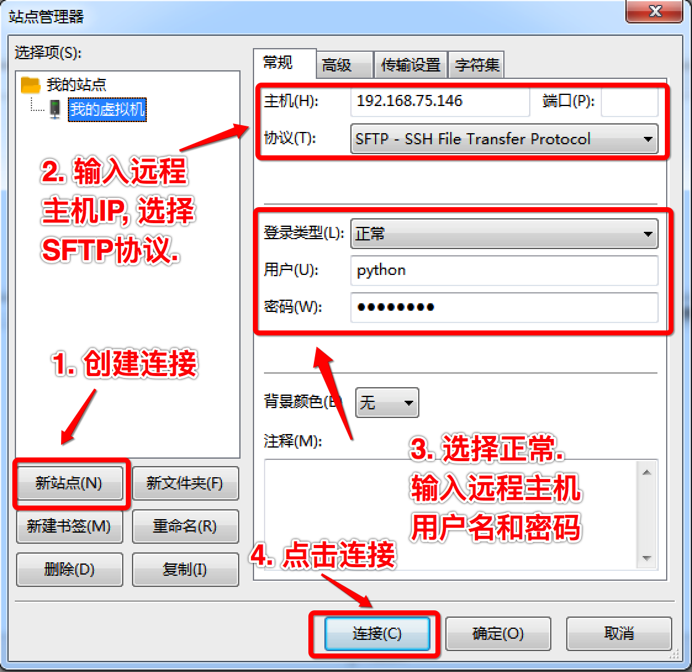
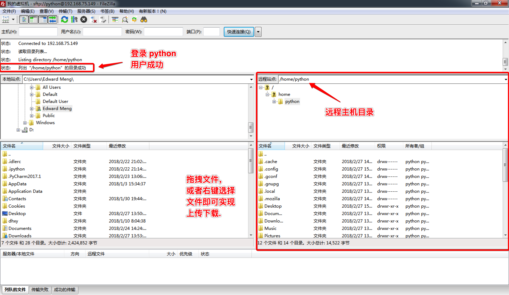
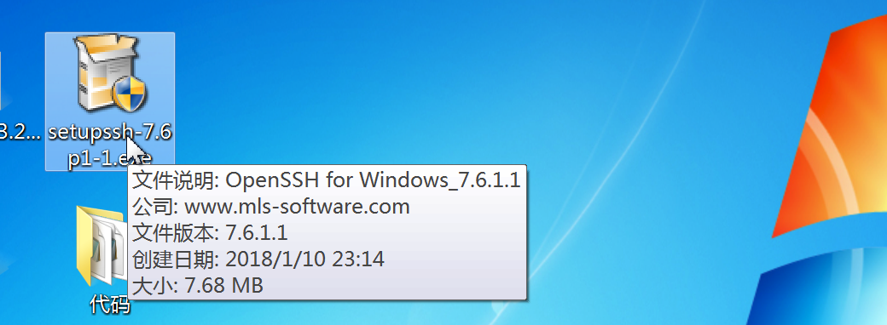

# 2.2. 远程登录和远程拷贝

目标
--

*   能够写出远程登录命令
*   能够写出远程拷贝命令

### 1>ssh介绍

**SSH是专为远程登录会话和其他网络服务提供安全性的协议。常用于远程登录，以及用户之间进行资料拷贝。**

SSH为Secure Shell的缩写，由 IETF 的网络工作小组（Network Working Group）所制定；SSH 为建立在应用层和传输层基础上的安全协议。

利用SSH协议可以有效防止远程管理过程中的信息泄露问题。SSH最初是 UNIX 系统上的一个程序，后来又迅速扩展到其他操作平台。SSH 在正确使用时可弥补网络中的漏洞。SSH 客户端适用于多种平台。几乎所有 UNIX 平台—包括 HP-UX、Linux、AIX、Solaris、Digital UNIX、Irix，以及其他平台，都可运行SSH。

使用SSH服务，需要安装相应的服务器和客户端。客户端和服务器的关系：如果，A机器想被B机器远程控制，那么，A机器需要安装SSH服务器，B机器需要安装SSH客户端。

### 2>在乌班图安装ssh

A.安装ssh服务器

    sudo apt-get install openssh-server

B.远程登陆

    ssh 用户名@IP

使用ssh访问，如访问出现错误。可查看是否有该文件 ～/.ssh/known_ssh 尝试删除该文件解决。

### 3>使用ssh连接服务器

SSH 告知用户，这个主机不能识别，这时键入"yes"，SSH 就会将相关信息，写入" ~/.ssh/know_hosts" 中，再次访问，就不会有这些信息了。然后输入完口令,就可以登录到主机了。

### 4>scp

远程拷贝文件,scp -r 的常用方法：

1.使用该命令的前提条件要求目标主机已经成功安装openssh-server

    如没有安装使用 sudo apt-get install openssh-server 来安装

2.使用格式：

    scp -r 目标用户名@目标主机IP地址：/目标文件的绝对路径  /保存到本机的绝对/相对路径
    
    举例：
    scp -r itcast@192.168.1.100:/home/itcast/QQ_dir/ ./mytest/lisi
    
    在后续会提示输入“yes”此时，只能输“yes”而不能简单输入“Y”

拷贝单个文件可以不加 -r参数，拷贝目录必须要加。

本地文件复制到远程：

    scp FileName RemoteUserName@RemoteHostIp:RemoteFile
    scp FileName RemoteHostIp:RemoteFolder
    scp FileName RemoteHostIp:RemoteFile

本地目录复制到远程：

    scp -r FolderName RemoteUserName@RemoteHostIp:RemoteFolder
    scp -r FolderName RemoteHostIp:RemoteFolder

远程文件复制到本地：

    scp RemoteUserName@RemoteHostIp:RemoteFile FileName
    scp RemoteHostIp:RemoteFolder FileName
    scp RemoteHostIp:RemoteFile FileName

远程目录复制到本地：

    scp -r RemoteUserName@RemoteHostIp:RemoteFolder FolderName
    scp -r RemoteHostIp:RemoteFolder FolderName

图形化界面上传下载
---------

我们在 Mac Ubuntu 通过命令可以上传下载文件, 也可使用图形界面的方式, 我们这里推荐一款 ftp 客户端软件 filezilla, 该款软件有 Mac Linux Windows 3个版本. Filezilla 支持 SFTP(基于 SSH 协议的 FTP). Linux 的 SSH 服务包含了 SFTP 功能.软件启动界面如下:   

### 小结

*   **1\. scp可以实现Ubuntu远程连接和文件上传和下载**
*   **2\. 在windows系统上远程连接Ubuntu需要安装OpenSSH软件**
*   **3\. FileZilla工具通过SFTP协议实现文件上传和下载** 