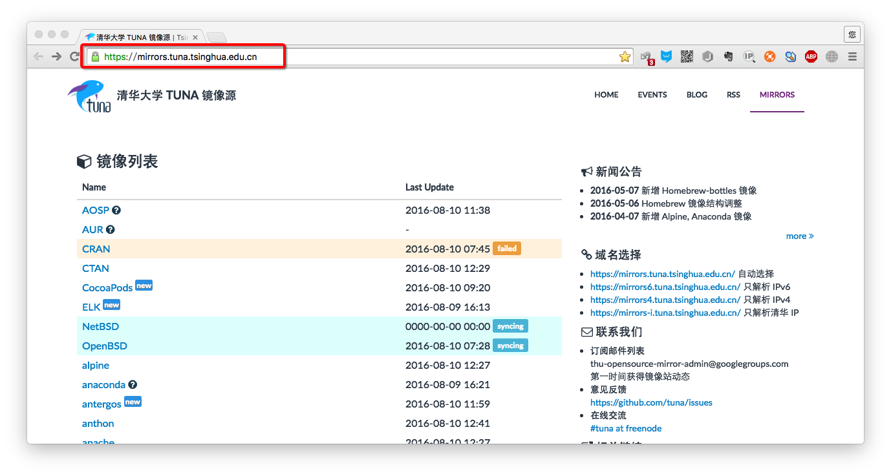
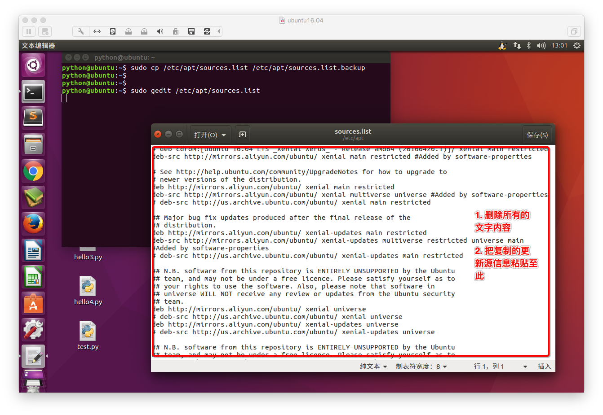

# 2.3. 软件安装与卸载

目标
--

*   能够说出修改镜像源的步骤
*   基于乌班图能够安装和下载软件

*   * *

在Ubuntu中安装软件和Windows系统中双击exe文件安装软件的方式有很大的不同，在Ubuntu中主要分为以下两种种软件安装的方式:

1.  **通过apt-get包管理器从软件源中安装(图形化和终端命令两种方式);**
2.  **通过deb格式的软件包安装;**

我们使用最多的是通过apt-get方式安装软件，已设定软件源中几乎包含了我们常用的所有软件。

那么什么是软件源: 软件源本质上就是一个软件仓库，Ubuntu在全世界各地有很多的软件仓库，这个仓库中包含了Ubuntu系统中的各种软件，需要什么软件，只要记得正确的软件的名字，就可以简单的通过 sudo apt-get install 命令安装，而且软件的卸载也非常方便，只需要运行 sudo apt-get remove 命令即可。而平时使用最多的软件安装方式就是通过软件源的方式。

其实通过软件源安装软件的原理很简单，Ubuntu系统自带了一个名叫 apt 的软件，它主要负责从系统中一个叫源列表(/etc/apt/source.list)的文件中读取软件源的网址信息，查找可以包含软件的软件源的网址，然后就从这个网址上把指定的软件给下载下来，然后由apt程序在本地进行一些解压和安装的操作。

软件源分为两类: Ubuntu官方软件源, PPA软件源(Personal Package Archives,也就是个人软件包集).

Ubuntu官方软件源中包含了Ubuntu系统所用到的绝大部分软件，在源列表文件中，记录了官方源的地址。

那么有同学有疑问，官方有软件源，为什么还有PPA，这是因为系统自带的源是优先的，我们肯定需要一些其他的软件包，而又不想直接下载deb格式的文件，又不想自己手动编译安装软件，所以这就用到了十分重要的的PPA源.

大家发现我的source.list和大家的文件内容不一样，很明显我更改了软件源，这是因为Ubuntu的官方软件源的服务器在国外，而从国内要访问国外的网站都需要经过“长城”来验证这个网站是否可访问，另一个原因服务器在国外，距离太远，访问速度没有直接从国内下载块。

重新编辑将新的软件源信息替换到source.list 也可以通过软件中心设置

更新Ubuntu软件下载地址
--------------

### 1\. 寻找国内镜像源

所谓的镜像源：可以理解为提供下载软件的地方，比如Android手机上可以下载软件的91手机助手；iOS手机上可以下载软件的AppStore

### 2\. 备份Ubuntu默认的源地址

    sudo cp /etc/apt/sources.list /etc/apt/sources.list.backup

### 3\. 更新源服务器列表

### 4\. 更新源

做完此步骤之后，就可以进行apt-get install 下载了

Ubuntu软件操作的相关命令
---------------

    sudo apt-get update  更新源
    
    sudo apt-get install package 安装包
    
    sudo apt-get remove package 删除包

小结
--

*   1.  Ubuntu软件安装常见的两种方式
        *   1.1 下载deb扩展名的安装包直接双击安装
        *   1.2 通过apt-get工具安装，90%都是以这种方式安装
*   1.  Ubuntu镜像源默认在国外，国内下载比较慢，需要将镜像源更改到国内
        *   2.1 通过Ubuntu软件中心更改
        *   2.2 手动更新sources.list文件并且需要执行sudo apt-get update 进行更新