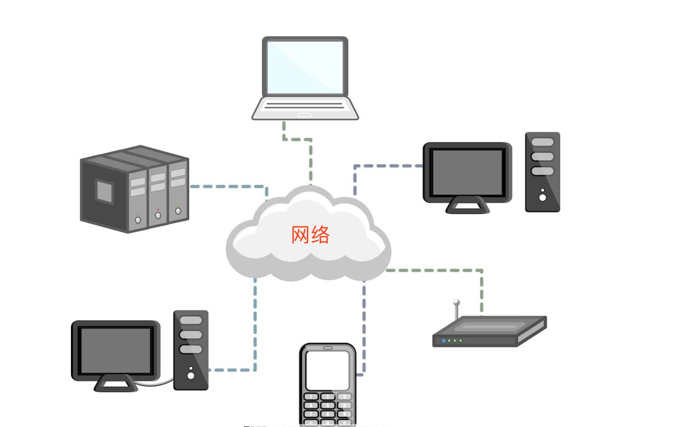
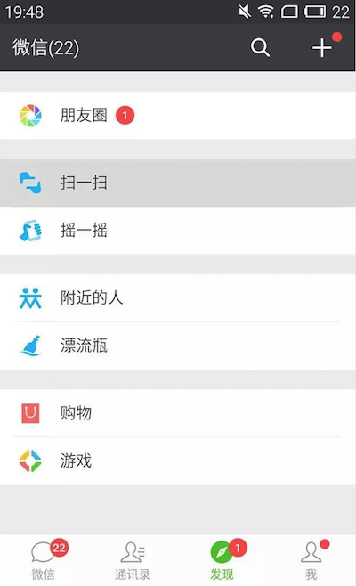

# 3.1. 网络概述

目标
--

*   知道网络的概念
*   知道学习网络的目标

### 1\. 什么是网络

> ###### 网络就是指将具有独立功能的多台计算机通过通信线路连接起来，在网络管理软件及网络通信协议下，实现资源共享和信息传递的虚拟平台。
>
> ###### 通俗理解网络就是把双方或者多方设备连接起来的一个工具，然后可以进行数据传递

### 2\. 现实生活那些地方使用了网络

1.浏览器上网

2.qq聊天

3.微信聊天

### 3\. 学习网络的目的

> ###### 能够编写基于网络通信的软件，通过网络把数据从一方传递到另外一方，完成数据的共享
>
> ###### 通俗来说就是能够进行网络编程，开发网络通信程序或者软件。

### 思考

想象一下生活中没有了网络会给我们带来什么影响?