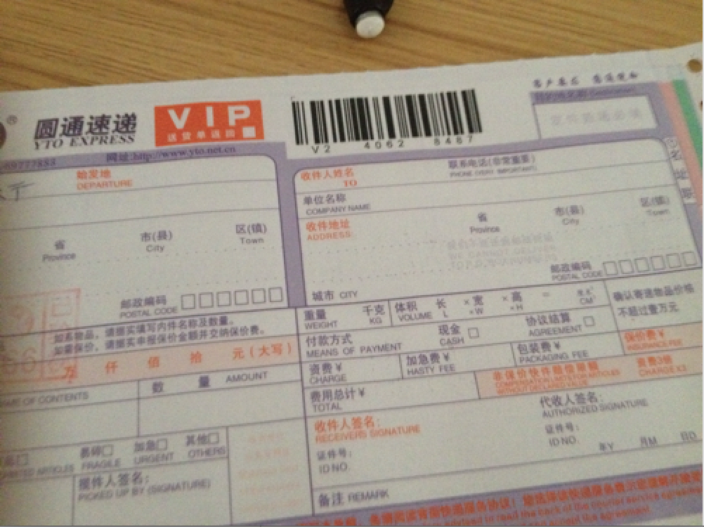
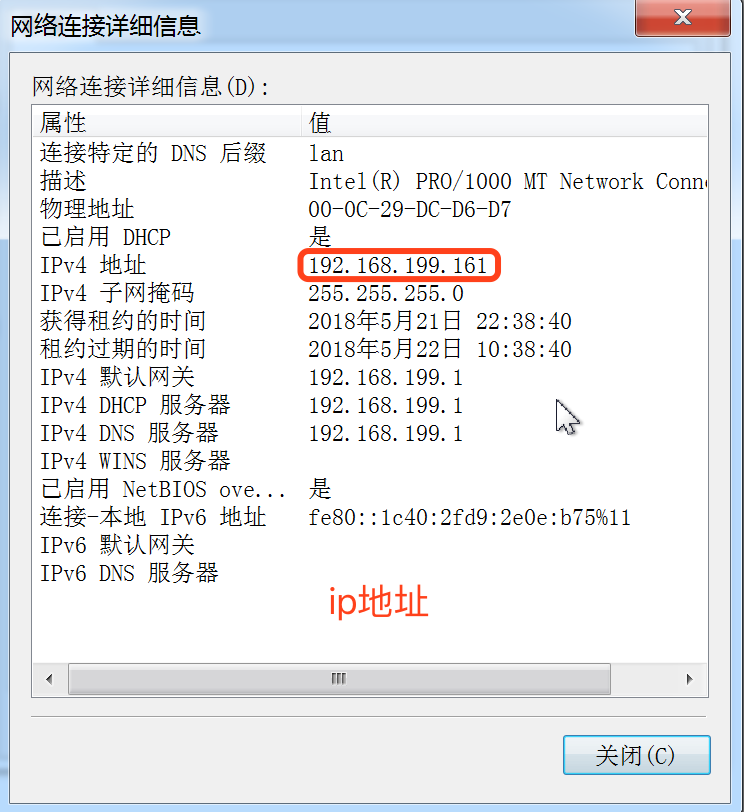
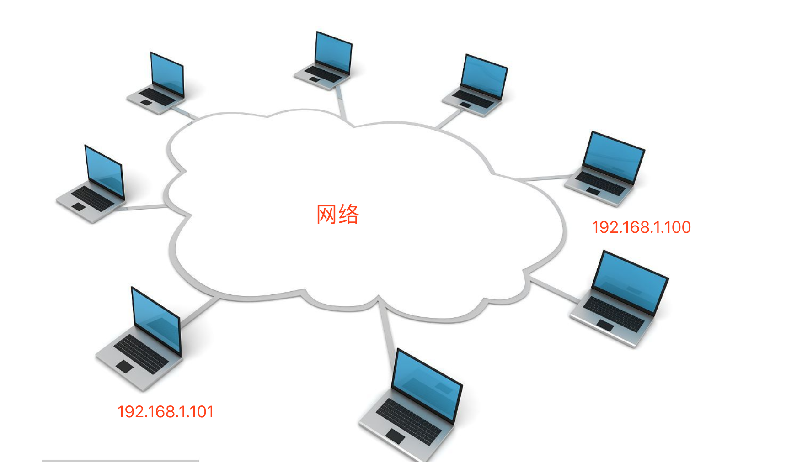

# 3.2. IP地址

目标
--

*   能够说出ip地址及作用

### 1\. ip地址的概念

> ###### ip地址是标识网络中唯一的一台设备的

ip地址好比现实生活中的家庭住址，快递小哥给你送快递根据你的家庭住址找到你的。

ip地址的样子:

### 2\. ip地址的作用

> ###### 通过ip地址找到网络中唯一一台设备，然后可以给设备发送数据

### 3\. 私有ip

> ###### 私有ip就是局域网中使用的ip地址，国际规定有一部分ip地址是在局域网中使用的

私有ip的范围，也就是不在公网中使用的ip地址范围:

    10.0.0.0～10.255.255.255
    
    172.16.0.0～172.31.255.255
    
    192.168.0.0～192.168.255.255

### 4\. 本机ip地址

> ###### 127.0.0.1表示本机ip地址; 本机域名是localhost; 通过域名可以解析一个ip地址，域名方便大家记忆某台电脑的主机地址

### 思考

想要和某台电脑进行通信，需要借助网络中的什么?