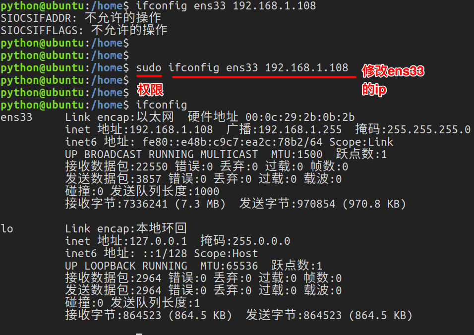

# 3.3. Linux命令-ping和ifconfig

### 查看或配置网卡信息：ifconfig

ifconfig查看网卡的信息：

### 测试远程主机连通性：ping

通常用ping来检测网络是否正常

### 小结

*   1.ping 127.0.0.1 检查本地网卡是否正常
*   2.ping www.baidu.com 检查是否能上公网
*   3.ping 当前局域网的ip地址 检查是否在同一个局域网内