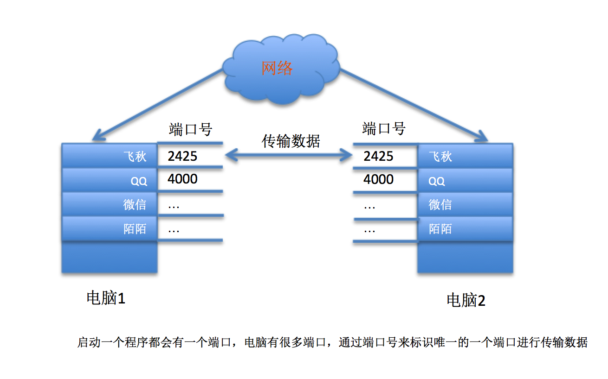
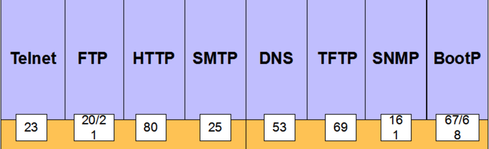

# 3.4. 端口

目标
==

*   知道端口及端口号的作用

### 1\. 什么是端口

> 端口是传输数据的通道，好比教室的门，是数据传输必经之路。

如果一个程序需要收发网络数据，那么就需要有这样的端口

问题:一个电脑上运行着多个应用程序，都需要收发数据，如何区分给那个应用程序呢?

既然有这么多端口，操作系统为了统一管理，所以进行了编号，这就是端口号

### 2\. 端口号

端口号:使用唯一一个编号来标识端口, 其实就是标识端口的一个编号。  
在linux系统中，端口号有65536（2的16次方）个

### 3\. 端口号划分

端口号不是随意使用的，而是按照一定的规定进行分配。

端口号分为知名端口号和动态端口号

#### 3.1 知名端口号（Well Known Ports）

> 知名端口号: 系统程序使用的端口号

知名端口号是众所周知的端口号，范围从0到1023

    80端口分配给HTTP服务
    21端口分配给FTP服务

可以理解为一些常用的功能使用的号码是估计的，好比 电话号码110、10086、10010一样

一般情况下，如果一个程序需要使用知名端口的需要有root权限

#### 3.2 动态端口号（Dynamic Ports）

> 动态端口号: 程序员开发应用程序使用端口号, 之所以称为动态端口，是因为它一般不固定分配某种服务，而是动态分配。

动态端口的范围是从1024到65535

当这个程序关闭时，同时也就释放了所占用的端口号

#### 3.3 怎样查看端口号 ？

*   用 netstat －an 查看程序所使用的端口号
*   lsof -i \[tcp/udp\]:2425 查看端口号对应的应用程序

提示: 如果端口号找不到应用程序，使用管理员权限加上sudo

### 4\. 总结

网络通信的流程是先通过ip地址找到网络中的设备，再通过端口号来找到对应的端口，然后通过端口把数据传输给对应的应用程序