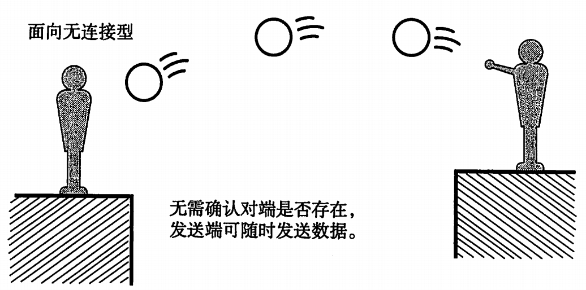
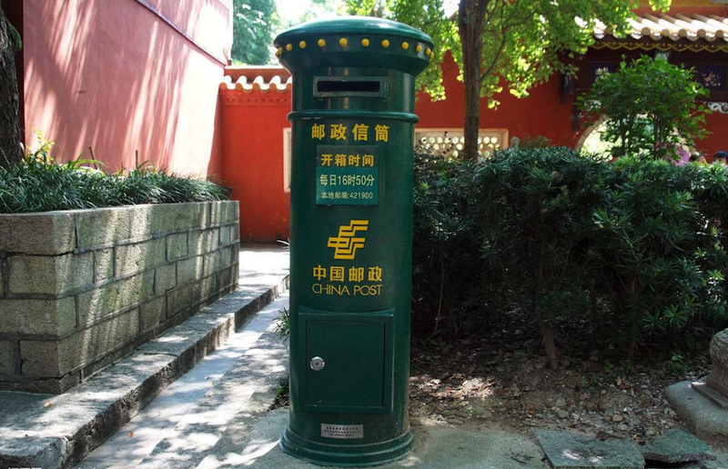

# 3.5. 网络传输方式-UDP

目标
--

*   知道UDP传输方式的优缺点

### 1.UDP概念

> ###### \# UDP:英文全拼(User Datagram Protocol)简称用户数据报协议，它是无连接的、不可靠的网络传输协议

udp网络传输协议好比现实生活中写信

### 2.UDP特点

因为udp发送数据之前不需要建立连接所有具有以下特点

*   无连接
*   资源开销小
*   传输速度快
*   udp每个数据包最大是64K

### 3.UDP的优缺点

优点:

*   传输速度快
*   不需要连接，资源开销小

缺点:

*   传输数据不可靠，容易丢数据包
*   没有流量控制，当对方没有及时接收数据，发送方一直发送数据会导致缓冲区数据满了，电脑出现卡死情况，所有接收方需要及时接收数据。

### 4.UDP的使用场景

当对网络通讯质量要求不高的时候，要求网络通讯速度能尽量的快，这时就可以使用UDP

*   qq音视频传输，微信音视频传输
*   上课使用的共屏软件
*   发送广播消息

### 小结

UDP是一个简单的面向数据报的运输层协议。UDP不提供可靠性，它只是把应用程序传给IP层的数据报发送出去，但是并不能保证它们能到达目的地。由于UDP在传输数据报前不用在客户和服务器之间建立一个连接，且没有超时重发等机制，故而传输速度很快。