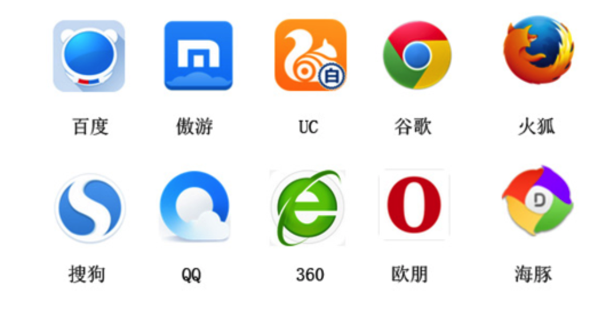

# 3.6. socket介绍

目标
--

*   知道socket的作用

1\. 不同电脑上的进程之间如何通信
------------------

首先通过ip地址找到网络中对应的电脑，然后通过传输协议和端口号来确定这个进程(运行起来的软件)，那么数据如何传输需要使用socket来完成，也就是进程之间通信使用socket

注意：

> ###### 所谓进程指的是：运行的程序或者软件称之为进程（在讲解多任务编程时进行详细讲解）
>
> ###### 所谓进程间通信指的是：运行的程序之间的数据共享

2\. 什么是socket
-------------

socket(简称 套接字) 是进程间通信一个工具，它能实现把数据从一方传输到另外一方，完成不同电脑上进程之间的通信， 它好比数据的搬运工。

3\. socket使用场景
--------------

不夸张来说，只要跟网络相关的应用程序或者软件都使用到了socket， 比如:

  

小结
--

*   **socket就是完成不同电脑上进程之间通信的一个工具，负责进程之间数据的传输**