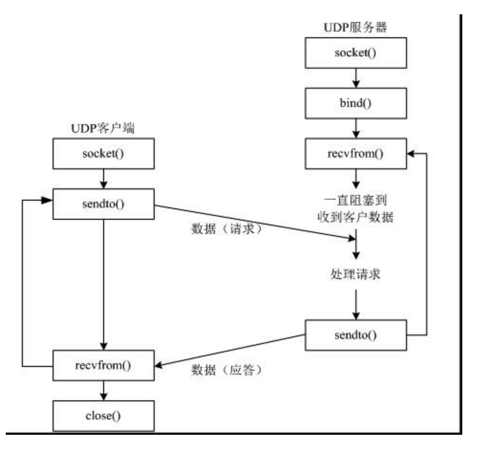
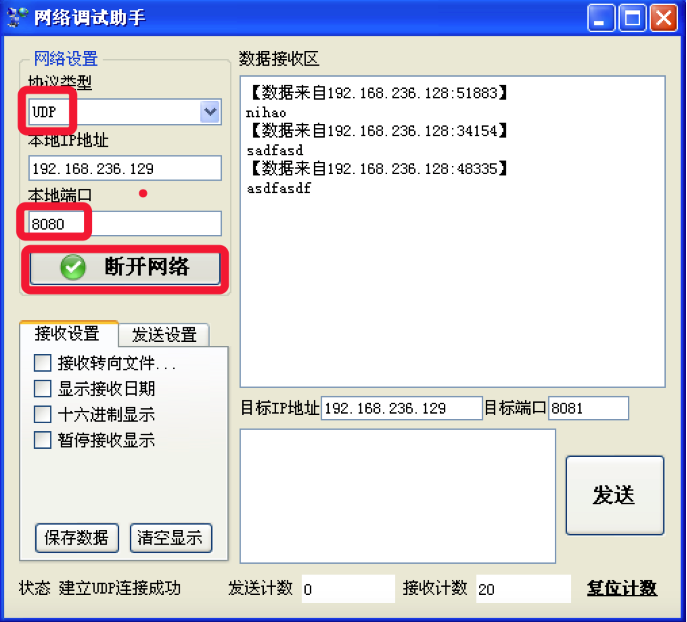
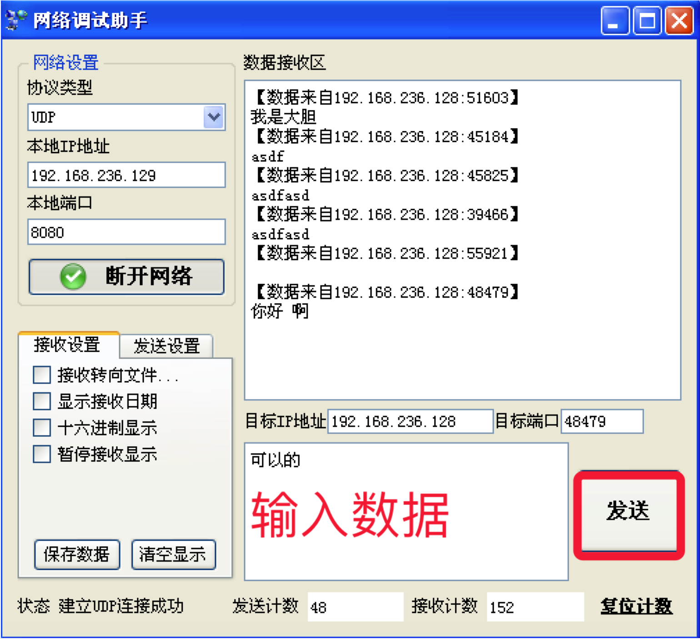

# 3.7. udp网络程序-发送、接收数据

目标
--

*   能够通过udp socket完成发送和接收数据功能代码

### 1\. udp网络程序流程

创建一个基于udp的网络程序流程很简单，具体步骤如下：

1.  创建客户端套接字
2.  发送/接收数据
3.  关闭套接字

### 2\. 创建socket

在 Python 中 使用socket 模块的函数 socket 就可以完成：

    import socket
    socket.socket(AddressFamily, Type)

说明：

函数 socket.socket 创建一个 socket，该函数带有两个参数：

Address Family：IP地址类型; AF\_INET表示ipv4类型、AF\_INET6表示ipv6类型; Type：套接字类型，可以是 SOCK\_STREAM（流式套接字，主要用于 TCP 协议）或者 SOCK\_DGRAM（数据报套接字，主要用于 UDP 协议）

创建一个udp socket（udp套接字）

    import socket
    
    # 创建udp的套接字
    s = socket.socket(socket.AF_INET, socket.SOCK_DGRAM)
    
    # ...这里是使用套接字的功能（省略）...
    
    # 不用的时候，关闭套接字
    s.close()

说明

套接字使用流程 与 文件的使用流程很类似 创建套接字 使用套接字收/发数据 关闭套接字

### 3.发送数据

代码如下：

    import socket
    
    # 1. 创建udp套接字
    udp_socket = socket.socket(socket.AF_INET, socket.SOCK_DGRAM)
    
    # 2. 准备接收方的地址
    # '192.168.1.103'表示目的ip地址
    # 8080表示目的端口
    dest_addr = ('192.168.1.103', 8080)  # 注意 是元组，ip是字符串，端口是数字
    
    # 3. 从键盘获取数据
    send_data = input("请输入要发送的数据:")
    
    # 4. 发送数据到指定的电脑上的指定程序中
    udp_socket.sendto(send_data.encode('utf-8'), dest_addr)
    
    # 5. 关闭套接字
    udp_socket.close()

在windows中运行“网络调试助手”：

### 4.发送、接收数据

    import socket
    
    # 1. 创建udp套接字
    udp_socket = socket.socket(socket.AF_INET, socket.SOCK_DGRAM)
    
    # 2. 准备接收方的地址
    dest_addr = ('192.168.236.129', 8080)
    
    # 3. 从键盘获取数据
    send_data = input("请输入要发送的数据:")
    
    # 4. 发送数据到指定的电脑上
    udp_socket.sendto(send_data.encode('utf-8'), dest_addr)
    
    # 5. 等待接收对方发送的数据
    recv_data = udp_socket.recvfrom(1024)  # 1024表示本次接收的最大字节数
    
    # 6. 显示对方发送的数据
    # 接收到的数据recv_data是一个元组
    # 第1个元素是对方发送的数据
    # 第2个元素是对方的ip和端口
    print(recv_data[0].decode('gbk'))
    print(recv_data[1])
    
    # 7. 关闭套接字
    udp_socket.close()

网络调试助手截图：

