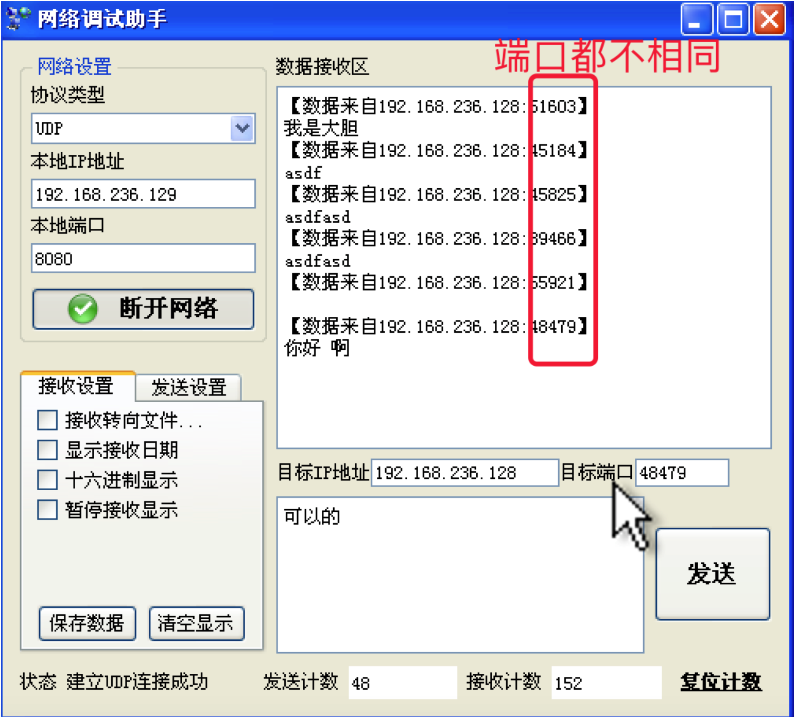
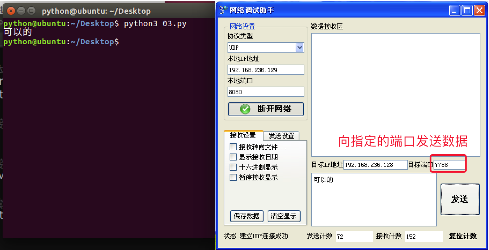

# 3.9. udp绑定端口号

目标
--

*   知道如何给程序绑定端口号

### 1\. udp网络程序-端口号问题

*   会变的端口号

重新运行多次脚本，然后在“网络调试助手”中，看到的现象如下：

说明：

*   每重新运行一次网络程序，上图中红圈中的数字，不一样的原因在于，这个数字标识这个网络程序，当重新运行时，如果没有确定到底用哪个，系统默认会随机分配
*   记住一点：这个网络程序在运行的过程中，这个就唯一标识这个程序，所以如果其他电脑上的网络程序如果想要向此程序发送数据，那么就需要向这个数字（即端口号）标识的程序发送即可

### 2\. udp绑定信息

#### <1>. 绑定信息

一般情况下，在一台电脑上运行的网络程序有很多，为了不与其他的网络程序占用同一个端口号，往往在编程中，udp的端口号一般不绑定

但是如果需要做成一个服务器端的程序的话，是需要绑定的，想想看这又是为什么呢？

如果报警电话每天都在变，想必世界就会乱了，所以一般服务性的程序，往往需要一个固定的端口号，这就是所谓的端口号绑定

#### <2>. 绑定示例

    #coding=utf-8
    
    from socket import *
    
    # 1. 创建套接字
    udp_socket = socket(AF_INET, SOCK_DGRAM)
    
    # 2. 绑定本地的相关信息，如果一个网络程序不绑定，则系统会随机分配
    local_addr = ('', 7788) #  ip地址和端口号，ip一般不用写，表示本机的任何一个ip
    udp_socket.bind(local_addr)
    
    # 3. 等待接收对方发送的数据
    recv_data = udp_socket.recvfrom(1024) #  1024表示本次接收的最大字节数
    
    # 4. 显示接收到的数据
    print(recv_data[0].decode('gbk'))
    
    # 5. 关闭套接字
    udp_socket.close()

#### 运行结果：

#### <3>. 总结

*   一个udp网络程序，不绑定端口号，此时操作系统会随机分配一个端口号，如果绑定端口号，每次启动程序端口号不变。