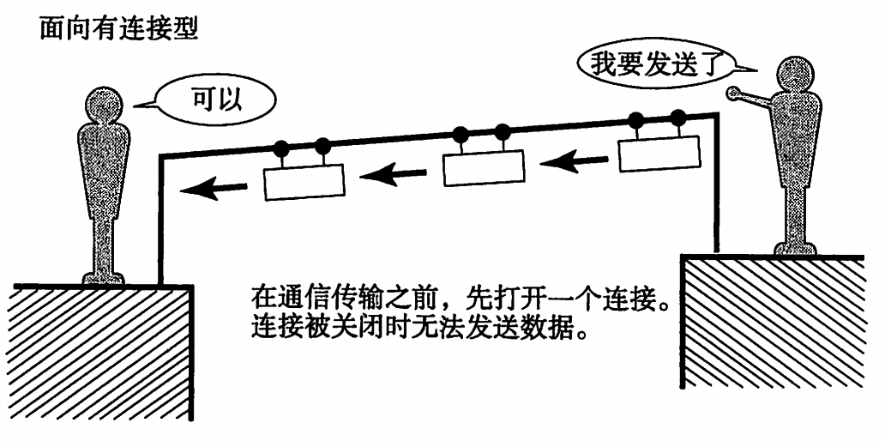
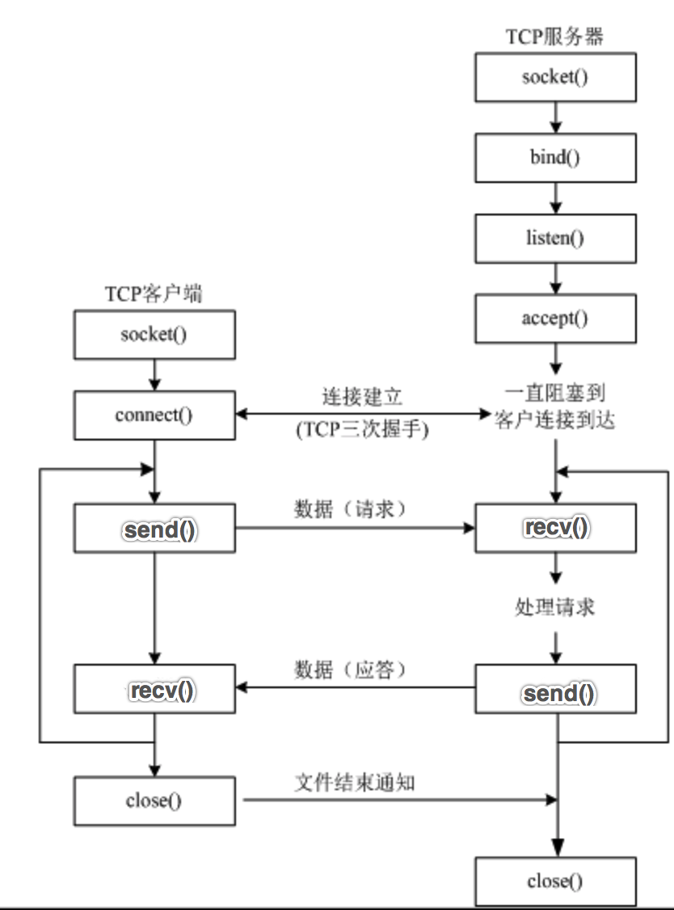

# 4.1. 网络传输方式-TCP

目标
--

*   知道TCP传输方式的优缺点

### 1.TCP概念

> ###### TCP:英文全拼(Transmission Control Protocol)简称传输控制协议，它是一种面向连接的、可靠的、基于字节流的传输层通信协议.

TCP通信需要经过**创建连接、数据传送、终止连接**三个步骤。

TCP通信模型中，在通信开始之前，一定要先建立相关的链接，才能发送数据，类似于生活中，"打电话""

### 2.TCP特点

#### 1\. 面向连接

通信双方必须先建立连接才能进行数据的传输，双方都必须为该连接分配必要的系统内核资源，以管理连接的状态和连接上的传输。

双方间的数据传输都可以通过这一个连接进行。

完成数据交换后，双方必须断开此连接，以释放系统资源。

这种连接是一对一的，因此TCP不适用于广播的应用程序，基于广播的应用程序请使用UDP协议。

#### 2\. 可靠传输

1. **TCP采用发送应答机制**

   TCP发送的每个报文段都必须得到接收方的应答才认为这个TCP报文段传输成功

2. **超时重传**

   发送端发出一个报文段之后就启动定时器，如果在定时时间内没有收到应答就重新发送这个报文段。

   TCP为了保证不发生丢包，就给每个包一个序号，同时序号也保证了传送到接收端实体的包的按序接收。然后接收端实体对已成功收到的包发回一个相应的确认（ACK）；如果发送端实体在合理的往返时延（RTT）内未收到确认，那么对应的数据包就被假设为已丢失将会被进行重传。

3. **错误校验**

   由发送端计算,然后由接收端验证,其目的是为了检测数据在发送端到接收端之间是否有改动,如果接收方检测到校验和有差错，则直接丢弃这个数据包。

4. **流量控制和阻塞管理**

   流量控制用来避免主机发送得过快而使接收方来不及完全收下。

### 3.TCP的优缺点

优点:

*   可靠，稳定
*   适合传输大量数据 缺点:
*   传输速度慢
*   占用系统资源高

### 4\. TCP和UDP区别

1.  TCP面向连接; UDP是不面向连接;
2.  TCP提供可靠的数据传输，也就是说，通过TCP连接传送的数据，无差错，不丢失，不重复，且按序到达;UDP不保证可靠的数据传输，容易出现丢包情况;
3.  TCP需要连接传输速度慢，UDP不需要连接传输速度快
4.  TCP不支持发广播;UDP支持发广播
5.  TCP对系统资源要求较多，UDP对系统资源要求较少。
6.  TCP适合发送大量数据，UDP适合发送少量数据
7.  TCP有流量控制，UDP没有流量控制

### 5\. TCP使用场景

当对网络通讯质量有要求的时候，比如：整个数据要准确无误的传递给对方，这往往用于一些要求可靠的应用，比如HTTP、HTTPS、FTP等传输文件的协议，POP、SMTP等邮件传输的协议。

在日常生活中，常见使用TCP协议的应用如下：

*   浏览器
*   QQ文件传输

### 6\. UDP网络程序流程

UDP网络程序发送数据不需要建立连接

### 7\. TCP网络程序流程

TCP网络程序发送数据需要建立连接 