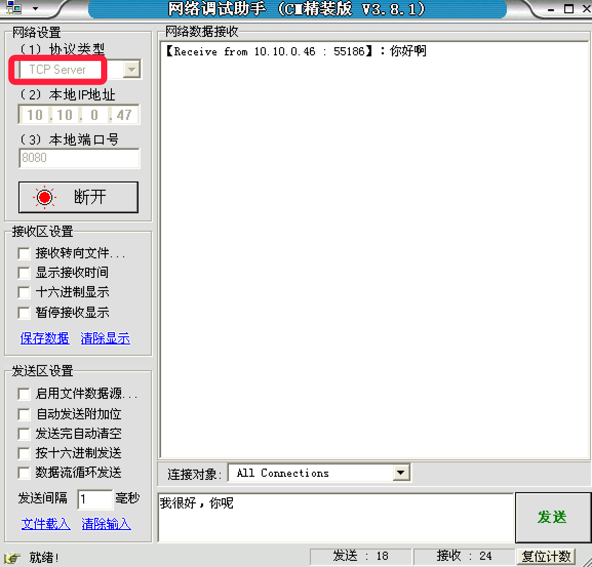

# 4.2. TCP网络程序-客户端

> ###### 所谓的客户端，就是需要被服务的一方,而服务器端就是提供服务的一方.

目标
--

*   能够写出TCP客户端程序完成发送数据和接收数据

### TCP客户端代码

示例代码：

    import socket
    
    # 创建tcp socket
    tcp_client_socket = socket.socket(socket.AF_INET, socket.SOCK_STREAM)
    
    # 目的信息
    server_ip = input("请输入服务器ip:")
    server_port = int(input("请输入服务器port:"))
    
    # 链接服务器
    tcp_client_socket.connect((server_ip, server_port))
    
    # 提示用户输入数据
    send_data = input("请输入要发送的数据：")
    
    tcp_client_socket.send(send_data.encode("gbk"))
    
    # 接收对方发送过来的数据，最大接收1024个字节
    recvData = tcp_client_socket.recv(1024)
    print('接收到的数据为:', recvData.decode('gbk'))
    
    # 关闭套接字
    tcp_client_socket.close()

### 运行结果：

#### tcp客户端:

    请输入服务器ip:10.10.0.47
    请输入服务器port:8080
    请输入要发送的数据：你好啊
    接收到的数据为: 我很好，你呢

#### 网络调试助手:

