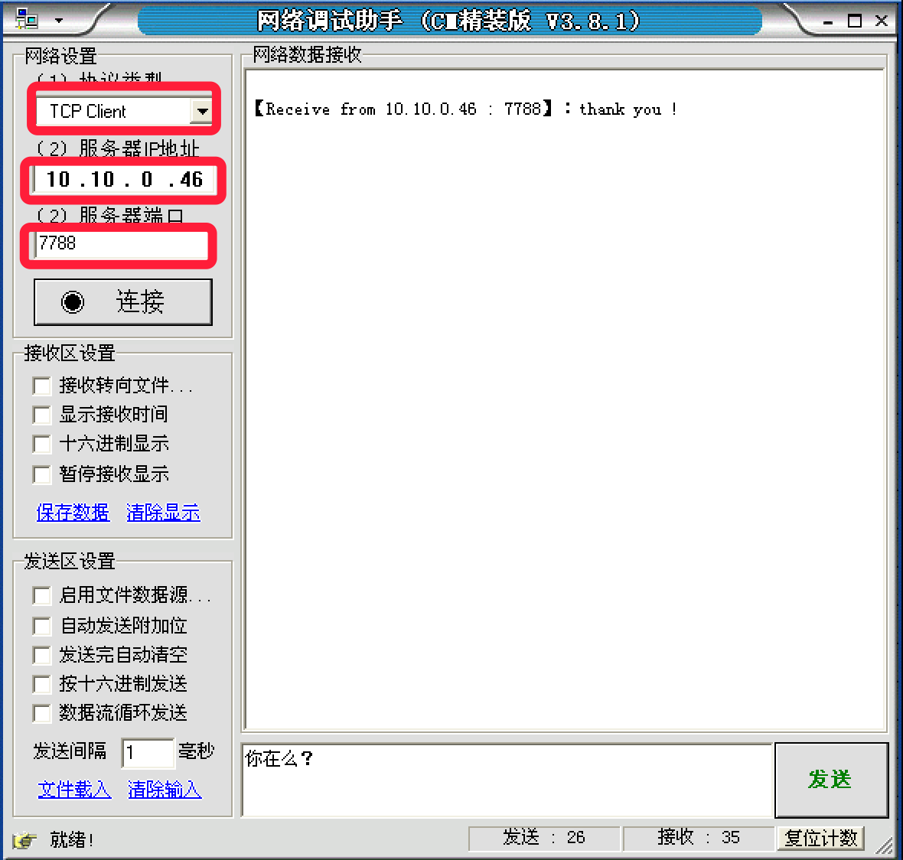

# 4.3. TCP网络程序-服务端

目标
--

*   能够写出TCP服务端程序完成发送数据和接收数据

### tcp服务器

想要完成一个tcp服务器的功能，需要的流程如下：

1.  socket创建一个套接字
2.  bind绑定ip和port
3.  listen使套接字变为可以被动链接
4.  accept等待客户端的链接
5.  recv/send接收发送数据

一个很简单的tcp服务器如下：

    import socket
    
    # 创建socket
    tcp_server_socket = socket(socket.AF_INET, socket.SOCK_STREAM)
    
    # 本地信息
    address = ('', 7788)
    
    # 绑定
    tcp_server_socket.bind(address)

​    
    # 设置监听
    # 使用socket创建的套接字默认的属性是主动的，使用listen将其变为被动的，这样就可以接收别人的链接了
    # 128:表示最大等待连接数
    tcp_server_socket.listen(128)
    
    # 如果有新的客户端来链接服务器，那么就产生一个新的套接字专门为这个客户端服务
    # client_socket用来为这个客户端服务
    # tcp_server_socket就可以省下来专门等待其他新客户端的链接
    client_socket, clientAddr = tcp_server_socket.accept()
    
    # 接收对方发送过来的数据
    recv_data = client_socket.recv(1024)  # 接收1024个字节
    print('接收到的数据为:', recv_data.decode('gbk'))
    
    # 发送一些数据到客户端
    client_socket.send("thank you !".encode('gbk'))
    
    # 关闭为这个客户端服务的套接字，只要关闭了，就意味着为不能再为这个客户端服务了，如果还需要服务，只能再次重新连接
    client_socket.close()

### 运行结果：

#### TCP服务端

    接收到的数据为: 你在么？

#### 网络调试助手：

