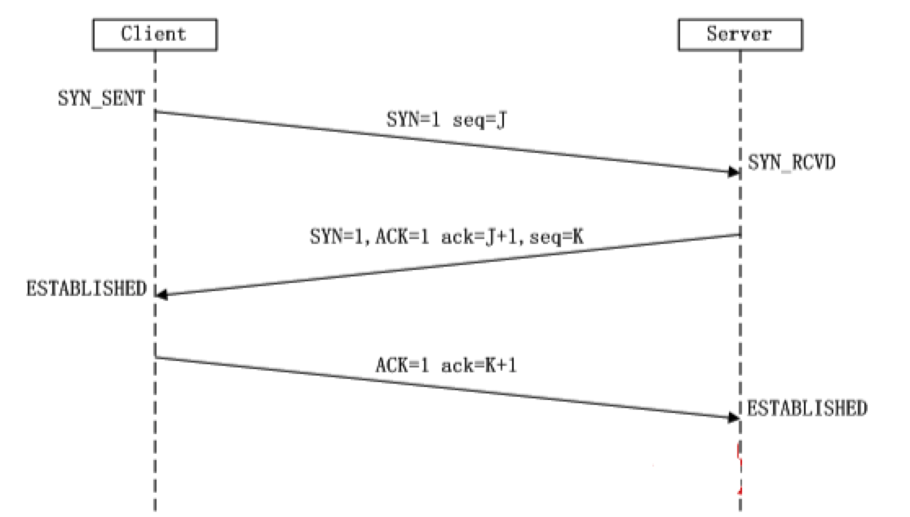

# 4.6. tcp的3次握手

目标
--

*   知道tcp的三次握手什么时候产生

TCP的三次握手流程图
-----------

### 标志位

SYN: 表示连接请求 ACK: 表示确认 FIN: 表示关闭连接 seq:表示报文序号 ack: 表示确认序号

小结:
---

1.  第一次握手：Client将标志位SYN置为1，随机产生一个值seq=J，并将该数据包发送给Server，Client进入SYN_SENT状态，等待Server确认。

2.  第二次握手：Server收到数据包后由标志位SYN=1知道Client请求建立连接，Server将标志位SYN和ACK都置为1，ack (number )=J+1，随机产生一个值seq=K，并将该数据包发送给Client以确认连接请求，Server进入SYN_RCVD状态。

3.  第三次握手：Client收到确认后，检查ack是否为J+1，ACK是否为1，如果正确则将标志位ACK置为1，ack=K+1，并将该数据包发送给Server，Server检查ack是否为K+1，ACK是否为1，如果正确则连接建立成功，Client和Server进入ESTABLISHED状态，完成三次握手，随后Client与Server之间可以开始传输数据了。