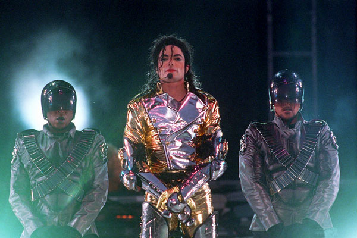

# 5.1. 多任务的介绍

目标
--

*   能够知道现实生活中出现多任务的情景

### 1\. 多任务的概念

> ###### 多任务: 在同一时间内执行多个任务，每个任务可以理解成现实生活中干的每个活。

### 2\. 现实生活中多任务

1.  有很多的场景中的事情是同时进行的，比如开车的时候 手和脚共同来驾驶汽车，再比如唱歌跳舞也是同时进行的；

1.  操作系统可以同时运行多个任务。打个比方，你一边在使用浏览器上网，一边在使用网易云音乐听歌，一边在使用Word赶作业，这就是多任务。

操作系统轮流让各个任务交替执行，任务1执行0.01秒，切换到任务2，任务2执行0.01秒，再切换到任务3，执行0.01秒……这样反复执行下去。表面上看，每个任务都是交替执行的，但是，由于CPU的执行速度实在是太快了，我们感觉就像所有任务都在同时执行一样。

单核cpu是并发的执行多任务，真正的并行执行多任务只能在多核CPU上实现，但是，由于任务数量远远多于CPU的核心数量，所以，操作系统也会自动把很多任务轮流调度到每个核心上执行。

### 小结

*   并发：指的是任务数多余cpu核数，通过操作系统的各种任务调度算法，实现用多个任务“一起”执行（实际上总有一些任务不在执行，因为切换任务的速度相当快，看上去一起执行而已）
*   并行：指的是任务数小于等于cpu核数，即任务真的是一起执行的