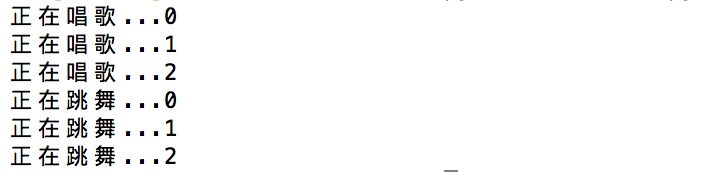
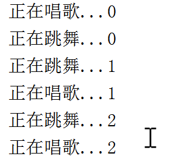

# 5.2. 线程

目标
--

*   能够知道创建线程完成多任务

### 1\. 线程的概念

> 线程就是在程序运行过程中，执行程序代码的一个分支，每个运行的程序至少都有一个线程

### 2\. 单线程执行

    from time import sleep
    
    def sing():
        for i in range(3):
            print("正在唱歌...%d" % i)
            sleep(1)
    
    def dance():
        for i in range(3):
            print("正在跳舞...%d" % i)
            sleep(1)
    
    if __name__ == '__main__':
        sing() #唱歌
        dance() #跳舞

运行结果如下：

### 3\. 多线程执行

#### 3.1 导入线程模块

    #导入线程模块
    import threading

#### 3.2 线程类Thread参数说明

Thread(\[group \[, target \[, name \[, args \[, kwargs\]\]\]\]\])

*   group: 线程组，目前只能使用None
*   target: 执行的目标任务名
*   args: 以元组的方式给执行任务传参
*   kwargs: 以字典方式给执行任务传参
*   name: 线程名，一般不用设置

#### 3.3 启动线程

启动线程使用start方法

#### 3.4 多线程完成多任务的代码

    import threading
    import time
    
    # 唱歌任务
    def sing():
        # 扩展： 获取当前线程
        # print("sing当前执行的线程为：", threading.current_thread())
        for i in range(3):
            print("正在唱歌...%d" % i)
            time.sleep(1)
    
    # 跳舞任务
    def dance():
        # 扩展： 获取当前线程
        # print("dance当前执行的线程为：", threading.current_thread())
        for i in range(3):
            print("正在跳舞...%d" % i)
            time.sleep(1)

​    
    if __name__ == '__main__':
        # 扩展： 获取当前线程
        # print("当前执行的线程为：", threading.current_thread())
        # 创建唱歌的线程
        # target： 线程执行的函数名
        sing_thread = threading.Thread(target=sing)
    
        # 创建跳舞的线程
        dance_thread = threading.Thread(target=dance)
    
        # 开启线程
        sing_thread.start()
        dance_thread.start()

执行结果:

#### 3.5 多线程执行带有参数的任务

    import threading
    import time
    
    # 唱歌任务
    def sing(num):
        # 扩展： 获取当前线程
        # print("sing当前执行的线程为：", threading.current_thread())
        for i in range(num):
            print("正在唱歌...%d" % i)
            time.sleep(1)
    
    # 跳舞任务
    def dance(num):
        # 扩展： 获取当前线程
        # print("dance当前执行的线程为：", threading.current_thread())
        for i in range(num):
            print("正在跳舞...%d" % i)
            time.sleep(1)

​    
    if __name__ == '__main__':
        # 扩展： 获取当前线程
        # print("当前执行的线程为：", threading.current_thread())
        # target： 线程执行的函数名
        # args： 表示以元组的方式给函数传参
        # kwargs: 表示以字典的方式给函数传参
        sing_thread = threading.Thread(target=sing, args=(3, ))
    
        # 创建跳舞的线程
        dance_thread = threading.Thread(target=dance, kwargs={"num": 3})
    
        # 开启线程
        sing_thread.start()
        dance_thread.start()

执行结果:

### 4\. 查看获取线程列表

    import threading
    import time
    
    # 唱歌
    def sing():
        # 扩展:-获取当前执行代码的线程
        print("sing:", threading.current_thread())
        for i in range(5):
            print("唱歌")
            time.sleep(0.2)
    
    # 跳舞
    def dance():
        # 扩展:-获取当前执行代码的线程
        print("dance:", threading.current_thread())
        for i in range(5):
            print("跳舞")
            time.sleep(0.2)

​    
    if __name__ == '__main__':
    
        # 扩展:-获取当前执行代码的线程
        print("main:", threading.current_thread())
    
        # 获取当前程序活动线程的列表
        thread_list = threading.enumerate()
        print("111:", thread_list, len(thread_list))
    
        # 创建唱歌线程, 表示创建的子线程执行唱歌任务
        sing_thread = threading.Thread(target=sing)
        # 创建跳舞的线程, 表示创建的子线程执行跳舞任务
        dance_thread = threading.Thread(target=dance)
    
        thread_list = threading.enumerate()
        print("222:", thread_list, len(thread_list))
    
        # 启动线程,执行对应的任务
        sing_thread.start()
        # 启动线程,执行对应的任务 
        dance_thread.start()
        提示：只有线程启动了，才能加入到活动线程列表中
        thread_list = threading.enumerate()
        print("333:", thread_list, len(thread_list))

执行结果:

    111: [<_MainThread(MainThread, started 57652)>] 1
    222: [<_MainThread(MainThread, started 57652)>] 1
    唱歌
    跳舞
    333: [<Thread(Thread-1, started 58024)>, <Thread(Thread-2, started 56504)>, <_MainThread(MainThread, started 57652)>] 3
    唱歌
    跳舞
    唱歌
    跳舞
    唱歌
    跳舞
    唱歌
    跳舞

### 总结

*   使用多线程可以完成多任务。
*   只有线程启动，线程才会加入到活动线程列表