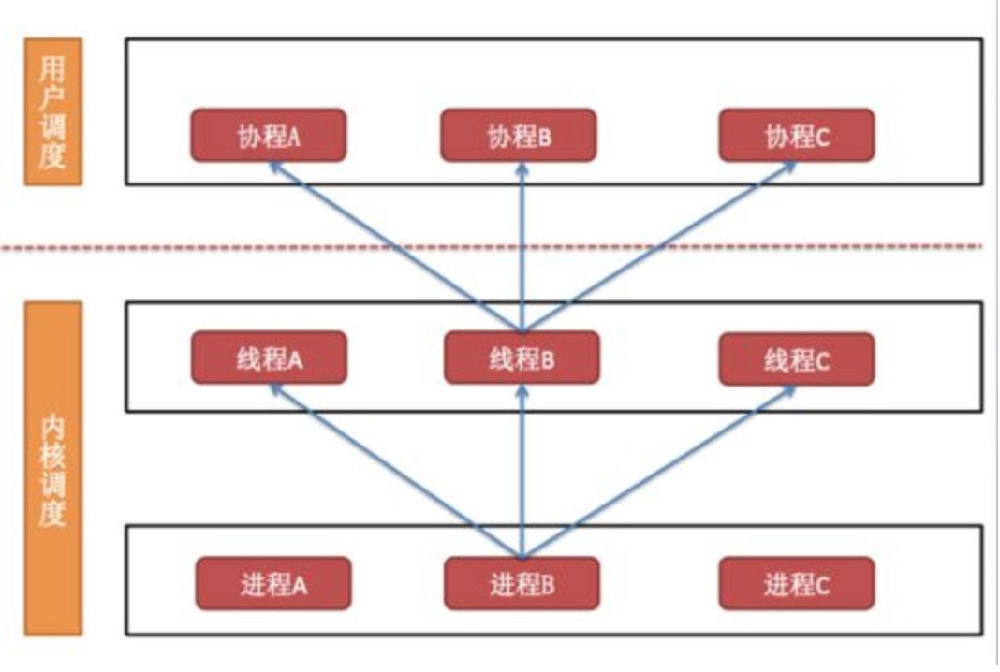

# 7.7. 进程、线程、协程区别

目标
--

*   知道进程、线程、协程的关系及作用

### 1\. 进程、线程、协程之间的关系

*   一个进程至少有一个线程，进程里面可以有多个线程
*   一个线程里面可以有多个协程

### 2.进程、线程、线程的对比

1.  进程是资源分配的单位
2.  线程是操作系统调度的单位
3.  进程切换需要的资源最大，效率很低
4.  线程切换需要的资源一般，效率一般（当然了在不考虑GIL的情况下）
5.  协程切换任务资源很小，效率高
6.  多进程、多线程根据cpu核数不一样可能是并行的，但是协程是在一个线程中 所以是并发

### 小结

*   进程、线程、协程都是可以完成多任务的，可以根据自己实际开发的需要选择使用
*   由于线程、协程需要的资源很少，所以使用线程和协程的几率最大
*   开辟协程需要的资源最少