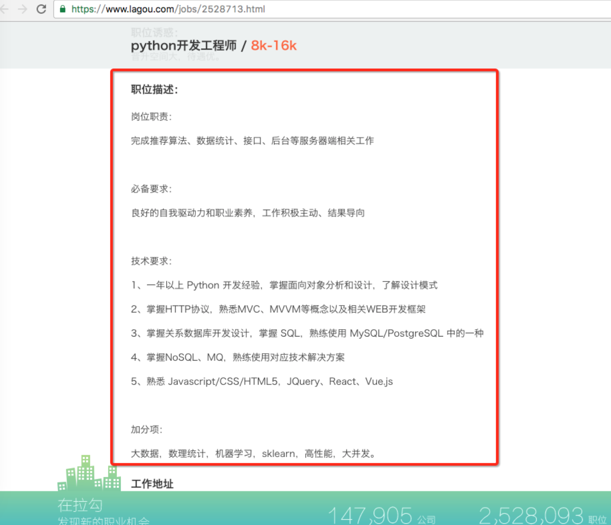

# 8.7. re模块的高级用法

目标
--

*   知道使用findall查找多个字符
*   知道使用sub替换数据
*   知道使用split根据多个标识符进行分割数据

1.search
--------

需求：匹配出水果的个数

    import re
    
    # 根据正则表达式查找数据，提示：只查找一次
    # 1.pattern: 正则表达式
    # 2.string: 要匹配的字符串
    match_obj = re.search("\d+", "水果有20个 其中苹果10个")
    if match_obj:
        # 获取匹配结果数据
        print(match_obj.group())
    else:
        print("匹配失败")

运行结果：

    20

2.findall
---------

需求：匹配出多种水果的个数

    import re

​    
    result = re.findall("\d+", "苹果10个 鸭梨5个 总共15个水果")
    print(result)

运行结果：

    ['10', '5', '15']

3.sub 将匹配到的数据进行替换
-----------------

需求：将匹配到的评论数改成22

    import re
    
    # pattern: 正则表达式
    # repl: 替换后的字符串
    # string: 要匹配的字符串
    # count=0 替换次数，默认全部替换 , count=1根据指定次数替换
    result = re.sub("\d+", "22", "评论数:10 赞数:20", count=1)
    print(result)

运行结果：

    评论数:22 赞数:20

需求：将匹配到的阅读数加1

    import re
    
    # match_obj:该参数系统自动传入
    def add(match_obj):
        # 获取匹配结果的数据
        value = match_obj.group()
        result = int(value) + 1
        # 返回值必须是字符串类型
        return str(result)
    
    result = re.sub("\d+", add, "阅读数:10")
    print(result)

运行结果：

    阅读数:11

4.split 根据匹配进行切割字符串，并返回一个列表
---------------------------

需求：切割字符串"貂蝉,杨玉环:西施,王昭君"

    import re
    
    # 1. 正则
    # 2. 要匹配的字符串
    # maxsplit=1 分割次数， 默认全部分割
    result = re.split(",|:", my_str, maxsplit=1)
    print(result)

运行结果：

    ['貂蝉', '杨玉环:西施,王昭君']

### 思考

使用正则表达式把职位描述信息提取出来不要html标签数据

    

    
岗位职责：

    
完成推荐算法、数据统计、接口、后台等服务器端相关工作

    
 

    
必备要求：

    
良好的自我驱动力和职业素养，工作积极主动、结果导向

    
&nbsp; 

    
技术要求：

    
1、一年以上 Python 开发经验，掌握面向对象分析和设计，了解设计模式

    
2、掌握HTTP协议，熟悉MVC、MVVM等概念以及相关WEB开发框架

    
3、掌握关系数据库开发设计，掌握 SQL，熟练使用 MySQL/PostgreSQL 中的一种 

    
4、掌握NoSQL、MQ，熟练使用对应技术解决方案

    
5、熟悉 Javascript/CSS/HTML5，JQuery、React、Vue.js

    
&nbsp; 

    
加分项：

    
大数据，数理统计，机器学习，sklearn，高性能，大并发。

    
    

参考代码:

    import re
    
    my_str = """

            
【职位描述】 1、负责数据后台服务的架构设计、开发、优化；  【任职要求】 1、本科以上学历，计算机相关专业； 2、3年以上python开发经验； 3、熟悉Unix、Linux操作系统原理及常用工具； 4、熟悉TCP/IP协议、进程间通讯编程，熟悉Unix/Linux下常用架构设计方法； 5、熟悉Mysql数据库，熟悉NoSQL存储，熟悉面向对象设计； 6、具备全面的软件知识结构认知（操作系统、软件工程、设计模式、数据结构、数据库系统、网络安全）； 7、具备良好的分析解决问题能力，能独立承担任务，有系统进度把控能力

            
"""
    # 根据正则表达式替换指定的标签数据
    result = re.sub(r"</?[a-zA-Z1-6]+>", "", my_str)
    # 去除左右空格
    print(result.strip())

执行结果:

    【职位描述】1、负责数据后台服务的架构设计、开发、优化；【任职要求】1、本科以上学历，计算机相关专业；2、3年以上python开发经验；3、熟悉Unix、Linux操作系统原理及常用工具；4、熟悉TCP/IP协议、进程间通讯编程，熟悉Unix/Linux下常用架构设计方法；5、熟悉Mysql数据库，熟悉NoSQL存储，熟悉面向对象设计；6、具备全面的软件知识结构认知（操作系统、软件工程、设计模式、数据结构、数据库系统、网络安全）；7、具备良好的分析解决问题能力，能独立承担任务，有系统进度把控能力