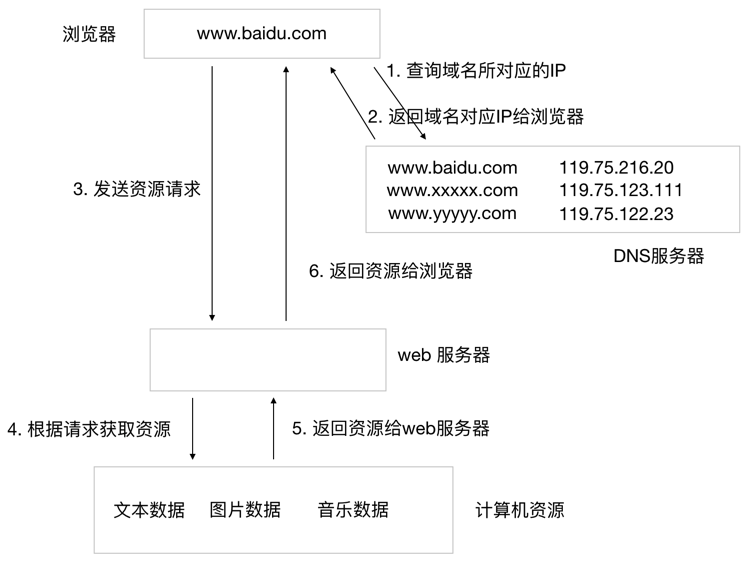

# 9.1. 浏览器访问服务器的过程

目标
--

*   知道浏览器访问服务器的过程
*   知道URL的含义
*   知道域名和ip的关系

**浏览器请求的基本流程如下:**

图1 - mini-web服务器工作流程

1.  用户输入网址.
2.  浏览器请求DNS服务器, 获取域名对应的IP地址.
3.  请求连接该IP地址服务器.
4.  发送资源请求. (HTTP协议)
5.  web服务器接收到请求, 并解析请求, 判断用户意图.
6.  获取用户想要的资源.
7.  将资源返回给web服务器程序.
8.  web服务器程序将资源数据通过网络发送给浏览器.
9.  浏览器解析请求的数据并且完成网页数据的显示.

> 网址是什么呢?

网址有称为URL，URL的英文全拼是(Uniform Resoure Locator),表达的意思是统一资源定位符，通俗理解就是网络资源地址。

URL的组成部分大概分为三部分:

*   协议部分
*   域名部分
*   资源路径部分

比如: [http://news.china.com.cn/2018-06/12/content_52060465.htm](http://news.china.com.cn/2018-06/12/content_52060465.htm) URL的格式为: http://: 协议部分,news.china.com.cn: 域名部分,/2018-06/12/content_52060465.htm:资源路径部分

> 域名是什么呢?

我们在访问一台服务器的时候, 需要记住该服务器的IP地址, 由于IP地址不利于人们记忆, 所以推出的域名技术. 域名是由一串用点分隔的名字组成的 Internet 上某一台计算机或计算机组的名称, 用于在数据传输时标识计算机的位置.

域名可以用来表示一个单位、机构或可以利用个人在 Internet上 的确定的名称或位置. 域名是惟一的. 客户可以利用这个名字找寻有关的产品和服务信息.

> DNS 是什么呢？

由于我们用域名来标识计算机的位置, 但是我们前面讲过, 网络上标识主机的唯一标识是IP地址, 所以就需要记录一下, 一个域名和IP地址的对应关系, 这个对应关系就存储在DNS服务器中, 当我们向DNS发出请求时, DNS会返回给我们域名所对应的IP地址.

### 小结

*   浏览器访问服务器其实就是请求和响应的过程
*   URL通俗理解就是请求资源在网络中的地址
*   通过域名可以解析出来一个ip地址，域名是方便大家记忆某台主机地址的。