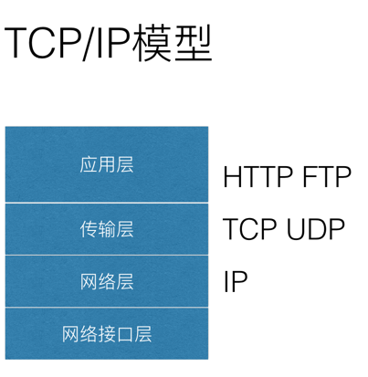
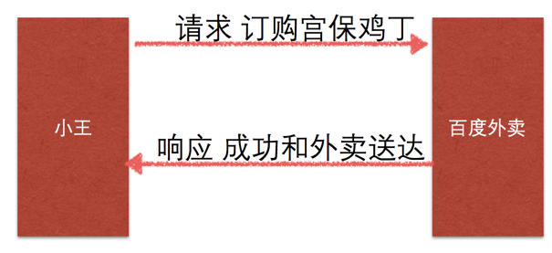
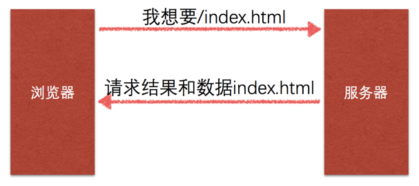

# 9.2. HTTP协议介绍

目标
--

*   知道http协议的作用

### HTTP协议简介

> HTTP协议就是超文本传输协议(HyperText Transfer Protocol),通俗理解是浏览器和web服务器传输数据格式的协议,HTTP协议是一个应用层协议。
>
> HTTP协议是基于TCP协议的，发送数据之前需要建立好连接
>
> HTTP是万维网的数据通信的基础。设计HTTP最初的目的是为了提供一种发布和接收HTML页面<网页>的方法。
>
> HTTP协议的制作者是**蒂姆·伯纳斯-李**，他供职于CERN(欧洲核子研究组织)
>
> *   1991年发布的0.9版，该版本极其简单，只有一个GET请求方法
> *   1996年5月，HTTP/1.0版本发布
> *   1997年1月，HTTP/1.1版本发布，目前使用就是HTTP/1.1版本

### 网络传输-TCP/IP四层模型

> TCP/IP模型又称为TCP/IP协议族，是一系列网络协议的总称。TCP/IP模型一共包括几百种协议，制作协议的目的，就是保证计算机之间可以进行按照一定格式进行数据通信。

1.  链路层(数据链路层/网络接口层):包括操作系统中的设备驱动程序、计算机中对应的网络接口卡.
2.  网络层:处理分组在网络中的活动,比如分组的选路.
3.  运输层:主要为两台主机上的应用提供端到端的通信.
4.  应用层:负责处理特定的应用程序细节.

### HTTP协议的工作模式

HTTP协议的工作模式是一次请求(request)和一次响应(response)的模式

