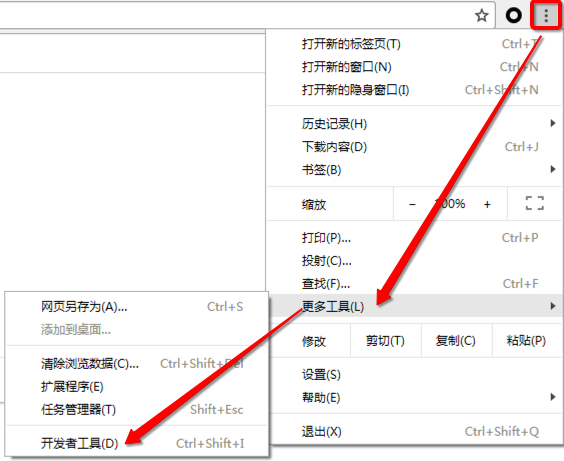
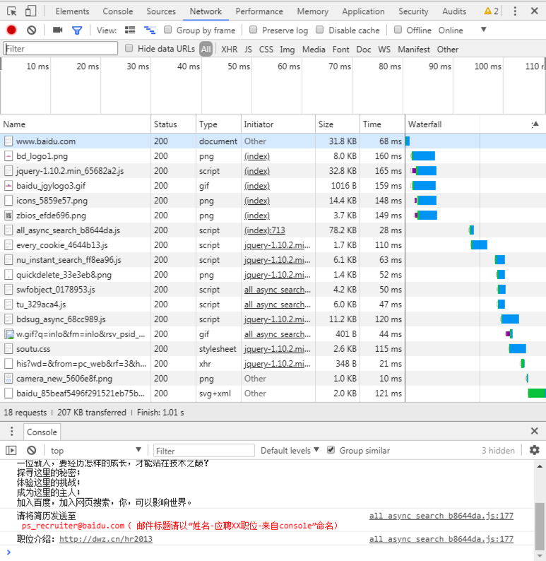

# 9.3. 开发工具查看http协议通信过程

目标
--

*   知道谷歌浏览器开发工具的使用流程

这里介绍 谷歌开发者工具使用

windows和Linux平台按F12调出开发者工具, MAC选择 视图 -> 开发者工具。

在 web 应用中, 服务器把网页传给浏览器, 实际就是把网页的 HTML 代码发送给浏览器, 浏览器解析显示出来. 而浏览器和服务器之间的传输应用层协议就是 HTTP. 所以:

*   HTML 是一种用来定义网页的文本, 会 HTML 就可以编写网页.
*   HTTP 是用来在网络上传输 HTML 文本的协议, 用于浏览器和服务器的通信.

Chrome 浏览器提供了一套完成的开发者工具, 很适合 web 开发者. 

图4 - 打开开发者工具

图5 - 开发者工具界面

*   元素(Elements):用于查看或修改HTML元素的属性、CSS属性、监听事件、断点等.
*   控制台(Console):控制台一般用于执行一次性代码, 查看JavaScript对象, 查看调试日志信息或异常信息.
*   源代码(Sources):该页面用于查看页面的HTML文件源代码、JavaScript源代码、CSS源代码, 此外最重要的是可以调试JavaScript源代码, 可以给JS代码添加断点等.
*   网络(Network):网络页面主要用于查看 header 等与网络连接相关的信息.

**注意**: Network 中的每一项就是一次请求/响应过程, 点击每一项, 可查看本次请求响应的报文信息.

### 小结

*   Network 中的每一项就是一次请求/响应过程, 点击每一项, 可查看本次请求响应的报文信息.