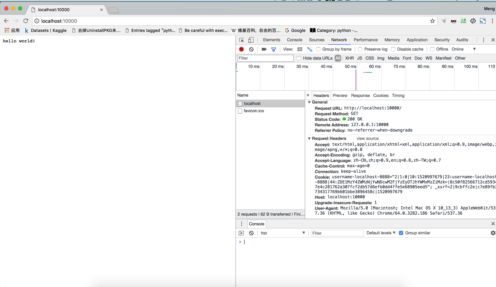
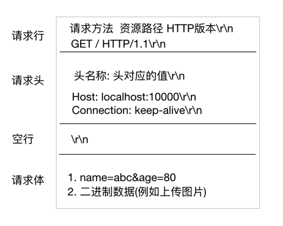

# 9.4. HTTP请求报文格式

目标
--

*   知道HTTP协议请求报文的格式

首先，我们通过开发者工具查看一下请求报文的格式.

Request Headers 中就是请求的报文数据内容. 下面就是我们要请求的报文示例数据:

    GET / HTTP/1.1
    Host: localhost:10000
    Connection: keep-alive
    User-Agent: Mozilla/5.0 (Macintosh; Intel Mac OS X 10_13_3) AppleWebKit/537.36 (KHTML, like Gecko) Chrome/64.0.3282.186 Safari/537.36
    Accept: text/html,application/xhtml+xml,application/xml;q=0.9,image/webp,image/apng,*/*;q=0.8
    Accept-Encoding: gzip, deflate, br
    Accept-Language: zh-CN,zh;q=0.9,en;q=0.8,zh-TW;q=0.7

1.  GET / HTTP/1.1 叫做请求行. 里面包含3个信息, 以空格隔开,

    *   第一个叫做请求方法, 除了 GET 方法之外, 还有 POST 方法, 除此之外还有其他方法, 这两种最常用. GET 主要用于从服务器获得数据, POST 主要用于从浏览器提交数据到服务器. 比如像百度首页提供的上传图片的功能, 就是用POST方式.

    *   第二个表示请求的资源路径. 当请求的URL是 [https://www.baidu.com/](https://www.baidu.com/), 那么我们会发现 路径会显示 '/', 那么如果请求的URL是 [https://www.baidu.com/index.html](https://www.baidu.com/index.html), 我们会发现路径显示是 '/index.html'.

    *   第三个表示 HTTP 协议的版本, 那么既然有 1.1版本， 前置版本肯定是1.0了，那么两个版本有什么区别呢? 1.1版本比1.0的版本主要多个一些请求方法等扩充协议的内容.

**问题: 如果用户请求路径是 [https://www.baidu.com/abc.png](https://www.baidu.com/abc.png), 那么资源路径会显示为什么呢?**

1.  请求头. 除了第一行之外, 剩下的所有数据的格式都是类似的.

    *   Host 表示浏览器要请求的主机地址. 这是我们查看下 baidu.com itcastcpp.cn， 请求不同的网站, 会有不同的主机地址.

    *   Connection 表示浏览器和服务器之间的连接方式, 浏览器和服务器连接是长连接还是短连接, 稍后会讲解.

    *   User-Agent 用户代理, 我们使用谷歌浏览器和火狐浏览器分别请求百度, 那么会发现 User-Agent 的值是不一样的, 它主要是用于浏览器告诉服务器自己的身份, 比如浏览器端使用的操作系统是什么版本, 浏览器是什么版本等等. 服务器端为什么需要知道这个信息呢? 我们后面会讲到爬虫，爬虫程序主要是从服务器端获取数据, 那么服务器端就会有反爬机制, 服务器不希望爬虫来获取数据, 所以通过该项可以知道客户端是否是爬虫程序. 如果爬虫程序想伪装成一个浏览器的请求, 就必须设置此项.

    *   Accept 表示浏览器告诉服务器, 自己能够接收并识别的文件类型.

    *   Accept-Encoding 表示浏览器能够处理的压缩方式. 为什么需要压缩呢？ 当网页数据量大的时候, 压缩之后可以提高传输速率, 提高用户体验.
    *   Accept-Language 浏览器可以接收的文本语言, 如果非中文编码可能会出现乱码.

### 小结

HTTP请求报文可以分为GET请求和POST请求报文，要注意的是GET请求没有请求体，POST请求有请求体信息