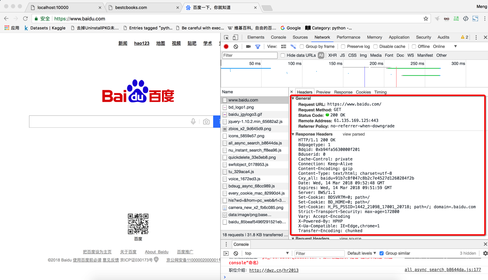
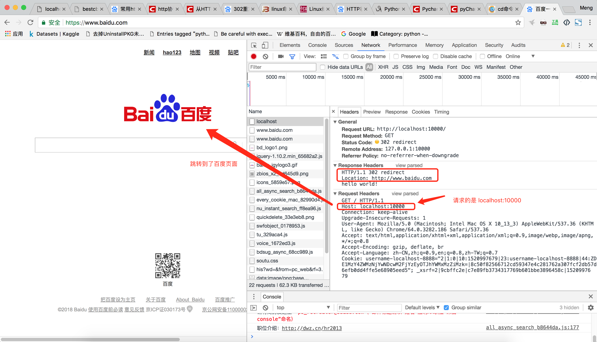
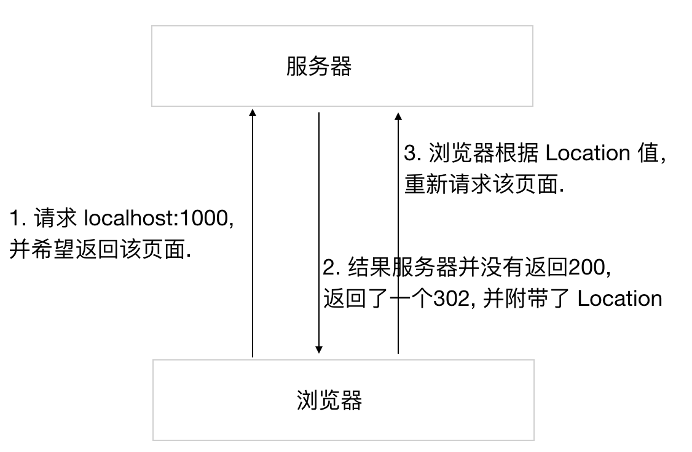
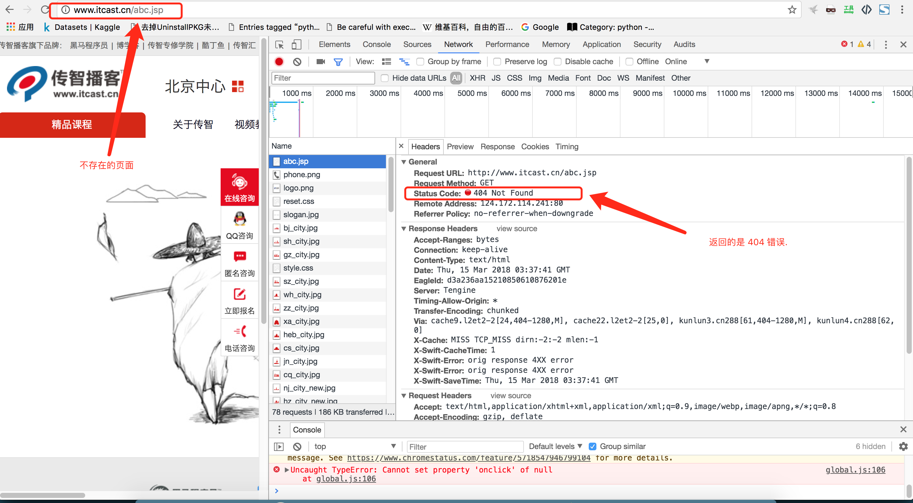
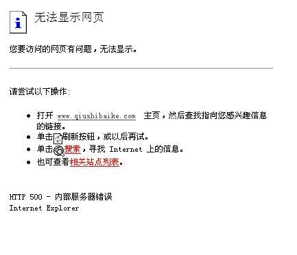
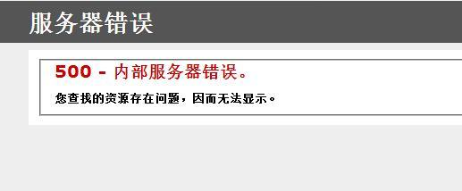
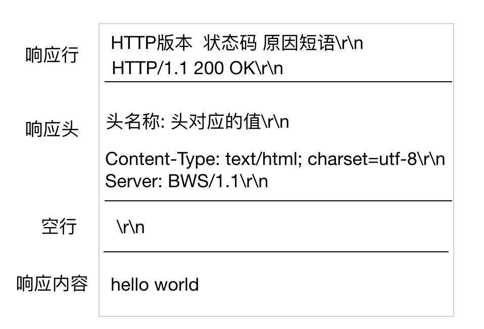

# 9.6. HTTP响应报文格式

如何使用开发者工具查看请求报文, 以请求 Baidu.com 为例:

    HTTP/1.1 200 OK
    Connection: Keep-Alive
    Content-Encoding: gzip
    Content-Type: text/html; charset=utf-8
    Date: Wed, 14 Mar 2018 09:52:48 GMT
    Server: BWS/1.1

*   第一行 HTTP/1.1 200 OK 叫做响应行, 共分成3部分, 第一部分 HTTP/1.1 表示 HTTP协议的版本, 第二部分是一个数字, 这个数字表示响应状态码, 用户向服务器发出了请求, 如果服务器正常返回响应报文, 那么状态码一般都是200, 第三部分的 "OK" 表示原因短语, 表示对前面状态码的简单描述. 这里需要说的是, 响应的状态码除了 200 之外, 还有其他的状态码, 下面是常见的状态码:

    *   302 redirect, 我们通过 302 状态码可以指示浏览器跳转到某一个 URL.  

    *   404 NOT FOUND, 当我们访问一个不存在的 URL 时, 一般会返回404状态码, 告诉浏览器, 你访问的 URL 是不存在的. 

    *   500 Internal Server Error, 服务器遇到了一个未曾预料的状况, 导致了它无法完成对请求的处理. 一般来说, 这个问题都会在服务器端的源代码出现错误时出现.  

*   第二行下面的所有内容, 我们叫做响应头. Content-Type 表示响应内容的文本格式和编码方式.

### 小结

HTTP协议响应报文分为4部分,每部分之间使用\\r\\n进行分割

*   响应行
*   响应头
*   空行(\\r\\n)
*   响应体