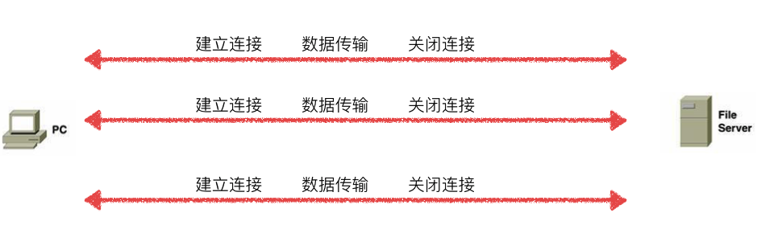
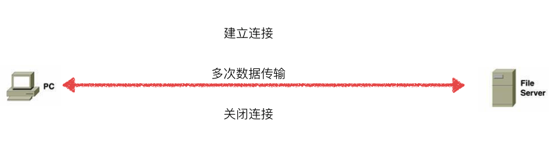

# 9.7. 长连接和短连接

目标
--

*   知道长连接和短连接的特点

在HTTP/1.0中, 默认使用的是短连接.也就是说, 浏览器和服务器每进行一次HTTP操作, 就建立一次连接, 但任务结束就中断连接.如果客户端浏览器访问的某个HTML或其他类型的 Web 页中包含有其他的Web资源，如js文件、图像文件、CSS文件等；当浏览器每遇到这样一个Web资源，就会建立一个HTTP会话。

但从 HTTP/1.1起，默认使用长连接，用以保持连接特性。使用长连接的HTTP协议，会在响应头有加入这行代码:

    Connection:keep-alive

在真正的读写操作之前，server与client之间必须建立一个连接，

当读写操作完成后，双方不再需要这个连接时它们可以释放这个连接，

连接的建立通过三次握手，释放则需要四次握手，

所以说每个连接的建立都是需要资源消耗和时间消耗的。

### 1\. TCP短连接

模拟一种TCP短连接的情况:

1.  client 向 server 发起连接请求
2.  server 接到请求，双方建立连接
3.  client 向 server 发送消息
4.  server 回应 client
5.  一次读写完成，此时双方任何一个都可以发起 close 操作

在步骤5中，一般都是 client 先发起 close 操作。当然也不排除有特殊的情况。

从上面的描述看，短连接一般只会在 client/server 间传递一次读写操作！

### 2\. TCP长连接通信过程

1.  client 向 server 发起连接
2.  server 接到请求，双方建立连接
3.  client 向 server 发送消息
4.  server 回应 client
5.  一次读写完成，连接不关闭
6.  后续读写操作...
7.  长时间操作之后client发起关闭请求

### 3\. TCP长/短连接的优点和缺点

*   长连接可以省去较多的TCP建立和关闭的操作，节约时间。但是如果用户量太大容易造成服务器负载过高最终导致服务不可用

*   短连接对于服务器来说实现起来较为简单，存在的连接都是有用的连接，不需要额外的控制手段。但是如果用户访问量很大, 往往可能在很短时间内需要创建大量的连接，造成服务器响应速度过慢

### 4\. 一张图看懂长连接和短连接

### 小结

*   长连接: 连接建立成功后，可以发送多次请求和响应，等双方不进行通信的时候，服务端做好断开连接的操作
*   短连接: 连接建立成功后，一次请求和响应完成以后连接就会断开，每次发送请求需要先建立好连接
*   长连接减少了用户的等待时间，提升了访问速度，但是增加了服务端的资源开销
*   短连接不会占用服务端过多的资源，但是增加了用户的等待时间，减慢了访问速速