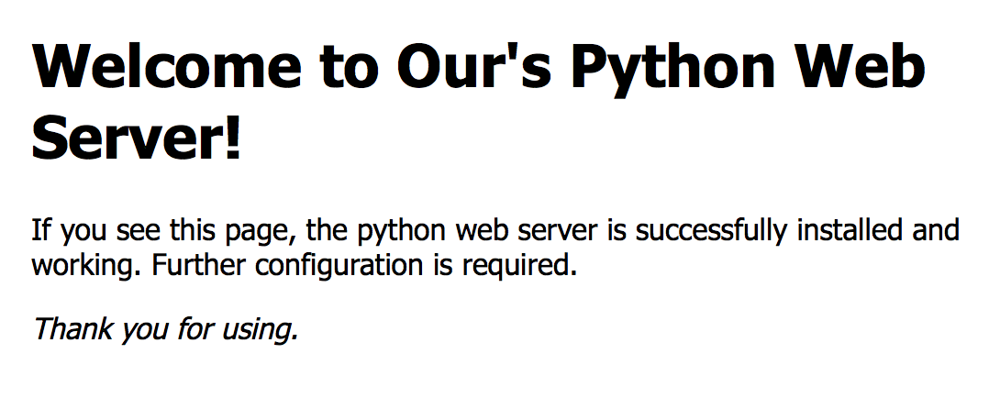

# 10.2. 返回固定页面数据

目标
--

*   知道读取固定网页数据封装响应报文数据

### 返回固定页面数据的代码

    import socket
    
    if __name__ == '__main__':
    
        # 创建tcp服务端套接字
        tcp_server_socket = socket.socket(socket.AF_INET, socket.SOCK_STREAM)
        # 设置socket选项，立即释放端口
        tcp_server_socket.setsockopt(socket.SOL_SOCKET, socket.SO_REUSEADDR, True)
        # 绑定端口号
        tcp_server_socket.bind(("", 9090))
        # 设置监听
        tcp_server_socket.listen(128)
        # 循环接收客户端的连接请求
        while True:
            service_client_socket, ip_port = tcp_server_socket.accept()
            # 获取客户端的请求报文数据
            client_request_data = service_client_socket.recv(4096)
            print(client_request_data)
    
            # 读取指定文件数据
            # 使用rb的原因是浏览器也有可能请求的是图片
            with open("index.html", "rb") as file:
                # 读取文件数据
                file_data = file.read()
    
            # 准备响应报文数据
            # 响应行
            response_line = "HTTP/1.1 200 OK\r\n"
            # 响应头
            response_header = "Server: PWS1.0\r\nContent-Type: text/html;charset=utf-8\r\n"
            # 响应体
            response_body = file_data
    
            # 匹配响应报文数据
            response_data = (response_line + response_header + "\r\n").encode("utf-8") + response_body
            # 发送响应报文数据
            service_client_socket.send(response_data)
            service_client_socket.close()

执行结果:

